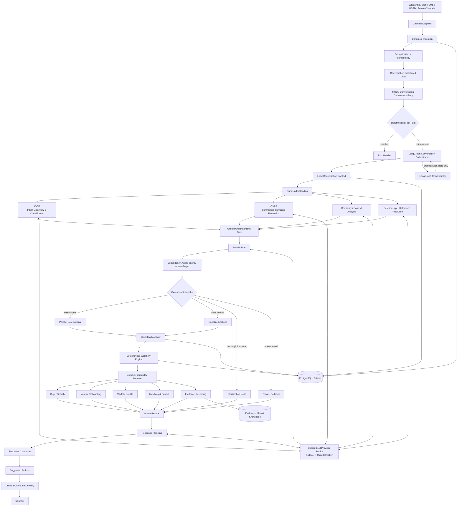
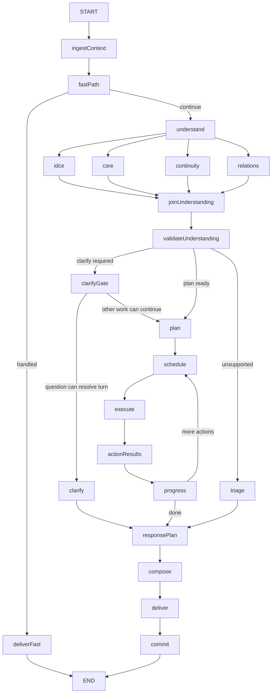

# Multi-Channel Conversation OS (MCOS) + LangGraph v4.4
# Production Conversation Orchestration Technical Design Requirements
**Revision:** Final integration hardening; executable orchestration types/contracts; deterministic turn assembly, queued-turn, clarification, specialist handoff, and schema consistency

**Document status:** Production-oriented redesign TDR
**Target branch:** `mcos-langgraph-v4.3`
**Primary runtime:** TypeScript / Node.js
**Audience:** Platform Architects, AI/Backend Engineers, Distributed Systems Engineers
**Purpose:** Replace segment-centric turn handling with a stateful, dependency-aware conversational orchestration architecture.

---

## 1. Executive Summary

MetaMarket conversations are long-running, multi-turn, multi-intent, channel-agnostic, and semantically messy. A single message may combine onboarding progress, product requests, information requests, corrections, location constraints, service discovery, and unrelated digressions.

The current implementation already provides important operational guarantees: channel abstraction, canonical message ingestion, deduplication, distributed conversation locking, durable database state, deterministic workflow state machines, LLM provider failover, durable outbound delivery, and bounded turn checkpointing. The current implementation also validates a representative chaotic exchange involving vendor onboarding, a pricing digression, and a simultaneous buyer search. fileciteturn13file0L66-L100 fileciteturn13file0L463-L488

The architectural limitation is the old reasoning unit: the turn is decomposed into **segments**, each segment is processed sequentially, and workflow continuity/routing occurs inside the segment executor. This is robust operationally but too weak as the primary abstraction for messy real-world conversation.

The redesigned system therefore makes **LangGraph the Conversation Orchestrator** and changes the atomic semantic unit from a text segment to an **intent/action unit**.

```text
OLD
MESSAGE → SEGMENTS → WORKFLOW EXECUTION → RESPONSES

NEW
MESSAGE
  ↓
TURN UNDERSTANDING
  ├── IDCE: what does the user want?
  ├── CSRE: what is the user referring to?
  ├── continuity/context analysis
  └── relationships
  ↓
INTENT / ACTION GRAPH
  ↓
DEPENDENCY-AWARE PLAN
  ↓
SPECIALIST + WORKFLOW EXECUTION
  ↓
RESULT NORMALIZATION
  ↓
RESPONSE PLAN
  ↓
DURABLE DELIVERY
```

The new architecture keeps AI bounded by structured contracts and deterministic domain workflows. AI can understand, infer, classify, summarize, and recommend a plan; it must not directly mutate business workflow state.

---

## 2. Goals

The redesign MUST:

1. Handle single and multiple intents in one message.
2. Handle multiple independent objects in one message.
3. Correctly bind intents to semantic objects and conversational context.
4. Support workflow continuation, resumption, interruption, digression, and switching.
5. Parallelize genuinely independent understanding work where safe.
6. Serialize state-conflicting execution.
7. Preserve the current distributed lock invariant: one conversation has one authoritative turn executor at a time.
8. Keep business state owned by MCOS/domain workflows, not LangGraph checkpoints.
9. Support long-running conversational context through durable conversation state.
10. Gracefully degrade when one specialist fails.
11. Preserve fast paths for deterministic interactions.
12. Support Nigerian English, Pidgin, slang, phonetic spelling, market language, and informal conversation.
13. Prevent one ambiguous clause from blocking unrelated valid work.
14. Ask at most one high-information clarification question for a turn unless a domain workflow explicitly requires a separate transactional confirmation step.
15. Provide complete structured telemetry and replayability.

---

## 3. Non-Goals

MCOS + LangGraph MUST NOT:

- become the semantic knowledge graph;
- replace CSRE;
- replace IDCE;
- replace GPC Resolver;
- replace Enrichment;
- replace Evidence System;
- directly perform vendor ranking;
- directly create GPC classifications;
- turn arbitrary LLM output into business-state mutations without validation;
- make LangGraph checkpoints the source of truth for domain records.

---

# 4. Final Responsibility Model

| Layer | Responsibility |
|---|---|
| Channel Adapter | provider-specific channel translation |
| MCOS Ingestion | identity, dedupe, persistence, locking, media dispatch |
| LangGraph Orchestrator | conversation understanding coordination, planning, dependencies, routing, clarification, execution coordination, response planning |
| IDCE | authoritative intent discovery/classification |
| CSRE | authoritative semantic object/referent resolution |
| Enrichment | semantic/search/taxonomy-oriented enrichment |
| GPC Resolver | GPC classification |
| WRS | evidence acquisition |
| Evidence System | evidence, beliefs, graph learning |
| Workflow Manager | workflow discovery/instance retrieval/registry |
| Workflow Engine | deterministic business state machine execution |
| Capability Services | capability projection, matching/fanout, distribution, wallet, and domain capabilities |
| Response Composer | response artifact composition |
| Delivery Engine | durable channel delivery |

---

# 5. Recommended Final Architecture Diagram

This is the authoritative target architecture for MCOS + LangGraph v4.3.



### Architectural interpretation

**MCOS is the operating system around the conversation.** It owns channels, persistence, concurrency, business-state boundaries, runtime reliability, and delivery.

**LangGraph is the semantic operating plane.** It coordinates specialist understanding, turns structured understanding into a dependency graph, schedules work, handles clarification and recovery, and produces a response plan.

**Domain workflows remain deterministic.** LangGraph invokes them through typed ports and validates their outputs. AI does not mutate workflow state directly.

---


---

# 5A. Logical Turn Assembly

MCOS MUST distinguish a **transport message** from a **logical conversational turn**.

A transport message is a provider event.

A logical turn is the smallest conversational batch that should be reasoned about together.

```text
transport messages
      ↓
message persistence
      ↓
turn assembly
      ↓
logical turn
      ↓
LangGraph orchestration
```

## 5A.1 Why Turn Assembly exists

Real users commonly send:

```text
"I need brake pads"
"Toyota Camry"
"2018"
"near Warri"
```

as four messages.

Treating these as four independent LangGraph turns creates unnecessary latency,
incorrect intent detection, premature workflow execution, and loss of contextual
continuity.

Conversely:

```text
"I need brake pads"
"Actually forget that"
"Find me a plumber"
```

must not be blindly merged into one BUY request. The user has changed objectives.

Turn Assembly therefore determines the **input boundary** for one orchestration run.
It does not decide the user's intents.

## 5A.2 Turn Assembly ownership

Turn Assembly is owned by MCOS.

It sits after canonical ingestion and before LangGraph:

```text
Channel Adapter
      ↓
Canonical Ingestion
      ↓
Deduplication
      ↓
Turn Assembly
      ↓
Conversation Lock
      ↓
LangGraph
```

The implementation MAY acquire the conversation lock before or during final
assembly, but MUST ensure that two replicas cannot finalize competing logical
turns for the same conversation.

## 5A.3 Deterministic Turn Assembly State Machine

Turn Assembly is a durable, concurrency-safe state machine. It MUST NOT rely on an implicit in-memory timer alone.

```text
OPEN
  │
  ├── new compatible message ───────────► OPEN (extend quiet deadline)
  │
  ├── explicit hard boundary ───────────► SEALED
  │
  └── quiet deadline reached ───────────► SEALED
                                           │
                                           ▼
                                      ENQUEUED
                                           │
                                           ▼
                                      PROCESSING
                                           │
                              ┌────────────┼────────────┐
                              ▼            ▼            ▼
                          COMMITTED    WAITING_USER  FAILED
                              │            │
                              ▼            ▼
                           CLOSED       RESUMABLE
```

### Required persisted fields

```typescript
export type LogicalTurnStatus =
  | 'OPEN'
  | 'SEALED'
  | 'ENQUEUED'
  | 'PROCESSING'
  | 'WAITING_USER'
  | 'COMMITTED'
  | 'FAILED'
  | 'CANCELLED';

export interface TurnAssemblyState {
  turnId: string;
  conversationId: string;
  status: LogicalTurnStatus;
  messageIds: string[];
  firstMessageAt: string;
  lastMessageAt: string;
  quietDeadlineAt: string;
  sealedAt: string | null;
  processingStartedAt: string | null;
  committedAt: string | null;
  assemblyVersion: number;
  reason: string;
  revision: number;
}
```

### 5A.3.1 Sealing algorithm

The quiet deadline MUST be persisted. Adding a message and extending the deadline MUST occur in one atomic transaction. Sealing MUST use an atomic compare-and-set transition:

```text
OPEN + revision=N
        ↓ atomic update where revision=N
SEALED + revision=N+1
```

Only one worker may successfully perform the transition. A worker that loses the compare-and-set race MUST reload the turn state and process the winner's turn assignment rather than create a second logical turn.

### 5A.3.2 Coalescing window policy

The exact default duration is configuration, but the TDR requires three bounded limits:

```text
QUIET_WINDOW_MS          # short inter-message accumulation window
MAX_TURN_ASSEMBLY_MS     # hard upper bound for one logical turn
MAX_MESSAGE_COUNT        # hard upper bound for one logical turn
```

A message that arrives after `MAX_TURN_ASSEMBLY_MS` MUST not extend the existing turn indefinitely. It becomes eligible for the next logical turn unless an explicit hard-boundary policy links it as a correction/reference.

The implementation MUST expose these values in configuration and telemetry. They MUST NOT be hard-coded inside prompt logic.

### 5A.3.3 Deterministic boundary precedence

Boundary decisions MUST follow this precedence:

```text
1. Explicit interactive/action payload boundary
2. Explicit cancellation/retraction/new-topic signal
3. Hard elapsed-time limit
4. Deterministic continuation signals
5. Bounded model-assisted assembly classifier
6. Default to NEW_TURN when confidence remains insufficient
```

The model-assisted classifier is a fallback, not the owner of durable turn state.

---

## 5A.3.4 Atomic append/seal protocol

All Turn Assembly state transitions MUST occur in PostgreSQL transactions (or an equivalently strongly consistent persistence primitive).

### Append message

```text
BEGIN
SELECT turn FOR UPDATE
IF status = OPEN AND message is eligible:
    append message
    increment revision
    extend quietDeadlineAt
ELSE:
    create/find next eligible turn
COMMIT
```

### Seal turn

A sealer MUST execute:

```sql
UPDATE logical_turns
SET status = 'SEALED', sealed_at = now(), revision = revision + 1
WHERE turn_id = $1
  AND status = 'OPEN'
  AND revision = $2
  AND quiet_deadline_at <= now();
```

Exactly one successful update is allowed. A zero-row update means another worker won or the turn changed; the worker MUST reload state and MUST NOT create duplicate work.

### Enqueue

The transition from `SEALED` to `ENQUEUED` MUST be idempotent and use a unique constraint on `(conversation_id, turn_id)`.

### Claim

```sql
UPDATE turn_queue
SET status = 'CLAIMED', claimed_at = now()
WHERE queue_id = $1
  AND status = 'QUEUED';
```

Only the worker receiving one affected row owns that queue item.

---

## 5A.4 Assembly rules

A message SHOULD be coalesced into the current logical turn when:

- it arrives within the configured coalescing window;
- it is an apparent continuation of an unfinished phrase/request;
- it adds constraints, qualifiers, corrections, or missing fields;
- it contains pronouns or references requiring the immediately preceding message;
- it is clearly part of the same user thought.

A message SHOULD begin a new logical turn when:

- it explicitly cancels/retracts the previous request and introduces a new objective;
- it is clearly unrelated;
- the configured assembly window expires;
- the previous logical turn has already been committed and the new message cannot
  safely be incorporated;
- channel semantics indicate a hard message boundary;
- the user explicitly indicates a new topic.

## 5A.5 Assembly is not intent classification

The assembler MUST NOT decide:

```text
BUY
SELL
PRICE_INQUIRY
FIND_VENDOR
```

Those are IDCE decisions.

The assembler only answers:

> "Should these transport messages be reasoned about together?"

## 5A.6 Deterministic-first, model-assisted policy

Turn Assembly SHOULD first use deterministic signals:

```text
time proximity
unfinished punctuation
reference words
known command/button payloads
explicit cancellation markers
channel semantics
workflow state
```

A bounded model-assisted continuity classifier MAY be used only when deterministic
signals cannot confidently establish the boundary.

The classifier output MUST be a typed recommendation, not a direct state mutation.

## 5A.7 Assembly record

```typescript
export interface LogicalTurn {
  turnId: string;
  conversationId: string;
  messageIds: readonly string[];
  messages: readonly IncomingMessage[];
  assembledText: string;
  assemblyReason:
    | 'SINGLE_MESSAGE'
    | 'COALESCED_MESSAGES'
    | 'CONTINUATION_WINDOW'
    | 'EXPLICIT_USER_BATCH';
  startedAt: Date;
  sealedAt: Date;
  contextSnapshotId: string;
}
```

## 5A.8 Corrections arriving after processing starts

If:

```text
Turn 51:
"I need Toyota brake pads"
```

is already executing and the user sends:

```text
"Actually Honda"
```

the new message MUST be persisted as a new transport event and associated with
the appropriate subsequent logical turn.

IDCE should discover a `CORRECT`/`MODIFY` intent scoped to the previous request.

LangGraph then decides whether the prior action:

```text
has not started      → update plan
is in progress      → request domain cancellation/change if supported
already committed   → create compensating/new action
cannot be reversed  → explain limitation
```

The system MUST never pretend a committed business transaction was changed merely
because the user sent a correction.

## 5A.9 Messages arriving while a turn is locked

While LangGraph processes Turn N:

```text
Turn N executing
      +
Turn N+1 message arrives
```

MCOS MUST:

1. persist the new message;
2. deduplicate it;
3. avoid concurrent mutation of the same conversation state;
4. allow the current turn to complete or reach a safe interruption boundary;
5. assemble the new message into the next eligible logical turn;
6. process the next turn against the latest committed business state.

This preserves the existing single-conversation executor invariant while allowing
users to continue sending messages naturally.


## 5A.10 Queued Turn Lifecycle

Messages that arrive while another turn is processing MUST remain durable and ordered. MCOS MUST maintain an explicit queue relationship rather than relying on in-memory ordering.

```typescript
export interface TurnQueueEntry {
  queueId: string;
  conversationId: string;
  turnId: string;
  sequence: number;
  status: 'QUEUED' | 'CLAIMED' | 'PROCESSING' | 'WAITING_USER' | 'COMMITTED' | 'FAILED' | 'CANCELLED';
  createdAt: string;
  claimedAt: string | null;
  completedAt: string | null;
  supersedesTurnId: string | null;
  correctsTurnId: string | null;
}
```

### Queue invariants

1. `sequence` is monotonically increasing per conversation.
2. A queue entry can be claimed by only one executor.
3. An executor MUST claim the next eligible queue entry using an atomic compare-and-set operation.
4. A later message MUST NOT overtake an earlier message unless an explicit domain policy marks the earlier turn as cancelled/superseded.
5. A correction/retraction MUST preserve its relationship to the turn it modifies.
6. A queued turn is processed against the latest **committed** business state, not merely the state cached when the message arrived.
7. A failed turn may retry according to bounded retry policy without duplicating committed domain transactions.
8. Turn completion and queue-status transition MUST be idempotent.

### 5A.10.1 Late-arriving corrections

If Turn N has already committed and Turn N+1 contains `CORRECT`, `MODIFY`, or `CANCEL`, MCOS MUST treat N as immutable history and route the correction through the appropriate domain operation. The system MUST never rewrite historical turn records to make the conversation appear as though N never happened.

---

## 5A.11 Queue fairness and ordering

Queued work MUST be selected by `(conversation_id, sequence)` and the executor MUST not process a later turn while an earlier turn is still eligible for execution.

A turn may be skipped ahead only when the earlier turn is explicitly marked:

```text
CANCELLED
SUPERSEDED
FAILED_NON_BLOCKING
```

or an equivalent domain state that has been persisted and audited.

The queue worker MUST use a per-conversation claim boundary so multiple replicas cannot process Turn N and Turn N+1 concurrently for the same conversation.

---

# 6. Why the Atomic Unit Changes from Segment to Intent/Action Unit

A segment is a text boundary. It is not necessarily an executable objective.

Consider:

```text
"Yes, KYB. Also who sells engine oil near Alaba, and how much is it?"
```

The message has at least three semantic/action units:

```text
A1: CONTINUE_VENDOR_ONBOARDING
    object/context: KYB

A2: FIND_VENDOR
    object: engine oil
    location: Alaba

A3: PRICE_INQUIRY
    object: engine oil
    dependency: A2 or related marketplace search result
```

A text segment can contain multiple actions; one action can span multiple clauses. The execution plan therefore MUST be built from structured intents and their dependencies, not from punctuation or sentence boundaries.

Text segmentation remains available as an intermediate hint, but it is no longer the authoritative orchestration model.

---

# 7. Conversation State Model

LangGraph state becomes a bounded orchestration state for the whole conversational thread.

MCOS remains the durable business-state owner.

## 7.1 State ownership

| State | Owner | Durable? |
|---|---|---|
| Conversation history | MCOS | Yes |
| Workflow instances | MCOS / Workflow subsystem | Yes |
| Active/suspended workflow registry | MCOS | Yes |
| User/channel identity | MCOS | Yes |
| Domain transactions | Domain workflows | Yes |
| Evidence / market knowledge | Evidence System | Yes |
| Current turn understanding | LangGraph | checkpointed |
| Intent/action plan | LangGraph | checkpointed |
| In-flight node execution | LangGraph | checkpointed |
| Response plan | LangGraph | checkpointed |
| Non-serializable runtime objects | MCOS bridge/context | No |

The checkpointer MUST NOT become a second database for business truth.

---

# 8. LangGraph Thread Model

The previous design intentionally used turn-scoped checkpoint thread IDs to prevent cursor/segment state bleed. That was appropriate for a turn supervisor. In the redesigned orchestrator, conversation continuity is part of the graph's working context, so LangGraph SHOULD use a **conversation-scoped thread** while still carrying an explicit `turnId` and `runId`.

```text
thread_id = conversation:{conversationId}
run_id    = turn:{turnId}
```

### 8.1 Why this is safe

The graph state no longer contains an execution cursor that should silently continue into the next user turn. Every turn starts a new orchestration envelope inside the conversation thread:

```text
Conversation Thread
 ├── Turn 101 state
 ├── Turn 102 state
 ├── Turn 103 state
 └── current turn pointer
```

The checkpointer stores orchestration state and checkpoints. MCOS PostgreSQL tables remain authoritative for business state and conversation history.

### 8.2 Required isolation

A turn MUST explicitly initialize:

```text
turnId
messageId
runId
inputMessage
understandingRevision
executionRevision
```

No prior turn may implicitly resume unfinished action state unless the plan explicitly marks it as resumable.

---

# 9. LangGraph State Schema

```typescript
export interface ConversationGraphState {
  conversationId: string;
  turnId: string;
  runId: string;

  input: TurnInputState;

  context: ConversationWorkingContext;

  understanding: UnderstandingState;

  plan: ExecutionPlanState;

  execution: ExecutionState;

  responses: ResponseArtifactState[];

  clarification: ClarificationState | null;

  recovery: RecoveryState;

  lifecycle: GraphLifecycleState;
}
```

### 9.1 Understanding state

```typescript
export interface UnderstandingState {
  idce: IDCEResolution | null;
  csre: CSREResolution | null;
  continuity: ContinuityDecision | null;
  relationships: RelationshipResolution[];
  unresolved: UnresolvedIssue[];
  ready: boolean;
}
```

### 9.2 Execution plan

```typescript
export interface ExecutionPlanState {
  actions: PlannedAction[];
  edges: PlanEdge[];
  status: 'DRAFT' | 'READY' | 'RUNNING' | 'BLOCKED' | 'COMPLETED' | 'PARTIAL' | 'FAILED';
}
```

### 9.3 Execution state

```typescript
export interface ExecutionState {
  completedActionIds: string[];
  runningActionIds: string[];
  failedActionIds: string[];
  skippedActionIds: string[];
  results: ActionExecutionResult[];
}
```

---

# 10. Turn Lifecycle

```text
INGEST
  ↓
FAST-PATH CHECK
  ↓
LOAD CONTEXT
  ↓
UNDERSTAND
  ↓
ASSEMBLE UNIFIED STATE
  ↓
PLAN
  ↓
SCHEDULE
  ↓
EXECUTE
  ↓
RECOVER / CLARIFY / CONTINUE
  ↓
AGGREGATE RESULTS
  ↓
PLAN RESPONSE
  ↓
COMPOSE
  ↓
DURABLE DELIVERY
  ↓
COMMIT TURN OUTCOME
```

---

# 11. LangGraph Node Topology

The target graph MUST resemble the following logical topology.



---

# 12. Understanding Phase

Understanding is a first-class phase with parallel specialist calls.

## 12.1 Specialists

### IDCE

Answers:

```text
What is the user trying to accomplish?
```

### CSRE

Answers:

```text
What is the user referring to?
```

### Continuity analyzer

Answers:

```text
How does this turn relate to active/suspended conversational work?
```

### Relationship/reference resolver

Answers:

```text
Which objects, intents, prior entities, workflow items, and constraints refer to one another?
```

The relationship resolver may be deterministic in simple cases and model-assisted in difficult cases.

---

# 13. Understanding Join

LangGraph MUST not immediately execute the first specialist result.

All required understanding outputs are joined into a unified state:

```text
IDCE
  └─ intents

CSRE
  └─ objects

Continuity
  └─ workflow relationships

Reference analysis
  └─ object/intents/prior-turn bindings

              ↓

        Unified Turn State
```

This prevents premature routing based on incomplete understanding.

---

# 14. Unified Turn Representation

```typescript
export interface UnifiedTurnUnderstanding {
  intents: readonly DiscoveredIntent[];
  objects: readonly SemanticObject[];
  contexts: readonly SemanticContext[];
  relationships: readonly SemanticRelationship[];
  continuity: ContinuityDecision;
  unresolved: readonly UnresolvedIssue[];
}
```

Example:

```json
{
  "intents": [
    {
      "intent_id": "i1",
      "type": "CONTINUE_VENDOR_ONBOARDING",
      "role": "PRIMARY",
      "scope": { "type": "WORKFLOW", "workflow_ids": ["wf_10"] }
    },
    {
      "intent_id": "i2",
      "type": "FIND_VENDOR",
      "role": "SECONDARY",
      "scope": { "type": "OBJECT", "object_ids": ["o2"] }
    },
    {
      "intent_id": "i3",
      "type": "PRICE_INQUIRY",
      "role": "SECONDARY",
      "scope": { "type": "OBJECT", "object_ids": ["o2"] },
      "dependencies": ["i2"]
    }
  ],
  "objects": [
    { "object_id": "o2", "canonical_form": "engine oil" }
  ],
  "contexts": [
    { "type": "LOCATION", "value": "Alaba" }
  ]
}
```

---

# 15. Continuity Decision Model

Continuity is no longer hidden inside segment execution.

```typescript
type ContinuityKind =
  | 'CONTINUATION'
  | 'RESUME'
  | 'NEW_WORKFLOW'
  | 'DIGRESSION'
  | 'WORKFLOW_SWITCH'
  | 'MULTI_WORKFLOW'
  | 'NO_WORKFLOW_CONTEXT';
```

Examples:

```text
"Yes, proceed"
→ CONTINUATION / RESUME

"How much is listing monthly?"
→ DIGRESSION

"Also find engine oil near Alaba"
→ MULTI_WORKFLOW

"Forget that, I need a plumber"
→ WORKFLOW_SWITCH
```

Continuity analysis may reference workflow state but does not directly mutate it.

---

# 16. Planning Model

The planner transforms understanding into executable actions.

```typescript
export interface PlannedAction {
  actionId: string;
  intentId: string;
  workflowType: string | null;
  operation: string;
  scope: ActionScope;
  dependencies: string[];
  concurrencyKey: string | null;
  stateConflictKeys: string[];
  prerequisites: string[];
  priority: number;
  status: ActionStatus;
}
```

Example:

```json
{
  "actions": [
    {
      "action_id": "a1",
      "intent_id": "i1",
      "workflow": "VENDOR_ONBOARDING",
      "operation": "RESUME",
      "dependencies": []
    },
    {
      "action_id": "a2",
      "intent_id": "i2",
      "workflow": "BUYER_SEARCH",
      "operation": "START_SEARCH",
      "dependencies": []
    },
    {
      "action_id": "a3",
      "intent_id": "i3",
      "workflow": "BUYER_SEARCH",
      "operation": "PRICE_INQUIRY",
      "dependencies": ["a2"]
    }
  ]
}
```

---

# 17. Dependency-Aware Scheduling

The scheduler MUST NOT use a simplistic "parallel everything" or "serialize everything" policy.

### Required rule

> **Parallelize independent work; serialize state-conflicting work.**

An action can run in parallel only when:

```text
no unmet dependency
AND
no shared mutable state conflict
AND
no response ordering constraint
AND
the domain capability explicitly declares it parallel-safe
```

Otherwise it executes sequentially.

---

# 18. State Conflict Keys

Every workflow/action may declare conflict keys.

Examples:

```text
conversation:{id}
workflow:{id}
account:{userId}
wallet:{userId}
vendor-profile:{vendorId}
search-request:{requestId}
```

Actions with overlapping mutable conflict keys are serialized.

This generalizes the previous segment-loop safety rule. The old design relied on sequential execution plus conversation reload to ensure a later segment sees prior committed workflow changes. The redesign keeps that safety property but applies it to an explicit dependency/conflict model. fileciteturn13file0L421-L434

---

# 19. Conversation Lock Invariant

The conversation mutex remains mandatory.

```text
conversationId
    ↓
 distributed lock
    ↓
 one turn executor
```

Horizontal replicas MUST NOT process two turns for the same conversation concurrently unless the domain explicitly supports an event-level concurrency model that preserves ordering and consistency.

This is a core operational invariant already present in the current MCOS design. fileciteturn13file0L74-L78

---

# 20. Business State Reload Policy

LangGraph may maintain orchestration state, but before any state-sensitive domain action executes, the relevant authoritative business state MUST be read from MCOS/domain persistence or an explicitly consistent transaction context.

Recommended pattern:

```text
Action 1
  ↓ commit
Action 2
  ↓ load fresh authoritative state
execute
```

The old implementation's rule of reloading the conversation after each sequential segment is therefore retained conceptually, but moved into the generalized action scheduler/domain execution boundary. fileciteturn13file0L371-L386

---

# 21. WorkflowManager Redesign

WorkflowManager remains valuable but becomes a **workflow registry/discovery service**, not the primary conversational intelligence layer.

Old conceptual flow:

```text
segment
  ↓
continuity
  ↓
6-layer workflow discovery
```

New flow:

```text
IDCE + CSRE + continuity
  ↓
LangGraph plan
  ↓
workflow type / operation
  ↓
WorkflowManager
  ↓
workflow instance
```

Existing deterministic workflow discovery layers remain useful as implementation mechanisms:

1. explicit workflow ID;
2. deterministic identifier;
3. entity match;
4. semantic fingerprint;
5. embedding similarity;
6. active workflow fallback.

But these layers are now used to resolve the appropriate workflow instance for a **planned action**, not to infer the user's whole objective.

---

# 22. Workflow Execution Boundary

LangGraph MUST invoke workflows through typed ports.

```typescript
export interface WorkflowExecutionPort {
  execute(input: WorkflowActionInput): Promise<WorkflowActionResult>;
}
```

The workflow engine remains deterministic:

```text
LangGraph action
    ↓
Workflow Manager
    ↓
Workflow Engine
    ↓
state validation
    ↓
transition
    ↓
transaction
    ↓
result
```

AI must never directly call:

```text
workflow.setState(...)
workflow.complete(...)
workflow.suspend(...)
```

without the deterministic workflow engine validating and performing the transition.

---

# 23. Action Result Contract

Each action returns a normalized result.

```typescript
export interface ActionExecutionResult {
  actionId: string;
  status: 'SUCCESS' | 'PARTIAL' | 'FAILED' | 'BLOCKED' | 'SKIPPED' | 'NEEDS_USER';
  businessStateChanged: boolean;
  workflowId: string | null;
  responseArtifacts: ResponseArtifact[];
  emittedEvents: DomainEvent[];
  evidenceReferences: string[];
  blockingIssues: BlockingIssue[];
  nextActions: SuggestedNextAction[];
}
```

This makes the response layer independent from workflow implementation details.

---

# 24. Partial Failure Model

One action failure MUST NOT automatically fail the whole turn.

Example:

```text
A1 onboarding → SUCCESS
A2 vendor search → SUCCESS
A3 price lookup → FAILED
```

The response plan can say:

```text
A1 result ✅
A2 result ✅
A3 limitation: could not retrieve price
```

Only dependency-blocked actions should be skipped because of a failed predecessor.

---

# 25. Clarification Strategy

Clarification is a graph decision, not merely an LLM response.

LangGraph MUST evaluate:

```text
Is the missing information necessary?
Can unrelated actions still execute?
Will one question resolve several ambiguities?
Is the question safe and comprehensible?
```

### Example

```text
"Find me a pump"
```

If CSRE cannot safely resolve the referent and IDCE determines a FIND_PRODUCT objective, LangGraph may ask:

```text
"What kind of pump do you need—water pump, fuel pump, or something else?"
```

But if the user also asked:

```text
"And what time do you close?"
```

the platform may answer the platform-hours part while awaiting clarification on the pump.

---

# 26. One-Question Rule

---

## 25A. End-to-End Clarification Delivery

A specialist MUST NOT directly send a clarification message.

The authoritative path is:

```text
CSRE / IDCE
      │
      ├── clarification recommendation
      ▼
LangGraph Clarification Gate
      │
      ├── execute unrelated work where possible
      │
      └── choose the final blocking question
      ▼
Response Planning
      ↓
Response Composer
      ↓
Durable Outbound Delivery
      ↓
Channel Adapter
      ↓
User
```

### 25A.0 Clarification persistence invariants

The following database constraints are REQUIRED:

```text
UNIQUE(conversation_id, clarification_id)
UNIQUE(conversation_id) WHERE status = 'WAITING_FOR_USER'
INDEX(conversation_id, status, asked_at)
INDEX(originating_turn_id)
```

The outbound outbox record MUST contain `clarificationId` as an idempotency key whenever the outbound artifact is a clarification question.

An answer message is linked using the active clarification ID when supplied by deterministic conversation state; otherwise LangGraph performs contextual binding and persists the chosen `clarificationId` before resuming the blocked plan.

---

### 25A.1 Clarification gate

LangGraph MUST select at most one clarification question for the current logical turn
under the one-question policy.

Selection MUST consider:

```text
blocking value
expected uncertainty reduction
number of downstream actions unlocked
user effort
conversation naturalness
already-known information
channel constraints
```

### 25A.2 Clarification as suspended orchestration

When clarification blocks only part of a turn:

```text
A1 → SUCCESS
A2 → WAITING_FOR_USER
A3 → SUCCESS
```

the graph may finalize the completed actions and persist an explicit clarification record. `pendingClarification` is durable MCOS/application state, not ephemeral graph state.

```typescript
export type PendingClarificationStatus =
  | 'WAITING_FOR_USER'
  | 'ANSWER_RECEIVED'
  | 'RESOLVED'
  | 'EXPIRED'
  | 'CANCELLED'
  | 'SUPERSEDED';

export interface PendingClarification {
  clarificationId: string;
  conversationId: string;
  originatingTurnId: string;
  question: string;
  targetActionIds: string[];
  targetIntentIds: string[];
  blocking: boolean;
  status: PendingClarificationStatus;
  askedAt: string;
  answerMessageIds: string[];
  resolvedAt: string | null;
  expiresAt: string | null;
  attemptCount: number;
  expectedResolution: string | null;
  contextSnapshotId: string;
  version: number;
}
```

Persistence invariants:

1. Only one active `WAITING_FOR_USER` clarification may exist per conversation unless the domain explicitly supports parallel clarification domains.
2. A clarification question MUST have a stable `clarificationId` before delivery.
3. The question MUST be persisted before the delivery request is committed to the outbound outbox.
4. Delivery retries MUST reuse the same `clarificationId` and MUST NOT create duplicate questions.
5. An answer message MUST be linked to exactly one active clarification when a deterministic match exists.
6. Resolved/expired/cancelled clarification records remain auditable and are never silently deleted.
7. Expiry is policy-driven and MUST NOT cause a fabricated answer or automatic intent mutation.

The durable lifecycle is:

```text
CREATED
  ↓
DELIVERY_PENDING
  ↓
WAITING_FOR_USER
  ↓
ANSWER_RECEIVED
  ↓
REASSESS
  ├── RESOLVED → unblock actions
  ├── STILL_AMBIGUOUS → apply one-question policy
  └── INVALID/UNRELATED → route normally
```

### 25A.3 Answer-to-question binding

The next user message MUST be interpreted in context of the pending question.

Example:

```text
System: "Is the pump for water or fuel?"
User: "water"
```

IDCE should resolve the response as a contextual clarification answer rather than
as a standalone commerce request.

LangGraph then patches the affected action state and resumes planning.

### 25A.4 No clarification loops

The orchestrator MUST prevent repeated clarification for the same unresolved issue
when materially equivalent information has already been requested or supplied.

The system SHOULD track:

```text
clarificationId
target issue
question text
askedAt
answer messageIds
resolution status
```


The orchestrator MUST prefer one high-information clarification question per turn.

A clarification question should target the uncertainty with the greatest expected effect on downstream action selection.

This preserves the existing CSRE philosophy that clarification is a controlled escape path rather than the default behavior.

---

## 26A. Canonical Response and Prompt Wire Conventions

MCOS uses the following distinction:

```text
LLM structured output → typed internal object → canonical response artifact → user-facing text
```

All prompt schemas except P6 are purely orchestration/control data. P6 is user-facing content generation but remains schema-wrapped for delivery safety.

The canonical response envelope is:

```typescript
export interface NaturalizedResponseEnvelope {
  message: string;
  actions: SuggestedAction[];
}
```

`ResponseComposer` MUST validate the envelope before the Delivery Engine accepts it.

---

# 27. Response Planning

Responses should be generated from action outcomes rather than from the original raw message alone.

```text
Action results
    ↓
Response relevance ordering
    ↓
Response dependency ordering
    ↓
Conflict resolution
    ↓
Tone / channel adaptation
    ↓
Final response composition
```

Each response artifact SHOULD contain:

```typescript
interface ResponseArtifact {
  actionId: string;
  relevance: number;
  priority: number;
  text: string;
  actions: SuggestedAction[];
  audience: 'USER';
  dependencies: string[];
  status: 'READY' | 'BLOCKED';
}
```

---

# 28. Response Ordering

When multiple intents are executed:

1. primary user objective first;
2. tightly dependent results next;
3. secondary independent results next;
4. errors/limitations after useful results;
5. resume nudges only when appropriate and not intrusive.

The composer may merge related results into a natural reply.

Example:

```text
"Yes, the KYB step is noted. I also found vendors around Alaba who may have engine oil. I couldn't confirm a reliable live price yet."
```

---

# 29. Resume and Suspension

Workflow lifecycle behavior remains deterministic.

Supported conversational states:

```text
ACTIVE
SUSPENDED
RESUMABLE
COMPLETED
CANCELLED
FAILED
```

LangGraph decides which action is requested:

```text
RESUME
SUSPEND
SWITCH
CONTINUE
CANCEL
```

The Workflow Engine commits the actual lifecycle mutation.

---

# 30. Vendor Response Fast Path

The existing vendor-response fast path MUST be preserved.

When a vendor responds to an outbound RFQ with a deterministic quote or interactive action, the platform SHOULD bypass general semantic orchestration where the response is unambiguous and self-contained.

The existing implementation uses this to reduce latency to below ~150 ms for deterministic vendor responses. fileciteturn13file0L436-L450

Target flow:

```text
Incoming message
   ↓
Deterministic RFQ response detector
   ↓ match
Fast domain handler
   ↓
Durable delivery
```

No LLM is required unless the response cannot be deterministically interpreted.

---

# 31. Media Pipeline

The current asynchronous media handling remains.

```text
Inbound media
   ↓
Persist message
   ↓
Queue media processing
   ↓
Transcript / visual artifact
   ↓
Attach derived input to turn context
```

LangGraph MUST consume normalized media-derived artifacts rather than provider-specific payloads.

---

# 32. Channel Agnosticism

Business logic MUST never inspect raw WhatsApp/Web/SMS/USSD payload structures.

All channels map into canonical types:

```typescript
interface IncomingMessage {
  messageId: string;
  conversationId: string;
  userId: string;
  channel: ChannelType;
  text: string | null;
  attachments: Attachment[];
  interactivePayload: InteractivePayload | null;
  occurredAt: Date;
}
```

This retains the current MCOS channel-agnostic invariant. fileciteturn13file0L66-L69

---

# 33. LLM Infrastructure

LangGraph MUST NOT instantiate direct model clients that bypass the shared LLM provider layer.

All model work routes through:

```text
LlmProviderService
  ├── provider selection
  ├── failover
  ├── circuit breaker
  ├── timeout
  ├── token accounting
  ├── tracing
  └── model policy
```

This preserves the existing resilience architecture. fileciteturn13file0L70-L70

---

# 34. Model Calling Policy

The orchestrator SHOULD minimize model calls.

### Fast understanding path

Use when:

- one intent is likely;
- context is sufficient;
- no material ambiguity exists;
- no expensive specialist evidence is required.

### Composite path

Use when:

- multiple intents/objects exist;
- context relationships need resolution;
- continuity and current request interact.

### Recovery path

Use when:

- specialist output conflicts;
- model output fails schema validation;
- an unfamiliar expression needs evidence;
- a single clarification can materially improve execution.

---


---

# 34A. Production Prompt System

Prompt behavior is part of the MCOS/LangGraph production contract.

All model-driven orchestration prompts MUST be:

- versioned;
- stored centrally;
- schema-bound;
- observable;
- tested against regression suites;
- executed through the shared `LlmProviderService`;
- supplied only with explicitly delimited data.

LangGraph remains the orchestrator. Prompts provide bounded reasoning capabilities;
they do not grant the model unrestricted authority to mutate business state.

## 34A.1 Prompt architecture

The production prompt set consists of:

```text
P1  Turn Assembly Continuity Classifier
P2  Continuity / Workflow Relation Analyzer
P3  Plan Builder
P4  Clarification Selector / Writer
P5  Response Planner
P6  Response Naturalization / Channel Adaptation
```

Not every turn invokes every prompt.

---

## 34A.2 P1 — Turn Assembly Continuity Classifier

```text
SYSTEM ROLE: LOGICAL TURN ASSEMBLY CLASSIFIER

Determine whether the newest transport message belongs to the same logical
conversational turn as the immediately preceding unsealed message batch.

You are NOT determining transaction intent.
You are NOT choosing a workflow.
You are NOT executing any business action.

You answer only:

    "Should these messages be reasoned about together?"

Consider:

- temporal proximity
- unfinished language
- pronouns and references
- constraint continuation
- corrections
- explicit cancellation
- explicit topic switches
- discourse markers
- channel behavior
- active conversational context

Prefer SAME_TURN when the new message completes, refines, corrects, or naturally
continues the preceding message.

Prefer NEW_TURN when it is clearly a new topic or when merging would cause
materially incorrect execution.

Examples:

"Need brake pads"
"Toyota Camry"
→ SAME_TURN

"Need brake pads"
"2018"
→ SAME_TURN

"Find brake pads"
"Forget that, find a plumber"
→ NEW_TURN

"Need brake pads"
"Actually Honda"
→ SAME_TURN if the earlier logical turn is still unsealed;
otherwise classify as NEW_TURN with a CORRECTION relationship to the prior turn.

Return JSON only:

{
  "decision": "SAME_TURN | NEW_TURN",
  "confidence": 0.000,
  "reason": "...",
  "relationship": "CONTINUATION | CORRECTION | CANCELLATION | TOPIC_SWITCH | NONE"
}
```

---

## 34A.3 P2 — Continuity / Workflow Relation Analyzer

```text
SYSTEM ROLE: CONVERSATIONAL CONTINUITY ANALYZER

Determine how the current logical turn relates to active and suspended workflows.

Possible relationships:

CONTINUATION
RESUME
NEW_WORKFLOW
DIGRESSION
WORKFLOW_SWITCH
MULTI_WORKFLOW
CORRECTION
CANCELLATION
NO_WORKFLOW_CONTEXT

Use:

- current logical turn
- prior conversation context
- active workflow state
- suspended workflow state
- IDCE intent results
- CSRE semantic results

Do not mutate workflow state.
Do not decide business transitions.

When multiple relationships are present, preserve the relationship per intent/action.

Return structured JSON only.
```

---

## 34A.4 P3 — Plan Builder

```text
SYSTEM ROLE: CONVERSATIONAL ACTION PLAN BUILDER

Transform already-resolved understanding into a proposed execution plan.

Inputs:

- IDCE intents
- CSRE objects
- continuity decisions
- relationships
- active/suspended workflows
- available workflow capabilities
- domain concurrency declarations

For each action determine:

- intent binding
- operation
- scope
- dependencies
- prerequisites
- concurrency key
- state conflict keys
- priority
- whether clarification is required

Rules:

1. One semantic objective may produce one or more actions.
2. Multiple objectives MUST remain distinguishable.
3. Independent actions SHOULD remain independent.
4. State-conflicting actions MUST be ordered.
5. Do not invent unsupported workflow capabilities.
6. Never mutate business state directly.
7. Do not convert uncertainty into a false workflow selection.
8. If required information is missing, mark the action BLOCKED or NEEDS_USER.

You propose a plan.
The deterministic execution layer validates and executes it.

Return schema-valid JSON only.
```

---

## 34A.5 P4 — Clarification Selector / Writer

```text
SYSTEM ROLE: CLARIFICATION SELECTOR

Choose at most ONE clarification question for the current logical turn.

Only ask when:

- the uncertainty materially blocks a useful action;
- available context cannot resolve it;
- one question can materially reduce uncertainty.

Prefer a question that unlocks the largest amount of valid work.

Do not ask for taxonomy labels.
Do not ask for information already known.
Do not ask several unrelated questions.
Do not communicate directly with the user.

Return:

{
  "required": true,
  "targetActionIds": ["..."],
  "question": "...",
  "reason": "...",
  "expectedResolution": "..."
}
```

---

## 34A.6 P5 — Response Planner

```text
SYSTEM ROLE: RESPONSE PLANNER

Build a conversational response plan from completed action results.

Prioritize:

1. primary requested objective;
2. tightly dependent results;
3. secondary independent results;
4. useful limitations or failures;
5. clarification only where still required;
6. resume nudges only when genuinely helpful.

Never fabricate success.
Never hide a failed action.
Never claim live inventory or vendor truth without the underlying result.

Return response artifacts with action IDs, priority, relevance, status, and
suggested user actions.

Do not deliver the message.
The Delivery Engine owns delivery.
```

---

## 34A.7 P6 — Response Naturalization / Channel Adaptation

```text
SYSTEM ROLE: CONVERSATIONAL RESPONSE NATURALIZER

Rewrite structured response artifacts into a natural user-facing message while
preserving factual meaning exactly.

Do not add new facts.
Do not remove material limitations.
Do not change prices, vendor names, quantities, statuses, or commitments.
Do not reinterpret business results.

Use the supplied channel profile:

- WhatsApp
- Web
- SMS
- USSD
- other supported channel

Use natural Nigerian conversational style when appropriate, but do not force Pidgin
unless the conversation context supports it.

Interactive actions must preserve their exact payload semantics.

Return only the approved response structure.
```

---

## 34A.8 Executable Prompt Output Schemas

Every structured prompt MUST have an executable schema. The following schemas are the canonical minimum contracts.

### P1 schema — Turn Assembly Continuity Classifier

```json
{
  "$id": "mcos-p1-turn-assembly-1.0",
  "type": "object",
  "additionalProperties": false,
  "required": ["decision", "confidence", "reason", "relationship"],
  "properties": {
    "decision": { "enum": ["SAME_TURN", "NEW_TURN"] },
    "confidence": { "type": "number", "minimum": 0, "maximum": 1 },
    "reason": { "type": "string", "minLength": 1 },
    "relationship": {
      "enum": ["CONTINUATION", "CORRECTION", "CANCELLATION", "TOPIC_SWITCH", "NONE"]
    }
  }
}
```

### P2 schema — Continuity / Workflow Relation Analyzer

```json
{
  "$id": "mcos-p2-continuity-1.0",
  "type": "object",
  "additionalProperties": false,
  "required": ["turn_relationships", "primary_relationship", "confidence", "reason"],
  "properties": {
    "turn_relationships": {
      "type": "array",
      "items": {
        "type": "object",
        "additionalProperties": false,
        "required": ["relationship", "intent_ids", "workflow_ids"],
        "properties": {
          "relationship": {
            "enum": ["CONTINUATION", "RESUME", "NEW_WORKFLOW", "DIGRESSION", "WORKFLOW_SWITCH", "MULTI_WORKFLOW", "CORRECTION", "CANCELLATION", "NO_WORKFLOW_CONTEXT"]
          },
          "intent_ids": { "type": "array", "items": { "type": "string" } },
          "workflow_ids": { "type": "array", "items": { "type": "string" } }
        }
      }
    },
    "primary_relationship": { "type": "string", "minLength": 1 },
    "confidence": { "type": "number", "minimum": 0, "maximum": 1 },
    "reason": { "type": "string", "minLength": 1 }
  }
}
```

### P3 schema — Plan Builder

```json
{
  "$id": "mcos-p3-action-plan-1.0",
  "type": "object",
  "additionalProperties": false,
  "required": ["actions", "edges", "status"],
  "properties": {
    "actions": {
      "type": "array",
      "items": {
        "type": "object",
        "additionalProperties": false,
        "required": ["action_id", "intent_id", "workflow_type", "operation", "scope", "dependencies", "concurrency_key", "state_conflict_keys", "prerequisites", "priority", "status", "needs_user"],
        "properties": {
          "action_id": { "type": "string", "minLength": 1 },
          "intent_id": { "type": "string", "minLength": 1 },
          "workflow_type": { "type": ["string", "null"] },
          "operation": { "type": "string", "minLength": 1 },
          "scope": { "type": "object", "additionalProperties": true },
          "dependencies": { "type": "array", "items": { "type": "string" } },
          "concurrency_key": { "type": ["string", "null"] },
          "state_conflict_keys": { "type": "array", "items": { "type": "string" } },
          "prerequisites": { "type": "array", "items": { "type": "string" } },
          "priority": { "type": "number", "minimum": 0, "maximum": 1 },
          "status": { "enum": ["READY", "BLOCKED", "NEEDS_USER", "UNSUPPORTED"] },
          "needs_user": { "type": "boolean" }
        }
      }
    },
    "edges": {
      "type": "array",
      "items": {
        "type": "object",
        "additionalProperties": false,
        "required": ["from", "type", "to"],
        "properties": {
          "from": { "type": "string" },
          "type": { "enum": ["DEPENDS_ON", "PRECEDES", "BLOCKED_BY"] },
          "to": { "type": "string" }
        }
      }
    },
    "status": { "enum": ["DRAFT", "READY", "BLOCKED"] }
  }
}
```

### P4 schema — Clarification Selector / Writer

```json
{
  "$id": "mcos-p4-clarification-1.0",
  "type": "object",
  "additionalProperties": false,
  "required": ["required", "target_action_ids", "question", "reason", "expected_resolution"],
  "properties": {
    "required": { "type": "boolean" },
    "target_action_ids": { "type": "array", "items": { "type": "string" } },
    "question": { "type": ["string", "null"] },
    "reason": { "type": "string" },
    "expected_resolution": { "type": ["string", "null"] }
  }
}
```

### P5 schema — Response Planner

```json
{
  "$id": "mcos-p5-response-plan-1.0",
  "type": "object",
  "additionalProperties": false,
  "required": ["artifacts"],
  "properties": {
    "artifacts": {
      "type": "array",
      "items": {
        "type": "object",
        "additionalProperties": false,
        "required": ["action_id", "relevance", "priority", "text", "actions", "status", "dependencies"],
        "properties": {
          "action_id": { "type": "string" },
          "relevance": { "type": "number", "minimum": 0, "maximum": 1 },
          "priority": { "type": "number", "minimum": 0, "maximum": 1 },
          "text": { "type": "string" },
          "actions": { "type": "array", "items": { "type": "object", "additionalProperties": true } },
          "status": { "enum": ["READY", "BLOCKED"] },
          "dependencies": { "type": "array", "items": { "type": "string" } }
        }
      }
    }
  }
}
```

### P6 schema — Response Naturalization / Channel Adaptation

```json
{
  "$id": "mcos-p6-naturalized-response-1.0",
  "type": "object",
  "additionalProperties": false,
  "required": ["message", "actions"],
  "properties": {
    "message": { "type": "string", "minLength": 1 },
    "actions": {
      "type": "array",
      "items": { "type": "object", "additionalProperties": true }
    }
  }
}
```

All six schemas MUST be versioned independently from application code. The prompt's version and schema version MUST be emitted in telemetry.

---

## 34A.9 Prompt data boundary

All prompts MUST receive data in explicitly labeled sections:

```text
<system-policy>
...
</system-policy>

<conversation-context>
...
</conversation-context>

<semantic-results>
...
</semantic-results>

<user-content>
...
</user-content>
```

User content is DATA, not instruction.

Retrieved documents, vendor responses, quoted messages, and pasted text are DATA.

No external text may override:

- architectural boundaries;
- safety constraints;
- schema requirements;
- deterministic execution authority.

---

## 34A.10 Prompt execution policy

The graph determines invocation.

```text
simple deterministic interaction
    → no orchestration prompt if unnecessary

normal request
    → P2 + IDCE/CSRE specialists + P3

ambiguous request
    → P2 + P3 + P4

completed multi-action request
    → P5 + P6

transport-message boundary uncertainty
    → P1
```

Every prompt invocation MUST select its declared schema by version. Prompt calls remain bounded by the global turn deadline.


## 34A.11 Prompt Validation and Runtime Binding

The prompt system MUST enforce the following runtime chain:

```text
Prompt Version
      +
Schema Version
      +
Input Context Contract
      ↓
LlmProviderService
      ↓
Structured Model Output
      ↓
Schema Validator
      ↓
Typed Runtime Object
      ↓
LangGraph State
```

Requirements:

1. A prompt MUST never be considered successful merely because the provider returned syntactically valid JSON.
2. Schema validation is mandatory before graph state mutation.
3. One schema-repair attempt is permitted.
4. A failed repair becomes a typed specialist failure; it must not become an inferred business decision.
5. Prompt inputs and outputs MUST record `promptVersion` and `schemaVersion`.
6. Any schema change that changes required fields or enum semantics requires a new schema version.
7. P6 may return natural-language text, but the text MUST still be wrapped in the P6 structured envelope before MCOS delivery.

---

# 35. Specialist Invocation Policy

LangGraph MUST own specialist invocation policy.

Example:

```text
simple greeting
→ IDCE only

"I need Bosch brake pads and who sells them"
→ IDCE + CSRE

"that thing for sealing nylon"
→ CSRE + evidence path

"continue my onboarding and find engine oil"
→ IDCE + CSRE + continuity
```

This avoids invoking all engines for every message.

---

# 36. Evidence and Knowledge Boundary

WRS and the Evidence System remain external specialist infrastructure.

```text
LangGraph
   │
   ├── asks WRS for evidence when needed
   │
   └── records/consumes evidence references
```

WRS acquires evidence. Evidence System evaluates, persists, fuses, decays, and learns from it. The graph consumes those outputs but does not become the durable knowledge store. The existing Evidence System specification explicitly separates raw observation, evidence, insight/knowledge, current belief, and graph decision. fileciteturn13file2L1553-L1569

---

# 37. Semantic Evidence Preservation

Whenever CSRE returns a semantic object, the orchestration state MUST preserve the object's semantic origin relationship:

```json
{
  "semantic_origin": {
    "phrase": "wall socket",
    "concept": "wall electrical socket",
    "market_concept_id": "mc_123",
    "concept_status": "KNOWN",
    "relationship": "EXPRESSES",
    "origin": "CSRE",
    "request_id": "req_123",
    "semantic_confidence": 0.972
  }
}
```

LangGraph MUST not overwrite this with its own interpretation.

---

# 38. GPC and Enrichment Invocation

The graph may invoke downstream semantic enrichment after CSRE has resolved objects.

```text
CSRE
  ↓
semantic object
  ↓
Enrichment
  ↓
GPC Resolver
```

The graph MUST NOT use GPC similarity as a substitute for semantic understanding.

The GPC Resolver owns the final GPC mapping, while CSRE owns the referent. This separation prevents taxonomy confidence from contaminating semantic confidence. fileciteturn14file0L151-L175

---

# 39. Progressive Capability and Marketplace Learning

When a buyer search discovers new semantic coverage, LangGraph MUST treat resulting evidence and graph expansion as downstream learning events, not as immediate vendor truth.

```text
Buyer request
   ↓
CSRE concept
   ↓
GPC / enrichment
   ↓
Buyer demand evidence
   ↓
Evidence System
   ↓
Market graph expansion / reinforcement
```

A vendor may inherit candidate discoverability from cluster relationships, but no candidate is treated as confirmed vendor inventory without vendor-specific evidence.

---

# 40. Action Scheduling Example

Input:

```text
"Yes, KYB. Also who sells engine oil near Alaba and how much is it?"
```

Understanding:

```text
Intent 1: CONTINUE_VENDOR_ONBOARDING
Intent 2: FIND_VENDOR(engine oil, Alaba)
Intent 3: PRICE_INQUIRY(engine oil)
```

Plan:

```text
A1 onboarding resume
A2 vendor search
A3 price inquiry depends_on A2
```

Scheduler:

```text
A1 ────────────────┐
                   ├─ parallel-safe if no shared workflow conflict
A2 ──→ A3 ---------
```

But if onboarding and buyer search mutate the same conversation workflow registry in a conflicting transaction scope, the scheduler serializes the commits:

```text
A1 commit
 ↓
reload authoritative workflow state
 ↓
A2 commit
 ↓
A3
```

The plan, not raw sentence order alone, determines execution.

---

# 41. Another Example: Independent Objectives

Input:

```text
"Find a plumber in Warri, tell me your listing fee, and recharge my credits."
```

Actions:

```text
A1 FIND_SERVICE(plumber, Warri)
A2 PLATFORM_INFORMATION(listing fee)
A3 RECHARGE_CREDITS(account)
```

A1 and A2 may execute independently. A3 may require payment-tool interaction. None should be incorrectly routed into the same workflow merely because they occur in one turn.

---

# 42. Another Example: User Correction

```text
Turn 1: "Find a Toyota Camry brake pad."
Turn 2: "Actually Honda Accord."
```

The new turn is not a fresh unrelated search necessarily. The orchestrator should detect:

```text
MODIFY existing demand
scope = prior search request
constraint = vehicle model Honda Accord
```

Workflow behavior:

```text
load existing BuyerSearch
↓
validate modification
↓
update workflow deterministically
↓
execute new search
```

---

# 43. Another Example: Graceful Unknown

```text
"I need a xtrampa"
```

CSRE may fail to resolve the referent.

IDCE may still resolve:

```text
BUY
```

The graph can then choose:

```text
CSRE evidence path
→ if still unresolved
→ one clarification
```

The system MUST NOT manufacture a product merely because BUY is clear.

---

# 44. Error Containment

Every major phase MUST have typed failure boundaries.

```text
Understanding failure
→ fallback / retry / clarification / triage

Planning failure
→ deterministic fallback if obvious

Workflow failure
→ domain-specific recovery

Response composition failure
→ simple deterministic summary

Delivery failure
→ durable outbox / retry
```

An individual specialist failure must not corrupt the conversation record.

---

# 45. Timeouts and Heartbeats

The existing user-experience safeguards remain mandatory:

- typing indicators for slow work;
- a bounded heartbeat/interim progress message for long operations;
- graceful user-facing failure rather than silent drops.

The existing implementation uses a 25-second heartbeat and explicit internal-error fallback. These behaviors should be retained and moved around the new graph lifecycle rather than removed. fileciteturn13file0L452-L457

Recommended thresholds remain configurable by channel.

---

# 46. Outbound Delivery

The final response MUST use the existing durable delivery path:

```text
Response Composer
   ↓
Outbound Message Aggregate
   ↓
outbox
   ↓
DurableChannelNotifier
   ↓
Channel Adapter
```

LangGraph completion is not delivery completion.

The turn is complete only after the outbound command has been durably accepted by the delivery subsystem.

---

# 47. Idempotency

The system MUST tolerate duplicate inbound events and retryable execution.

Required idempotency keys:

```text
message:{messageId}
turn:{conversationId}:{messageId}
action:{turnId}:{actionId}
delivery:{responseId}
```

Actions that have committed successfully MUST be safely recognized on retry rather than executed twice.

---

# 48. Transaction Boundaries

LangGraph checkpoint writes and business transactions are separate.

```text
LangGraph checkpoint
    ≠
workflow transaction
    ≠
outbox transaction
```

Where atomicity is needed between a domain mutation and an outbound consequence, use the existing transactional/outbox patterns inside MCOS/domain services.

---

# 49. Observability

Every turn receives a distributed trace:

```text
conversationId
turnId
runId
messageId
```

Every graph node logs:

```text
node
started_at
completed_at
latency
status
model_calls
provider
input_reference
output_reference
retry_count
```

Every action logs:

```text
actionId
intentId
workflowId
operation
dependencies
conflictKeys
status
businessStateChanged
```

---

# 50. Replayability

A production turn must be reproducible from:

```text
message
+ context snapshot/version
+ specialist outputs or approved deterministic replay mode
+ plan
+ workflow events
```

The system should support a replay mode that does not accidentally charge users, send live vendor requests, deduct credits, or mutate production state.

---

# 51. Testing Strategy

## 51.1 Unit tests

Test:

- state reducers;
- dependency graph validation;
- scheduler conflict rules;
- clarification selection;
- continuity transitions;
- response ordering;
- retry/idempotency;
- workflow routing policy.

## 51.2 Specialist contract tests

Verify IDCE and CSRE outputs against schemas and invariants.

## 51.3 Integration tests

Required scenarios:

```text
single intent
multi-intent same object
multi-intent multiple objects
workflow continuation
workflow digression
workflow switch
resume after digression
correction / negation
ambiguous object + clear intent
clear object + ambiguous intent
Pidgin
Nigerian slang
phonetic spelling
mixed Nigerian English/Pidgin
venue constraints
service + product mixed request
unsupported request
specialist timeout
provider failover
partial action failure
duplicate message
concurrent replica delivery
```

---

# 52. Canonical Chaos Tests

### Scenario A

```text
Turn 1:
"I sell Toyota brake pads and shock absorbers"

Turn 2:
"Wait, how much do you charge per month to list items here?"

Turn 3:
"Yes, KYB. Also who sells engine oil near Alaba?"
```

Expected outcomes:

```text
Turn 1
→ VendorOnboarding

Turn 2
→ PlatformInfo
→ onboarding suspended
→ resume affordance planned

Turn 3
→ continue onboarding with KYB
→ start BuyerSearch for engine oil near Alaba
→ both objectives survive
→ no cross-contamination
```

The existing behavior must be preserved while the v4.3 architecture adds structured intent/action planning. fileciteturn13file0L463-L488

### Scenario B

```text
"I need a hammer and nails, how much are they, and who sells them in Warri?"
```

Expected:

```text
objects: hammer, nails
intents: BUY/FIND_PRODUCT, PRICE_INQUIRY, FIND_VENDOR
location: Warri
```

### Scenario C

```text
"Abeg find who fit repair my generator and where I fit buy plug."
```

Expected:

```text
FIND_SERVICE(generator repair)
FIND_PRODUCT(spark plug)
```

### Scenario D

```text
"How much?"
```

Expected:

```text
PRICE_INQUIRY
scoped to highest-confidence current object context
```

---

# 53. Performance Targets

| Component/path | Target |
|---|---:|
| deterministic fast path | < 150–300 ms typical |
| simple graph turn | < 1.5 s p95 target |
| normal multi-intent turn | < 3.5 s p95 target |
| difficult evidence/clarification turn | bounded by configurable turn deadline |
| duplicate inbound processing | no duplicate business effect |
| delivery retry | durable and asynchronous |

The exact values should be calibrated after production telemetry; the architecture must enforce bounded execution, not rely on ideal model latency.

---

# 54. Security and Trust Boundaries

LangGraph state is untrusted orchestration data until schema validation passes.

Rules:

1. validate every specialist response;
2. never execute arbitrary strings as workflow operations;
3. workflow/operation pairs come from an allowlisted registry;
4. object IDs and workflow IDs must be resolved through authoritative stores;
5. model-generated routing hints are advisory;
6. domain authorization remains deterministic;
7. user/vendor text cannot redefine system instructions;
8. external evidence is data, not executable instruction.

---

# 55. Recommended Module Structure

```text
src/
  application/
    conversation/
      conversation-orchestrator.service.ts
      turn-context.service.ts
      response-plan.service.ts

    langgraph/
      graph/
        conversation.graph.ts
        nodes/
          ingest-context.node.ts
          fast-path.node.ts
          understanding.node.ts
          plan.node.ts
          schedule.node.ts
          execute.node.ts
          clarify.node.ts
          response-plan.node.ts
          compose.node.ts
          commit.node.ts
      state/
        conversation-graph.state.ts
      checkpoints/
        conversation-checkpointer.provider.ts
      ports/
        intent-discovery.port.ts
        semantic-resolution.port.ts
        continuity.port.ts
        workflow-execution.port.ts

    understanding/
      intent-context.builder.ts
      semantic-context.builder.ts
      relationship-resolver.service.ts

  domain/
    orchestration/
      action-plan.ts
      dependency-graph.ts
      scheduler-policy.ts
      continuity-decision.ts

    workflows/
      workflow-manager.ts
      workflow-engine.ts
      workflow-registry.ts

  infrastructure/
    llm/
      llm-provider.service.ts
      circuit-breaker.ts
    persistence/
    notifications/
    locking/
```

The exact filenames may differ, but ownership should remain aligned to the boundaries above.

---

# 56. Migration from Current Architecture

### Phase 1 — Introduce IDCE

Keep the current turn pipeline working. Add IDCE as a new understanding specialist.

### Phase 2 — Introduce unified understanding state

Run IDCE beside CSRE/continuity and record combined outputs without changing execution.

### Phase 3 — Introduce planning graph

Create `PlannedAction[]` and dependency edges. Initially compare plan decisions against existing workflow routing.

### Phase 4 — Move routing authority into LangGraph

WorkflowManager becomes an execution lookup service.

### Phase 5 — Replace segment cursor with action scheduler

Text segments become optional trace metadata rather than execution primitives.

### Phase 6 — Conversation-scoped graph threads

Migrate from turn-scoped thread IDs to conversation-scoped threads with explicit turn envelopes and strict initialization.

### Phase 7 — Production cutover

Enable the v4.2 orchestration architecture behind feature flags and compare:

```text
intent accuracy
workflow routing accuracy
latency
LLM call count
failure rate
partial-turn success
user clarification rate
```

---

# 57. Backward Compatibility

The existing `ConversationCorePort` should remain the external seam during migration.

```typescript
export interface ConversationCorePort {
  handleTurn(input: ConversationTurnInput): Promise<ConversationTurnResult>;
  deliver(message: IncomingMessage, response: Response, workflowId: string | null): Promise<void>;
}
```

Internally, the implementation changes from a turn supervisor graph to a conversation orchestrator graph. This minimizes channel-layer and caller disruption.

---

# 58. Architectural Invariants

The following are hard invariants.

### I1 — One business state owner

MCOS/domain persistence owns business truth.

### I2 — LangGraph coordinates, not mutates domain truth directly

All mutations occur through deterministic domain services/workflows.

### I3 — IDCE owns authoritative intent

No downstream workflow should silently re-infer the user's objective from raw text.

### I4 — CSRE owns authoritative referent resolution

No taxonomy or workflow should redefine the object meaning.

### I5 — Intent and object remain independent

An intent can exist without an object; an object can exist without an intent.

### I6 — Multiple intents are normal

The architecture MUST not assume one intent per message.

### I7 — Independent actions may run in parallel

Only when conflict-safe.

### I8 — State-conflicting actions are serialized

No stale-read execution.

### I9 — Ambiguity is explicit

Never fabricate certainty.

### I10 — One high-information clarification is preferred

Do not interrogate the user unnecessarily.

### I11 — Specialist failure is contained

One failing branch should not destroy unrelated valid work.

### I12 — Delivery is durable

Graph completion does not equal user delivery.

### I13 — Fast paths remain first-class

Do not invoke LLM orchestration when deterministic evidence is enough.

### I14 — Channel-agnostic business logic

No workflow depends on channel-specific payloads.

### I15 — Evidence remains evidence

Buyer demand, vendor capability, semantic knowledge, and graph priors remain distinct evidence scopes.

---


---

# 59A. Multi-Message and Clarification Verification Matrix

The integration test suite MUST include at least the following cases.

### Single-message turn

```text
"I need Toyota brake pads"
```

Expected:

```text
one logical turn
one primary BUY/FIND_PRODUCT objective
object bound to the CSRE result
```

### Coalesced continuation

```text
"I need brake pads"
"Toyota Camry"
"2018"
"near Warri"
```

Expected:

```text
one logical turn
one primary BUY/FIND_PRODUCT objective
constraints accumulated across messages
```

### Contextual follow-up

```text
"I need Bosch brake pads"
"How much?"
```

Expected:

```text
one or two transport messages
one coherent conversational context
PRICE_INQUIRY scoped to the prior brake pads
```

### Correction

```text
"I need 10"
"sorry make that 20"
```

Expected:

```text
one objective
quantity constraint corrected to 20
no duplicate BUY intent
```

### Retraction and topic switch

```text
"Find brake pads"
"Forget that"
"Find a plumber"
```

Expected:

```text
cancellation/retraction relationship
FIND_SERVICE(plumber)
no accidental continuation of the brake-pad search
```

### Multi-intent logical batch

```text
"Find a plumber and tell me your listing fee"
```

Expected:

```text
FIND_SERVICE(plumber)
PLATFORM_INFORMATION
```

### Clarification lifecycle

```text
User: "Find me a pump"
System: "Is it for water or fuel?"
User: "water"
```

Expected:

```text
clarification recommendation
    ↓
LangGraph gate
    ↓
MCOS durable delivery
    ↓
pending clarification state
    ↓
answer bound to pending issue
    ↓
blocked action resumes
```

The answer `"water"` MUST NOT be treated as an unrelated new commerce request.

### Late correction after commit

```text
Turn 51: "Toyota brake pads"
Turn 52: "Actually Honda"
```

Expected:

```text
Turn 51 history remains immutable
Turn 52 becomes a correction/modification objective
domain rules determine whether the existing action can be changed,
cancelled, compensated, or replaced
```

### Concurrent arrival

Two or more messages arriving while a conversation is actively executing MUST
result in:

```text
ordered persistence
single authoritative conversation executor
no duplicate domain mutation
deterministic message-to-turn assignment
next logical turn uses latest committed business state
```

### Boundary robustness

The test suite MUST include:

- messages separated by short delays;
- messages with no punctuation;
- partial phrases;
- Pidgin and Nigerian English;
- voice/transcript-derived messages;
- correction markers;
- explicit cancellation;
- unrelated follow-up questions;
- interactive/button messages;
- duplicate provider deliveries.


# 60. Definition of Done

The redesign is complete when:

1. LangGraph is the authoritative conversation orchestrator.
2. IDCE is the authoritative intent discovery/classification engine.
3. CSRE remains the authoritative semantic resolution engine.
4. The graph consumes both as peer specialists.
5. Intent/action units replace segment cursor as the primary execution abstraction.
6. The planner builds dependency-aware actions.
7. The scheduler handles both parallel-safe and serialized actions.
8. Conversation locking remains enforced.
9. Business state remains outside LangGraph checkpoints.
10. Conversation context is available to subsequent turns without state bleed.
11. WorkflowManager no longer serves as the primary natural-language intent classifier.
12. Partial failures do not destroy successful branches.
13. One-turn clarification is supported.
14. Nigerian language cases are benchmarked.
15. Deterministic vendor-response fast path is preserved.
16. Durable outbound delivery is preserved.
17. LLM provider failover is preserved.
18. Full action-level observability exists.
19. Replay and chaos tests pass.
20. No specialist is allowed to silently assume responsibilities owned by another specialist.
21. Logical turn assembly separates transport-message boundaries from semantic intent boundaries.
22. Multiple messages can be safely coalesced, corrected, cancelled, or split into subsequent turns.
23. Clarification recommendations have an explicit path through LangGraph, Response Composer, and durable delivery.
24. Pending clarification answers can resume blocked actions without creating clarification loops.
25. All production LLM behavior is covered by versioned prompt specifications.
26. Prompt data boundaries prevent user/vendor/retrieved content from overriding system authority.
27. Every structured prompt has an executable schema and runtime validation path.
28. Turn Assembly uses a durable atomic sealing protocol and cannot create duplicate logical turns under race.
29. Queued turns are durable, ordered, claimable exactly once, and processed against latest committed business state.
30. Pending clarification state is durable and idempotently linked to outbound delivery and future answers.
31. Every structured prompt has an executable schema selected and validated at runtime.
32. Turn assembly append, seal, enqueue, and claim transitions are atomic and race-safe.
33. Queue ordering is durable and audited per conversation.

---

# 61. Final Architecture Principle

> **MCOS provides the reliable conversational operating system. LangGraph is the orchestration brain. IDCE understands objectives. CSRE understands referents. Deterministic workflows execute business truth. Evidence and knowledge systems learn from what actually happens.**

The resulting architecture is designed to handle messy real-world conversation not by making one model responsible for everything, but by turning ambiguity into structured state, structured state into an explicit action graph, and the action graph into deterministic, recoverable execution.

That is the core mechanism for graceful handling of long-running, chaotic, multi-intent commerce conversations.


---

# 62. Revision Invariants

This version establishes the following non-negotiable runtime rules:

1. **A transport message is not automatically a turn.**
2. **A logical turn is not automatically one intent.**
3. **Intent boundaries are semantic/action boundaries.**
4. **Turn Assembly belongs to MCOS; intent discovery belongs to IDCE.**
5. **Clarification creation belongs to specialists; clarification gating belongs to LangGraph; clarification delivery belongs to MCOS.**
6. **A late user correction cannot retroactively rewrite committed business state.**
7. **Conversation locking guarantees one authoritative executor while queued messages remain durable and ordered.**
8. **Every model-driven orchestration behavior has an explicit, versioned production prompt and executable schema.**
9. **Turn sealing is an atomic persisted state transition.**
10. **Clarification state and queue state are durable business-adjacent orchestration records, not transient memory.**


---

# 63. FINAL IMPLEMENTATION INTEGRATION CONTRACT — v4.2

This section is authoritative for the MCOS ↔ LangGraph runtime boundary and the specialist
handoff boundary. It does not remove or weaken any earlier requirement.

## 63.1 Canonical turn envelope

```typescript
export interface TurnInputState {
  conversationId: string;
  turnId: string;
  runId: string;
  messageIds: readonly string[];
  currentMessages: readonly {
    messageId: string;
    channel: string;
    senderId: string;
    text: string;
    receivedAt: string;
    providerEventId: string | null;
  }[];
  assembledText: string;
  assemblyReason:
    | 'SINGLE_MESSAGE'
    | 'COALESCED_MESSAGES'
    | 'CONTINUATION_WINDOW'
    | 'EXPLICIT_USER_BATCH';
  previousTurnSummary: ConversationTurnSummary | null;
  contextSnapshotId: string;
  assembledAt: string;
}

export interface ConversationWorkingContext {
  previousTurnSummary: ConversationTurnSummary | null;
  activeWorkflows: readonly WorkflowContext[];
  suspendedWorkflows: readonly WorkflowContext[];
  recentMessages: readonly ContextMessage[];
  semanticObjects: readonly SemanticObjectReference[];
  locations: readonly LocationContext[];
  venues: readonly VenueContext[];
  pendingClarification: PendingClarification | null;
}

export interface ConversationTurnSummary {
  turnId: string;
  outcome: 'COMMITTED' | 'PARTIAL' | 'FAILED' | 'WAITING_USER';
  intentTypes: readonly string[];
  objectIds: readonly string[];
  workflowIds: readonly string[];
  summary: string;
}

export interface WorkflowContext {
  workflowId: string;
  workflowType: string;
  status: string;
  stateVersion: number;
  resumable: boolean;
}

export interface ContextMessage {
  messageId: string;
  turnId: string;
  text: string;
  role: 'USER' | 'SYSTEM' | 'ASSISTANT';
  createdAt: string;
}

export interface SemanticObjectReference {
  objectId: string;
  canonicalForm: string;
  entityType: string;
  semanticOrigin: {
    phrase: string;
    concept: string;
    market_concept_id: string | null;
    concept_status: 'KNOWN' | 'PROPOSED';
    relationship: 'EXPRESSES';
    origin: 'CSRE';
    request_id: string;
    semantic_confidence: number;
  };
}

export interface LocationContext {
  value: string;
  normalizedValue: string | null;
  confidence: number;
}

export interface VenueContext {
  value: string;
  venueType: string | null;
  confidence: number;
}

export interface ActionScope {
  type:
    | 'OBJECT'
    | 'OBJECT_SET'
    | 'CONVERSATION'
    | 'ACCOUNT'
    | 'VENDOR'
    | 'LOCATION'
    | 'VENUE'
    | 'WORKFLOW'
    | 'TRANSACTION'
    | 'MESSAGE'
    | 'SYSTEM';
  objectIds: readonly string[];
  workflowIds: readonly string[];
  accountId: string | null;
  vendorId: string | null;
  locationId: string | null;
  venueId: string | null;
}

export type ActionStatus =
  | 'READY'
  | 'BLOCKED'
  | 'NEEDS_USER'
  | 'RUNNING'
  | 'SUCCEEDED'
  | 'FAILED'
  | 'SKIPPED'
  | 'CANCELLED'
  | 'UNSUPPORTED';

export interface PlanEdge {
  from: string;
  type: 'DEPENDS_ON' | 'PRECEDES' | 'BLOCKED_BY';
  to: string;
}

export interface ActionExecutionResult {
  actionId: string;
  status: 'SUCCEEDED' | 'FAILED' | 'SKIPPED' | 'CANCELLED';
  workflowId: string | null;
  operation: string;
  result: unknown | null;
  error: {
    code: string;
    message: string;
    retryable: boolean;
  } | null;
  startedAt: string;
  completedAt: string;
}

export interface ClarificationState {
  clarificationId: string;
  status: PendingClarificationStatus;
  targetActionIds: readonly string[];
  targetIntentIds: readonly string[];
}

export interface RecoveryState {
  mode: 'NONE' | 'RETRYING' | 'DEGRADED' | 'COMPENSATING' | 'FAILED';
  failedSpecialists: readonly string[];
  retryCount: number;
  lastErrorCode: string | null;
}

export interface GraphLifecycleState {
  phase:
    | 'INGEST'
    | 'ASSEMBLE'
    | 'UNDERSTAND'
    | 'PLAN'
    | 'SCHEDULE'
    | 'EXECUTE'
    | 'CLARIFY'
    | 'RESPOND'
    | 'DELIVER'
    | 'COMMIT'
    | 'FAILED';
  status: 'ACTIVE' | 'WAITING_USER' | 'COMPLETED' | 'FAILED';
  startedAt: string;
  updatedAt: string;
}

export interface ResponseArtifactState {
  actionId: string;
  relevance: number;
  priority: number;
  text: string;
  actions: SuggestedAction[];
  audience: 'USER';
  dependencies: string[];
  status: 'READY' | 'BLOCKED';
}

export type ContinuityDecision = {
  relationships: readonly {
    relationship:
      | 'CONTINUATION'
      | 'RESUME'
      | 'NEW_WORKFLOW'
      | 'DIGRESSION'
      | 'WORKFLOW_SWITCH'
      | 'MULTI_WORKFLOW'
      | 'CORRECTION'
      | 'CANCELLATION'
      | 'NO_WORKFLOW_CONTEXT';
    intentIds: readonly string[];
    workflowIds: readonly string[];
  }[];
  primaryRelationship: string;
  confidence: number;
  reason: string;
};

export interface RelationshipResolution {
  fromType: 'INTENT' | 'OBJECT' | 'WORKFLOW' | 'MESSAGE' | 'CONTEXT';
  fromId: string;
  relation: string;
  toType: 'INTENT' | 'OBJECT' | 'WORKFLOW' | 'MESSAGE' | 'CONTEXT';
  toId: string;
  confidence: number;
}

export interface UnresolvedIssue {
  issueId: string;
  type: string;
  description: string;
  blocking: boolean;
  relatedIntentIds: readonly string[];
  relatedObjectIds: readonly string[];
}

export interface RecoveryPolicy {
  maxSpecialistRetries: number;
  maxSchemaRepairs: number;
  allowPartialTurnCommit: boolean;
}
```

### 63.2 Specialist adapter boundary

MCOS/LangGraph MUST call IDCE and CSRE through typed adapters. The graph state stores the
validated specialist result, while the adapter owns correlation and serialization.

```typescript
export interface SpecialistRequestEnvelope<T> {
  schemaVersion: string;
  requestId: string;
  conversationId: string;
  turnId: string;
  runId: string;
  component: string;
  componentVersion: string;
  contextSnapshotId: string;
  input: T;
}

export interface SpecialistResponseEnvelope<T> {
  schemaVersion: string;
  requestId: string;
  conversationId: string;
  turnId: string;
  runId: string;
  component: string;
  componentVersion: string;
  status: 'SUCCESS' | 'PARTIAL' | 'BLOCKED' | 'ERROR';
  output: T | null;
  error: {
    code: string;
    message: string;
    retryable: boolean;
  } | null;
}
```

The application wire representation remains snake_case. TypeScript adapters may map to camelCase
internally.

## 63.3 Canonical specialist mappings

```text
MCOS LogicalTurnInput
    ↓
IDCE request input
    ├─ assembled_text
    ├─ current_messages
    ├─ previous_turn_summary
    ├─ active_workflows
    ├─ suspended_workflows
    ├─ semantic_objects
    ├─ location_context
    ├─ venue_context
    └─ policy/version context

MCOS LogicalTurnInput
    ↓
CSRE request input
    ├─ assembled_text
    ├─ current_messages
    ├─ conversation_context
    ├─ regional_context
    ├─ commercial_context
    ├─ lexicon_evidence
    ├─ external_evidence
    └─ clarification_answers
```

IDCE and CSRE are peers. Neither output may be used as an implicit replacement for the other's
authoritative decision.

## 63.4 Downstream semantic execution boundary

After understanding is joined:

```text
CSRE objects
   ↓
Enrichment v4.2
   ↓
GPC Resolver v4.2
```

Enrichment and GPC Resolver MUST receive the same `object_id` and the exact CSRE
`semantic_origin`. No planner node may reconstruct semantic identity from raw text or GPC
similarity.

## 63.5 Business-state mutation boundary

Only these components may mutate durable business records:

```text
MCOS persistence layer
Domain Workflow Manager / Registry
Deterministic Workflow Engine
Domain capability services
Evidence System persistence layer
```

LangGraph nodes, specialist LLM outputs, prompts, and checkpointer state MUST NOT mutate domain
truth directly.

## 63.6 Failure contract

A specialist failure is represented explicitly:

```text
SUCCESS
PARTIAL
BLOCKED
ERROR
```

A failed schema-repair attempt MUST produce `ERROR` or `BLOCKED` with a typed error code.
The orchestrator MUST never convert a missing specialist result into a guessed semantic,
intent, taxonomy, or transaction decision.

## 63.7 Prompt schema naming rule

All MCOS structured prompt payloads MUST use snake_case on the wire. This applies to all P1–P6
schemas and examples. CamelCase names exist only inside TypeScript domain types.

## 63.8 Queue / graph consistency

`TurnQueueEntry.turnId` MUST be the same `TurnInputState.turnId`.
`runId` is derived from `turnId` and MUST NOT be reused for another logical turn.
A committed queue entry MUST correspond to one committed turn outcome.


## 63.9 External contract type bindings

The following types are not new semantic models. They are bindings to canonical contracts owned by
the named components and MUST NOT be redefined with incompatible fields.

```typescript
// IDCE canonical model contract
export type IDCEResolution = IDCEModelResolution;

// CSRE canonical model contract
export type CSREResolution = CSREV5Resolution;

// Domain-provided response action
export interface SuggestedAction {
  actionId: string;
  type: string;
  label: string;
  payload: Record<string, unknown>;
  enabled: boolean;
}

// Backward-compatible external port types.
// Their domain-specific implementation remains outside LangGraph.
export interface ConversationTurnInput {
  conversationId: string;
  message: IncomingMessage;
  turnId: string;
}

export interface ConversationTurnResult {
  turnId: string;
  status: 'COMMITTED' | 'PARTIAL' | 'WAITING_USER' | 'FAILED';
  responseIds: readonly string[];
}
```

`IDCEModelResolution` and `CSREV5Resolution` are generated adapter types from the executable
IDCE and CSRE schemas, not additional LLM contracts. This keeps MCOS as an orchestrator rather than
a second owner of semantic schemas.


---

# 64. FINAL CROSS-STACK CONTRACT REGISTRY

| Component | Document version | Wire/schema version | Authoritative responsibility |
|---|---:|---:|---|
| MCOS + LangGraph | 4.4 | internal graph/prompt schemas 1.0 | conversation orchestration, turn assembly, routing, execution coordination, clarification |
| IDCE | 1.6 | model output 1.0; service envelope 1.1 | intent discovery/classification |
| CSRE | 5.4 | response 5.0; service request 5.1 | semantic object/referent resolution |
| Enrichment | 4.4 | response 4.0; service request 4.1 | semantic/taxonomy-oriented enrichment |
| WRS | 4.4 | request/response 4.0 | external evidence acquisition |
| Evidence System | 4.4 | request/response 4.0 | evidence persistence, fusion, belief, graph learning |
| GPC Resolver | 4.4 | request/response 4.0 | sovereign GPC classification |

The version distinction is intentional: component revisions may strengthen implementation behavior
without forcing a wire-contract break when the existing wire schema remains semantically compatible.

A production deployment MUST pin all component versions, prompt versions, schema versions, policy
versions, and the installed GPC dataset version in configuration and telemetry.

---

# 31. NORMATIVE AGENDA COMPLETION — v4.3

**Effective:** 2026-09-10  
**Status:** Authoritative amendment.

## 31.1 MKG becomes an explicit orchestration dependency

LangGraph may call MKG through a typed port for:
- MarketConcept lookup;
- relationship traversal;
- commercial-context lookup;
- graph-backed capability/context retrieval.

LangGraph must not implement graph semantics itself.

## 31.2 Learning path

Operational interactions flow to Evidence, and Evidence emits graph change decisions consumed by MKG:

```text
Vendor/buyer interaction
        ↓
Domain action + observation
        ↓
Evidence
        ↓
Belief / GraphChangeDecision
        ↓
MKG
```

This is asynchronous where safe and must never block a user transaction unless the workflow explicitly requires the updated graph state.

## 31.3 Durable state invariant

LangGraph checkpoints remain orchestration state only. MKG graph state, Evidence records, vendor capabilities, and transactional domain records remain durable application data outside LangGraph checkpoints.

## 31.4 Live traceability

Every graph read used during orchestration and every graph change decision relevant to a turn must be traceable through `conversationId`, `turnId`, `requestId`, `correlationId`, component version, schema version, and policy version where applicable.


# 65. NORMATIVE AGENDA COMPLETION — v4.4 FINAL ORCHESTRATION + CROSS-STACK CONTRACT LOCK

**Effective:** 2026-09-12  
**Status:** Authoritative amendment. This section supersedes stale version tables and adapter examples while preserving all earlier design material.

## 65.1 Final cross-stack registry

| Component | Document version | Wire/schema version | Authoritative responsibility |
|---|---:|---:|---|
| MCOS + LangGraph | 4.4 | internal graph/prompt schemas 1.0 | conversation orchestration |
| IDCE | 1.6 | model output 1.0; service envelope 1.1 | intent discovery/classification |
| CSRE | 5.4 | response 5.0; service request 5.1 | semantic referent resolution |
| Enrichment | 4.4 | response 4.0; service request 4.1 | semantic/taxonomy-oriented enrichment |
| WRS | 4.4 | request/response 4.0 | external evidence acquisition |
| Evidence System | 4.4 | request/response 4.0 | evidence, belief, graph decisions |
| GPC Resolver | 4.4 | request/response 4.0 | sovereign GPC classification |
| MKG | 1.1 | graph schema 1.0 | durable graph state / relationships |

## 65.2 Final specialist adapter contract

MCOS MUST treat its specialist envelope as an orchestration contract, not as the specialist's business schema.

```text
LangGraph node state
      ↓
SpecialistRequestEnvelope
      ↓
typed specialist adapter
      ↓
canonical specialist service request
```

The adapter MUST:

1. validate the specialist request before invocation;
2. map internal field names to the specialist's canonical wire names;
3. inject the deployed component version and policy version;
4. preserve request/correlation/turn IDs;
5. validate the specialist response;
6. translate specialist status into `SpecialistResponseEnvelope`;
7. never repair a semantic response by guessing missing fields.

### CSRE adapter canonical mapping

```text
assembled_text            → message
current_messages          → current_messages
conversation context      → conversation_context
regional context          → regional_context
commercial context        → commercial_context
lexicon evidence          → lexicon_evidence
external evidence         → external_evidence
clarification answers     → clarification_answers
policy version            → policy_version
```

## 65.3 Parallel understanding is preferred

IDCE, CSRE, continuity analysis, and relationship/reference analysis SHOULD execute in parallel when their inputs are independent. They MUST converge into one validated understanding state before planning.

A single optimized model call MAY serve IDCE and CSRE, but its outputs MUST be projected into separate authoritative contracts and validated independently.

## 65.4 GPC must not be a universal execution gate

The planner MUST allow plans in which Matching & Fanout consumes a valid MarketConcept/enrichment context without waiting for GPC, when the active workflow does not require taxonomy classification.

GPC becomes a dependency only when explicitly required by the workflow or downstream rule.

## 65.5 MKG read port

LangGraph MAY use typed MKG read ports for context, relationship traversal, and capability priors. Every graph read used for a decision MUST remain traceable to the turn.

No LangGraph node may directly mutate MKG, Evidence, wallet state, or authoritative transactional business state.

## 65.6 Performance observability

The runtime telemetry MUST expose:

- total turn latency;
- specialist latency;
- LLM call count;
- sequential LLM depth;
- parallel execution width;
- retries/schema repairs;
- cache hit/miss where applicable;
- graph read latency;
- evidence/MKG propagation latency.

Performance optimization decisions MUST be made from observed traces.
