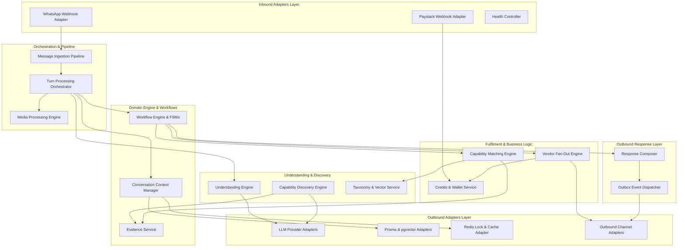

# MetaMarket High-Level Architecture & Component Specification

This document provides a detailed specification of all high-level components within the MetaMarket platform. Built on Hexagonal Architecture (Ports and Adapters) as defined in [ADR-001](ADR-001-Hexagonal-Architecture.md), the system decouples external communication channels, persistence providers, and AI platforms from pure domain logic.

---

## 1. System Architecture Overview

---

## 2. Detailed Component Specifications

### 2.1 Inbound Channel & Webhook Adapters

#### How It Works
The Inbound Channel Adapters act as the primary entry points for external event triggers into MetaMarket.
* **`WhatsAppWebhookAdapter`**: Listens for Meta Webhook HTTP `POST` requests. Performs mandatory HMAC SHA-256 signature verification against `x-hub-signature-256`. Converts heterogeneous raw payloads (text, images, audio, interactive button responses, message status updates) into canonical DTOs (`CanonicalIncomingMessage`). Returns an immediate `200 OK` response to Meta to prevent retry loops.
* **`PaystackWebhookAdapter`**: Listens for Paystack payment notification HTTP `POST` webhooks. Verifies the request signature (`x-paystack-signature`), extracts payment reference, deposit amount, and virtual account details, and routes the payment notification directly to the Wallet Service.
* **`HealthController`**: Provides standard HTTP `/health` liveness and readiness probes for infrastructure monitoring.

#### Direct Relationships
* **Upstream (Callers):**
  * Meta Graph API Webhook Infrastructure
  * Paystack Payment Webhook Infrastructure
* **Downstream (Invoked Targets):**
  * `MessageIngestionService` (for incoming communication turns)
  * `PaymentProcessorService` (for financial deposit webhooks)

#### Inputs & Outputs
* **Inputs:**
  * Meta Webhook Payload (HTTP Request Body + `x-hub-signature-256` header)
  * Paystack Webhook Payload (HTTP Request Body + `x-paystack-signature` header)
* **Outputs:**
  * HTTP `200 OK` / `401 Unauthorized` / `400 Bad Request`
  * `CanonicalIncomingMessage` DTO (passed to `MessageIngestionService`)
  * `PaymentWebhookPayload` DTO (passed to `PaymentProcessorService`)

---

### 2.2 Message Ingestion Pipeline (`MessageIngestionService`)

#### How It Works
The Message Ingestion Pipeline handles initial message receipt, validation, deduplication, and persistence before passing control to the turn orchestrator.
1. Receives `CanonicalIncomingMessage` from inbound channel adapters.
2. Invokes `MessageDeduplicationPort` (backed by Redis) to ensure duplicate webhook notifications (re-sent by providers during network latency) are silently dropped.
3. Persists the raw incoming message into PostgreSQL via `MessageRepositoryPort` for auditing and lineage tracking.
4. Forwards valid, non-duplicate messages to `TurnProcessorService`.

#### Direct Relationships
* **Upstream (Callers):**
  * `WhatsAppWebhookAdapter`
* **Downstream (Invoked Targets):**
  * `MessageDeduplicationPort` (Redis Adapter)
  * `MessageRepositoryPort` (Prisma Adapter)
  * `TurnProcessorService`

#### Inputs & Outputs
* **Inputs:**
  * `CanonicalIncomingMessage` (messageId, channel, senderId, recipientId, timestamp, messageType, rawPayload)
* **Outputs:**
  * `IngestionResult` (`DUPLICATE_SKIPPED`, `PROCESSED_SYNCHRONOUSLY`, `ENQUEUED_FOR_PROCESSING`)

---

### 2.3 Turn Processing Orchestrator (`TurnProcessorService`)

#### How It Works
The `TurnProcessorService` orchestrates the complete lifecycle of a single conversational turn in a deterministic, sequential manner:
1. **Lock Acquisition:** Acquires a Redis distributed lock (with fencing token) on the conversation ID to prevent concurrent race conditions across multiple incoming webhooks for the same user.
2. **Media Pre-Processing:** If the message contains audio (voice note) or image attachments, invokes `MediaProcessingService` to convert audio to text via Speech-to-Text (Whisper) or extract text from images via OCR.
3. **Context Loading:** Fetches or initializes the active `ConversationContext` via `ConversationContextManager`.
4. **NLU & Continuity Analysis:** Invokes `ContinuityAnalyzerService` to determine if the message continues an ongoing active workflow or triggers new intent resolution.
5. **Workflow Routing:** If a new intent is detected, invokes `IntentResolutionService` and `SemanticResolutionService` to select and route to the appropriate domain workflow state machine.
6. **Workflow Execution:** Invokes the active workflow state machine (e.g. `BuyerSearchWorkflow`, `VendorOnboardingWorkflow`) with the current input and context.
7. **Response & Event Dispatch:** Passes workflow output to `ResponseComposerService` and sends immediate notifications to `ChannelNotifierPort`.
8. **Lock Release:** Safely releases the Redis distributed lock.

#### Direct Relationships
* **Upstream (Callers):**
  * `MessageIngestionService`
* **Downstream (Invoked Targets):**
  * `LockPort` (Redis Lock Adapter)
  * `MediaProcessingService`
  * `ConversationContextManager`
  * `ContinuityAnalyzerService`
  * `IntentResolutionService`
  * `SemanticResolutionService`
  * `WorkflowEngine` / State Machines
  * `ResponseComposerService`
  * `ChannelNotifierPort`

#### Inputs & Outputs
* **Inputs:**
  * `CanonicalIncomingMessage`
* **Outputs:**
  * `TurnProcessingResult` (conversationId,ExecutedWorkflow, stateTransition, responseMessages, sideEffects)

---

### 2.4 Conversation Context Manager (`ConversationContextManager`)

#### How It Works
Manages loading, mutation, history buffer management, and persistence of the central `ConversationContext` domain aggregate root.
* Maintains user session state, short-term turn history memory, active workflow metadata, entity slot memory, and identity registries.
* Implements cache-aside state management using Redis for high-speed access and Prisma/PostgreSQL for persistent state storage.

#### Direct Relationships
* **Upstream (Callers):**
  * `TurnProcessorService`
  * Workflow State Machines (`BuyerSearchWorkflow`, `VendorOnboardingWorkflow`)
* **Downstream (Invoked Targets):**
  * `ConversationRepositoryPort` (Prisma Persistence Adapter)
  * `RedisCachePort` (Redis Cache Adapter)

#### Inputs & Outputs
* **Inputs:**
  * `channel`, `userId`, `conversationId`
  * State updates (new turn history, updated workflow state, mutated slots)
* **Outputs:**
  * `ConversationContext` aggregate object

---

### 2.5 Understanding Engine

#### How It Works
Comprises three specialized application services:
* **`ContinuityAnalyzerService`**: Analyzes incoming messages against the active workflow state machine. Uses rule-based keyword matching and short LLM checks to categorize messages into `CONTINUATION` (answering a pending workflow prompt), `EXPLICIT_COMMAND` (e.g. "cancel", "help", "restart"), or `NEW_INTENT`.
* **`IntentResolutionService`**: Leverages `LlmProviderPort` with structured output schemas to classify non-continuation utterances into domain intents (`BUYER_SEARCH`, `VENDOR_ONBOARDING`, `RECHARGE_CREDITS`, `ESCALATION`, `UNKNOWN`).
* **`SemanticResolutionService`**: Extracts structured parameters (product names, quantities, budget constraints, target locations) from raw text.

#### Direct Relationships
* **Upstream (Callers):**
  * `TurnProcessorService`
* **Downstream (Invoked Targets):**
  * `LlmProviderPort` (OpenAI / Gemini / Anthropic Adapters)
  * `ConversationContextManager`

#### Inputs & Outputs
* **Inputs:**
  * `CanonicalIncomingMessage`, current `ConversationContext`, `TurnHistory`
* **Outputs:**
  * `ContinuityAnalysisResult` (decision: `CONTINUATION` | `NEW_INTENT` | `COMMAND`)
  * `IntentResolutionResult` (intent: `DomainIntent`, confidence: `number`, parameters: `Record<string, any>`)
  * `SemanticResolutionResult` (normalizedQuery: `string`, entities: `EntitySlot[]`)

---

### 2.6 Media Processing Engine (`MediaProcessingService`)

#### How It Works
Handles asynchronous download, processing, and transcription of rich media attachments:
* **Voice Processing:** Downloads voice notes (e.g., OGG/Opus audio) via `MediaDownloaderRegistry` / S3 storage. Invokes OpenAI Whisper via `TranscriberPort` / `LlmProviderPort` to obtain text transcriptions.
* **Image Processing:** Downloads images, executes OCR processing to extract printed or handwritten text on product tags/receipts.
* Replaces or augments `CanonicalIncomingMessage.payload.text` with transcribed content before turn orchestration proceeds.

#### Direct Relationships
* **Upstream (Callers):**
  * `TurnProcessorService`
* **Downstream (Invoked Targets):**
  * `MediaDownloaderRegistry` / `S3StoragePort`
  * `TranscriberPort` / `LlmProviderPort`

#### Inputs & Outputs
* **Inputs:**
  * `MediaAttachment` (mediaId, mimeType, url/buffer)
* **Outputs:**
  * `MediaProcessingResult` (transcribedText: `string`, confidence: `number`, metadata: `Record<string, any>`)

---

### 2.7 Capability Discovery Engine (CDE)

#### How It Works
Extracts structured seller capability declarations ("Vendor DNA") from informal, unstructured conversational vendor interactions.
* **`CapabilityDiscoveryService`**: Analyzes multi-turn vendor conversations using structured LLM prompts. Identifies offered products/services, brands, price points, conditions, and delivery limits.
* **`BusinessUnderstandingService` & `OnboardingExtractionService`**: Extracts merchant business metadata (business name, location, operating hours).
* Emits discovered capability claims as structured events to the `EvidenceService`.

#### Direct Relationships
* **Upstream (Callers):**
  * `VendorOnboardingWorkflow`
  * `TurnProcessorService`
* **Downstream (Invoked Targets):**
  * `LlmProviderPort`
  * `EvidenceProcessorService`
  * `TaxonomySeederService`

#### Inputs & Outputs
* **Inputs:**
  * Vendor conversation turn history, vendor profile DTO
* **Outputs:**
  * `VendorDNA` model (capabilities: `CapabilityClaim[]`, businessMetadata: `VendorBusinessInfo`)
  * `EvidenceRecord` events emitted to `EvidenceProcessorService`

---

### 2.8 Evidence Service (`EvidenceProcessorService`, `EvidenceQueryService`)

#### How It Works
Functions as the immutable, event-sourced audit and reputation repository for vendor capabilities.
* **`EvidenceProcessorService`**: Ingests multi-source capability evidence (explicit merchant claims, transaction histories, successful buyer fulfillments, customer feedback). Computes capability confidence weights and trust scores.
* **`EvidenceQueryService`**: Exposes query interfaces for the matching engine to retrieve verified vendor capability profiles and evidence scores.

#### Direct Relationships
* **Upstream (Callers):**
  * `CapabilityDiscoveryService`
  * `CapabilityMatchingService`
  * `VendorResponseHandlerService`
* **Downstream (Invoked Targets):**
  * `EvidenceRepositoryPort` (Prisma / PostgreSQL Adapter)
  * `EventBusPort`

#### Inputs & Outputs
* **Inputs:**
  * `EvidenceRecord` (vendorId, capabilityId, evidenceType, confidenceWeight, metadata)
* **Outputs:**
  * Persisted `EvidenceRecord` database entity
  * `VerifiedVendorCapabilities` DTO (capability list with aggregate trust scores)

---

### 2.9 Taxonomy & Vector Service (`TaxonomySeederService`)

#### How It Works
Maintains standard product taxonomy based on the GS1 Global Product Classification (GPC) hierarchy (Segment $\rightarrow$ Family $\rightarrow$ Class $\rightarrow$ Brick $\rightarrow$ Attribute).
* Embeds GS1 Brick definitions into vector representations using `EmbeddingProviderPort`.
* Stores dense vector embeddings in PostgreSQL using `pgvector`.
* Provides vector search capabilities to resolve colloquial user search queries to normalized GS1 Bricks.

#### Direct Relationships
* **Upstream (Callers):**
  * `DemandUnderstandingService`
  * `CapabilityDiscoveryService`
* **Downstream (Invoked Targets):**
  * `EmbeddingProviderPort` (OpenAI / Gemini Embedding Adapters)
  * `TaxonomyRepositoryPort` (Prisma / pgvector Adapter)

#### Inputs & Outputs
* **Inputs:**
  * GS1 GPC JSON taxonomy definition, search text string
* **Outputs:**
  * High-dimensional vector embeddings (`number[]`)
  * Matched `TaxonomyBrickMatch` (brickCode, brickTitle, similarityScore)

---

### 2.10 Capability Matching Engine (CME)

#### How It Works
Executes structured and semantic multi-stage vendor matching to fulfill buyer search requests.
1. **`DemandUnderstandingService`**: Translates buyer request text into a structured `SearchDemandSpec` (target GS1 Brick, attributes, price range, geo-location).
2. **`CapabilityMatchingService`**: Executes a 4-stage retrieval pipeline:
   * **Stage 1 (Vector Search):** Performs cosine similarity search over `pgvector` vendor capability embeddings.
   * **Stage 2 (Geo-Spatial Filtering):** Filters candidate vendors by physical location and delivery distance.
   * **Stage 3 (Evidence & Trust Lookup):** Fetches verified trust scores from `EvidenceQueryService`.
   * **Stage 4 (Multi-Factor Ranking):** Scores candidates using weighted ranking (vector relevance + trust score + response history rating). Returns top candidate vendors for fan-out.

#### Direct Relationships
* **Upstream (Callers):**
  * `BuyerSearchWorkflow`
* **Downstream (Invoked Targets):**
  * `DemandUnderstandingService`
  * `EvidenceQueryService`
  * `TaxonomyRepositoryPort` / `VectorSearchPort`

#### Inputs & Outputs
* **Inputs:**
  * Raw buyer query string, buyer geo-location DTO, search filters
* **Outputs:**
  * `SearchDemandSpec` DTO
  * Ranked list of `MatchingVendorResult` (vendorId, matchScore, trustScore, distanceKm, matchExplanation)

---

### 2.11 Workflow Engine & State Machines

#### How It Works
Executes deterministic finite state machines (FSM) governing domain workflows.
* **`BuyerSearchWorkflow`**: Manages state progression (`TRIAGE` $\rightarrow$ `PRODUCT_SPECIFICATION` $\rightarrow$ `MATCHING_AND_FANOUT` $\rightarrow$ `RESPONSE_DELIVERY` $\rightarrow$ `COMPLETED`).
* **`VendorOnboardingWorkflow`**: Manages merchant onboarding state machine (`DISCOVERY` $\rightarrow$ `CAPABILITY_EXTRACTION` $\rightarrow$ `VERIFICATION` $\rightarrow$ `ONBOARDED`).
* **`CreditsRechargeWorkflow`**: Manages top-up flow, virtual bank account allocation, deposit confirmation, and balance update states.
* **`WorkflowExpirySweeper`**: Background sweeper process that periodically scans for abandoned workflows and transitions them to expired states.

#### Direct Relationships
* **Upstream (Callers):**
  * `TurnProcessorService`
  * `WorkflowExpirySweeper`
* **Downstream (Invoked Targets):**
  * `CapabilityMatchingService`
  * `RequestDistributionService`
  * `WalletService`
  * `ConversationContextManager`

#### Inputs & Outputs
* **Inputs:**
  * `CanonicalIncomingMessage`, active `ConversationContext`
* **Outputs:**
  * `WorkflowStepResult` (nextState: `WorkflowState`, responseTemplates: `CanonicalResponse[]`, sideEffectEvents: `DomainEvent[]`)

---

### 2.12 Vendor Fan-Out & Order Fulfilment Engine

#### How It Works
Distributes buyer search requests to candidate sellers and processes seller replies.
* **`RequestDistributionService`**: Takes buyer `SearchDemandSpec` and top candidate vendors from CME. Checks each vendor's wallet balance via `WalletService`. Deducts fan-out credit fees. Dispatches formatted request cards to selected vendors via `VendorFanOutNotifier`.
* **`VendorResponseHandler`**: Intercepts inbound vendor quotes (e.g. price, availability confirmation), verifies vendor authorization, correlates responses with active buyer requests, and updates buyer conversation context.

#### Direct Relationships
* **Upstream (Callers):**
  * `BuyerSearchWorkflow`
  * `TurnProcessorService` (for incoming vendor responses)
* **Downstream (Invoked Targets):**
  * `WalletService`
  * `VendorFanOutNotifier`
  * `EvidenceProcessorService`
  * `ChannelNotifierPort`

#### Inputs & Outputs
* **Inputs:**
  * `SearchDemandSpec`, candidate `MatchingVendorResult[]`, incoming vendor response message
* **Outputs:**
  * `FanOutSummary` (vendorsNotifiedCount, creditsDeductedTotal, fanOutBatchId)
  * Formatted quote message delivered to buyer context

---

### 2.13 Credits & Wallet Service (Konnet Credits)

#### How It Works
Provides financial ledger management and credit accounting for merchant operations.
* **`WalletService`**: Manages virtual wallet balances, atomic credit grants (e.g., onboarding bonus credits), lead fee deductions, and ledger audits. Enforces non-negative balance constraints.
* **`PaymentProcessorService`**: Receives Paystack bank transfer webhook notifications. Matches payment reference or virtual account number to vendor identity. Credits vendor wallet with exactly-once settlement guarantees.
* **`WalletNotifier`**: Composes and dispatches WhatsApp notification cards confirming credit recharges.

#### Direct Relationships
* **Upstream (Callers):**
  * `PaystackWebhookAdapter`
  * `RequestDistributionService`
  * `CreditsRechargeWorkflow`
  * `WalletOnboardingGrantListener`
* **Downstream (Invoked Targets):**
  * `WalletRepositoryPort` (Prisma / PostgreSQL Adapter)
  * `ChannelNotifierPort`
  * `PaystackApiAdapter`

#### Inputs & Outputs
* **Inputs:**
  * `PaymentWebhookPayload`
  * Credit deduction request (vendorId, amount, transactionType, referenceId)
* **Outputs:**
  * `WalletAccount` DTO
  * `TransactionResult` (success: `boolean`, ledgerId: `string`, newBalance: `number`)
  * WhatsApp credit confirmation notification

---

### 2.14 Response Composer & Outbox Dispatcher

#### How It Works
Ensures reliable, channel-specific response formatting and outbox delivery.
* **`ResponseComposerService`**: Maps internal domain response DTOs (`CanonicalResponse`) into channel-native structures (WhatsApp interactive list messages, button cards, plain text, or voice synthesis scripts).
* **Transactional Outbox Dispatcher**: Writes outgoing message payloads into a database `outbox` table within the same transaction as conversation state updates. A background worker picks up outbox records and delivers them to `ChannelNotifierPort`, ensuring at-least-once outbound message delivery.

#### Direct Relationships
* **Upstream (Callers):**
  * `TurnProcessorService`
  * `VendorFanOutNotifier`
  * `WalletNotifier`
* **Downstream (Invoked Targets):**
  * `OutboxRepositoryPort` (Prisma Adapter)
  * `ChannelNotifierPort` (WhatsApp / Twilio Adapters)

#### Inputs & Outputs
* **Inputs:**
  * `CanonicalResponse` (templateId, templateData, recipientChannel, recipientId)
* **Outputs:**
  * Persisted `OutboxRecord` entity
  * Outbound HTTP payload dispatched to channel provider API

---

### 2.15 Outbound Infrastructure Adapters

#### How It Works
Implements driven ports defined by the domain core, insulating application logic from specific third-party APIs and infrastructure details.
* **LLM Provider Adapters (`OpenAiLlmAdapter`, `GeminiLlmAdapter`, `AnthropicLlmAdapter`)**: Implement `LlmProviderPort`. Provide automatic provider failover (OpenAI $\rightarrow$ Gemini $\rightarrow$ Anthropic) upon API errors or rate limits.
* **Persistence Adapters (`PrismaConversationRepository`, `PrismaEvidenceRepository`, `PrismaWalletRepository`)**: Implement database repository ports using Prisma ORM over PostgreSQL and `pgvector`.
* **Lock & Cache Adapter (`RedisLockAdapter`, `RedisCacheAdapter`)**: Implements `LockPort` using Redis Redlock algorithms and fencing tokens for concurrency control.
* **Outbound Channel Adapters (`WhatsAppNotifierAdapter`, `TwilioVoiceAdapter`)**: Implement `ChannelNotifierPort` to dispatch HTTP API calls to Meta Graph API or Twilio API.

#### Direct Relationships
* **Upstream (Callers - Driven Ports):**
  * `LlmProviderPort`
  * `ConversationRepositoryPort`
  * `EvidenceRepositoryPort`
  * `WalletRepositoryPort`
  * `LockPort`
  * `ChannelNotifierPort`
* **Downstream (External Cloud & Middleware Services):**
  * OpenAI API / Google Gemini API / Anthropic Claude API
  * Meta WhatsApp Graph API / Twilio Gateway API
  * Paystack Payment Gateway API
  * PostgreSQL DB (`pgvector`)
  * Redis Cluster

#### Inputs & Outputs
* **Inputs:**
  * Method calls on driven interface ports with canonical domain parameters
* **Outputs:**
  * Raw external API payloads, database query results, locks, network execution statuses

---

## 3. Component Interaction Matrix

| Source Component | Destination Component | Relationship Type | Trigger / Mechanism | Passed Payload / Data DTO | Returned Result |
|---|---|---|---|---|---|
| **WhatsApp Webhook Adapter** | **Message Ingestion Pipeline** | Direct Synchronous Call | HTTP Webhook POST Ingestion | `CanonicalIncomingMessage` | `IngestionResult` |
| **Paystack Webhook Adapter** | **Credits & Wallet Service** | Direct Synchronous Call | Bank Transfer Webhook POST | `PaymentWebhookPayload` | `TransactionResult` |
| **Message Ingestion Pipeline** | **Turn Processing Orchestrator** | Direct Synchronous Call | Valid Non-Duplicate Message | `CanonicalIncomingMessage` | `TurnProcessingResult` |
| **Turn Processing Orchestrator** | **Media Processing Engine** | Direct Synchronous Call | Incoming Voice/Image Media | `MediaAttachment` | `MediaProcessingResult` |
| **Turn Processing Orchestrator** | **Conversation Context Manager** | Direct Synchronous Call | Turn Lifecycle Start/End | `conversationId`, updates | `ConversationContext` aggregate |
| **Turn Processing Orchestrator** | **Understanding Engine** | Direct Synchronous Call | Intent & Semantic Extraction | `CanonicalIncomingMessage` | `Continuity` / `Intent` / `Semantic` DTOs |
| **Turn Processing Orchestrator** | **Workflow Engine (FSM)** | Direct Synchronous Call | Executing Active Workflow | `CanonicalIncomingMessage`, `Context` | `WorkflowStepResult` |
| **Buyer Search Workflow** | **Capability Matching Engine** | Direct Synchronous Call | Buyer Product Request State | Search text, location | Ranked `MatchingVendorResult[]` |
| **Capability Matching Engine** | **Taxonomy & Vector Service** | Direct Synchronous Call | Query Embedding & Vector Search | Query string | `TaxonomyBrickMatch[]` |
| **Capability Matching Engine** | **Evidence Service** | Direct Synchronous Call | Vendor Trust Lookup | `vendorId[]` | `VerifiedVendorCapabilities` |
| **Buyer Search Workflow** | **Vendor Fan-Out Engine** | Direct Synchronous Call | Match Execution State | Demand spec, matched vendors | `FanOutSummary` |
| **Vendor Fan-Out Engine** | **Credits & Wallet Service** | Direct Synchronous Call | Fan-out Fee Deduction | `vendorId`, fee amount | Ledger deduction status |
| **Vendor Onboarding Workflow** | **Capability Discovery Engine** | Direct Synchronous Call | Merchant Chat Interaction | Vendor turn history | `VendorDNA` |
| **Capability Discovery Engine** | **Evidence Service** | Direct Async / Event | Claim Evidence Generation | `EvidenceRecord` | Persisted evidence ID |
| **Turn Processing Orchestrator** | **Response Composer** | Direct Synchronous Call | Turn Completion | `CanonicalResponse` | Outbox entity / Dispatched status |
| **Response Composer / Outbox** | **Outbound Channel Adapters** | Direct Delivery Call | Message Dispatch | Formatted channel payload | Remote API response status |
