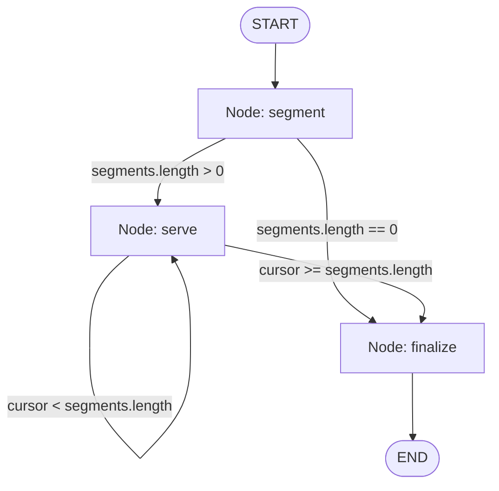
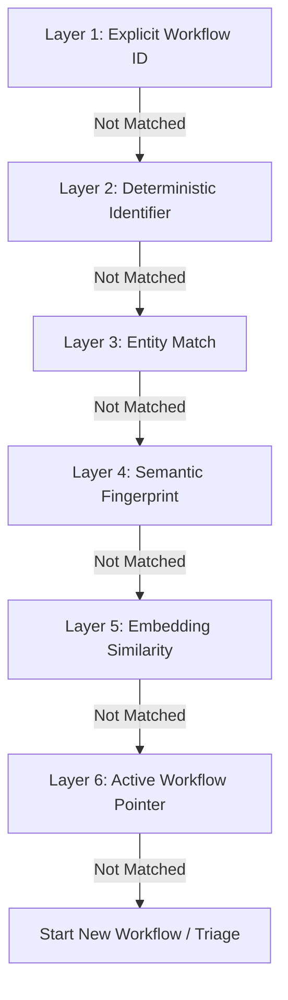
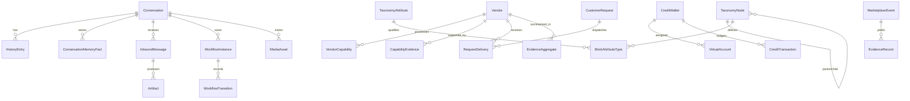
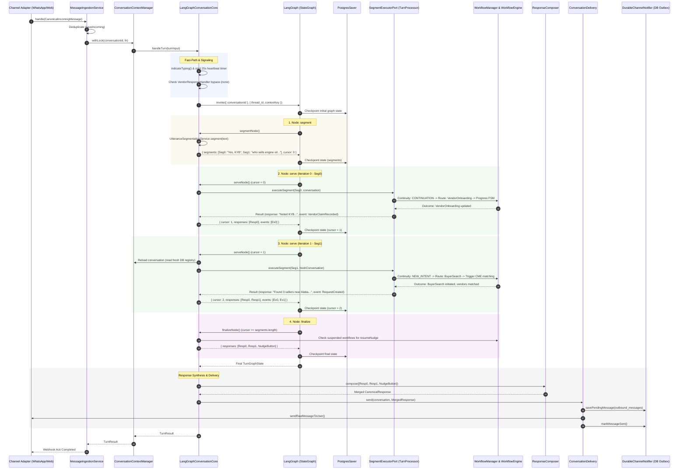

# MetaMarket Backend High-Level Architecture

**Branch:** `mcos-langgraph`  
**Scope:** Backend Architecture Only  
**Target Audience:** Platform Architects, AI & Backend Engineers, Distributed Systems Engineers  
**Related Documents:**
- [ADR-001: Hexagonal Architecture](ADR-001-Hexagonal-Architecture.md)
- [MCOS & LangGraph Integration Design](../design/MCOS-LangGraph-Integration.md)
- [Multi-Channel Conversation OS TDR](../design/Multi-Channel-Conversation-OS.md)
- [Conversation Core Comparison TDR](../design/Conversation-Core-Comparison-TDR.md)

---

## 1. Architectural Philosophy & Overview

MetaMarket is an enterprise conversational operating system designed for informal commerce. Buyers and sellers transact naturally via channels like WhatsApp and Web chat in noisy, unstructured, multi-intent conversations. Rather than treating conversational AI as a monolithic chatbot, MetaMarket implements a **Hexagonal (Ports and Adapters) Architecture** as codified in [ADR-001](ADR-001-Hexagonal-Architecture.md).

The backend cleanly segregates pure domain business logic from external messaging channels, persistence stores, AI providers, and asynchronous messaging queues.

### 1.1 The Dual-Substrate Core

On the `mcos-langgraph` branch, the backend is organized into two cooperating architectural substrates:

1. **MCOS (Multi-Channel Conversation Operating System)**: The execution substrate, domain state owner, and platform infrastructure. MCOS owns user identity across channels, distributed conversation concurrency locking, media processing pipelines, database-backed workflow and conversation persistence, multi-provider LLM failover, capability discovery/matching engines, financial wallets, and durable message delivery.
2. **LangGraph (`@langchain/langgraph`)**: The turn plan supervisor. Positioned behind the inbound `ConversationCorePort`, LangGraph models the discrete turn execution lifecycle as a checkpointed, stateful directed graph (`StateGraph`). It sequences utterance segmentation, iterative segment execution against MCOS's workflow engine, and post-turn resume/nudge synthesis.

```
> "The platform is not a chatbot. It is a Conversation Operating System." — MCOS TDR §25
```

---

## 2. System Architecture Diagram

```mermaid
graph TD
    subgraph Inbound Adapters Layer
        WA_IN[WhatsApp Webhook Controller]
        WEB_IN[Web Channel Controller]
        PAY_IN[Paystack Webhook Controller]
        HEALTH[Health Controller]
    end

    subgraph Concurrency & Message Ingestion
        INGEST[MessageIngestionService]
        REDIS_LOCK[(Redis Distributed Mutex)]
        MEDIA_Q[BullMQ Media Queue]
        MEDIA_WORKER[MediaProcessingProcessor]
    end

    subgraph Conversation Core Seam [Inbound Port: ConversationCorePort]
        LG_CORE[LangGraphConversationCore]
        CHECKPOINTER[(TurnCheckpointer / PostgresSaver)]
    end

    subgraph Turn Execution Seam [Outbound Port: SegmentExecutorPort]
        TURN_PROC[TurnProcessor]
    end

    subgraph MCOS Understanding & Workflow Subsystem
        SEGMENTER[UtteranceSegmentationService]
        CONTINUITY[ConversationContinuityAnalyzer]
        INTENT[IntentResolutionService]
        SEMANTIC[SemanticResolutionService]
        WFM[WorkflowManager - 6 Discovery Layers]
        POLICY[ConversationPolicyEngine]
        WFE[WorkflowEngine - State Machine FSM]
        CTX[ConversationContextManager]
    end

    subgraph Domain Capabilities & Market Subsystems
        CDE[Capability Discovery Engine]
        CME[Capability Matching Engine]
        EVIDENCE[Evidence Service & Raw Event Store]
        TAXONOMY[GS1 GPC Taxonomy & Vector Seeder]
        FULFIL[Request Distribution & Vendor Fan-Out]
        WALLET[Konnet Credits Wallet & DVA Ledger]
    end

    subgraph Outbound Delivery Subsystem
        COMPOSER[ResponseComposer]
        SUGGESTIONS[SuggestedActionsService]
        DELIVERY[ConversationDelivery]
        DURABLE_NOTIFIER[DurableChannelNotifier]
        OUTBOX_REPO[(Prisma OutboundMessage Repo)]
        OUTBOX_RELAY[OutboxRelay & Event Publisher]
    end

    subgraph Outbound Infrastructure Adapters
        LLM_FAILOVER[LLM Provider Service - DeepSeek / Claude / OpenAI]
        CIRCUIT[Circuit Breakers]
        POSTGRES[(PostgreSQL + pgvector)]
        REDIS[(Redis Cache & Queues)]
        S3[(S3 / MinIO Media Store)]
        CHANNEL_OUT[WhatsApp / Twilio SMS / WebStreamHub Notifiers]
    end

    WA_IN --> INGEST
    WEB_IN --> INGEST
    PAY_IN --> WALLET
    INGEST --> REDIS_LOCK
    INGEST --> MEDIA_Q
    MEDIA_Q --> MEDIA_WORKER
    MEDIA_WORKER --> INGEST

    INGEST -->|handleTurn| LG_CORE
    LG_CORE <--> CHECKPOINTER
    LG_CORE --> SEGMENTER
    LG_CORE -->|executeSegment| TURN_PROC

    TURN_PROC --> CONTINUITY
    TURN_PROC --> INTENT
    TURN_PROC --> SEMANTIC
    TURN_PROC --> WFM
    TURN_PROC --> POLICY
    TURN_PROC --> WFE
    TURN_PROC --> CTX

    WFE --> CDE
    WFE --> CME
    WFE --> FULFIL
    WFE --> WALLET

    CDE --> TAXONOMY
    CDE --> EVIDENCE
    CME --> TAXONOMY
    CME --> EVIDENCE
    FULFIL --> WALLET
    FULFIL --> CHANNEL_OUT

    LG_CORE --> COMPOSER
    LG_CORE --> SUGGESTIONS
    LG_CORE --> DELIVERY
    DELIVERY --> DURABLE_NOTIFIER
    DURABLE_NOTIFIER --> OUTBOX_REPO
    DURABLE_NOTIFIER --> CHANNEL_OUT
    DELIVERY --> OUTBOX_RELAY

    CONTINUITY --> LLM_FAILOVER
    INTENT --> LLM_FAILOVER
    SEMANTIC --> LLM_FAILOVER
    CDE --> LLM_FAILOVER
    CME --> LLM_FAILOVER
    LLM_FAILOVER --> CIRCUIT

    CTX --> POSTGRES
    CTX --> REDIS
    EVIDENCE --> POSTGRES
    TAXONOMY --> POSTGRES
    WALLET --> POSTGRES
    OUTBOX_REPO --> POSTGRES
    OUTBOX_RELAY --> POSTGRES
```



---

## 3. Core Architectural Tenets & State Ownership

### 3.1 The Single State Owner Principle (No Split-Brain)

A crucial architectural principle on this branch is **strict segregation of state ownership**. LangGraph and MCOS never compete for or duplicate state:

| State Dimension | Authoritative Owner | Persistence Engine | Lifecycle & Rationale |
| :--- | :--- | :--- | :--- |
| **In-Flight Turn Graph Position** | **LangGraph** | Postgres Checkpointer (`PostgresSaver`) | Transient. Owns the graph `cursor`, `segments`, and turn-local partial responses. Discarded when the turn completes. Keyed by `thread_id: ${conversation.id}:${message.id}` so state never bleeds across turns. |
| **Conversation Aggregate & History** | **MCOS** | PostgreSQL (`conversations`, `history_entries`, `inbound_messages`, `conversation_memory_facts`) | Permanent. Cross-channel user identity, message deduplication, conversation memory facts, and rolling conversation summaries. |
| **Workflow Registry & Active Pointer** | **MCOS** | PostgreSQL (`workflow_instances`, `workflow_transitions`) | Permanent. Manages active/suspended workflow lifecycles, slot data (`importantEntities`, `data`), and transition audit logs. |
| **Non-Serializable Turn Context** | **Bridge Map** | In-memory `Map<string, TurnContext>` | Transient. Bridges live DB connections, Date instances, and domain classes around the PostgreSQL checkpointer. Deleted in a `finally` block on turn completion. |
| **Marketplace Capabilities & Evidence** | **MCOS** | PostgreSQL (`vendors`, `vendor_capabilities`, `marketplace_events`, `evidence_aggregates`) | Permanent. Vendor DNA, canonical capabilities, Bayesian trust scores, and immutable event lineage. |
| **Financial Ledger & DVA Accounts** | **MCOS** | PostgreSQL (`credit_wallets`, `virtual_accounts`, `credit_transactions`, `payment_notifications`) | Permanent. Double-entry virtual credit transactions, Paystack virtual account mappings, and balance records. |

### 3.2 Sequential Cursor Execution vs. Fan-Out

LangGraph provides a `Send()` API for parallel subgraph branching. In MetaMarket, parallel graph execution for compound utterances is **explicitly prohibited**:

- **The Problem**: User utterances with multiple requests (e.g., *"Yes, KYB. Also who sells engine oil near Alaba?"*) are not orthogonal. Segment 1 completes a step in an existing workflow (`VendorOnboarding`), mutating the registry. Segment 2 initiates a new search (`BuyerSearch`).
- **The Failure Mode of Fan-Out**: Running segments concurrently via `Send()` causes race conditions: Segment 2 routes against stale workflow registry state before Segment 1 commits, leading to corrupted active workflow pointers or duplicate workflow instances.
- **The Solution**: LangGraph executes an iterative sequential cursor loop (`segment` $\rightarrow$ `serve` $\rightarrow$ `serve` $\rightarrow$ `finalize`). If `cursor > 0`, `serveNode` reloads the `Conversation` aggregate from PostgreSQL via `context.load()`, guaranteeing that Segment $N+1$ observes the exact database state committed by Segment $N$.

---

## 4. Backend Subsystem Specifications

### 4.1 Inbound Channel Adapters Layer

Located in `src/adapters/inbound/`. Translates external transport payloads into canonical domain aggregates without exposing channel nuances to business logic.

- **`WhatsAppWebhookController`**:
  - Listens for Meta Cloud API webhook events.
  - Enforces mandatory HMAC SHA-256 signature verification via `x-hub-signature-256`.
  - Normalizes heterogeneous payloads (text, audio, image, interactive list replies, button taps) into `CanonicalIncomingMessage`.
  - Returns an immediate HTTP `200 OK` to prevent Meta webhook delivery retry loops.
- **`WebChannelController`**:
  - Exposes REST endpoints for web client interactions (`/channels/web/message`).
  - Manages web session-to-user identity mapping and SSE stream initialization.
- **`PaystackWebhookController`**:
  - Ingests Paystack payment webhooks for Konnet Credits top-ups.
  - Verifies HMAC SHA-512 signatures (`x-paystack-signature`).
  - Extracts dedicated virtual account deposits, passing normalized DTOs directly to the `WalletService`.
- **`HealthController`**:
  - Standard HTTP `/health` probe reporting DB connectivity, Redis health, and uptime.

### 4.2 Message Ingestion & Distributed Concurrency

Located in `src/application/pipeline/message-ingestion.service.ts`.

1. **Identity & Conversation Resolution**: Maps channel addresses (normalised E.164 phone numbers or web session IDs) to the root `Conversation` aggregate via `ConversationContextManager`.
2. **Idempotent Deduplication**: Persists messages via `MessageRepositoryPort.saveIncoming()`. Backed by a database unique constraint on `providerMessageId`. If a duplicate delivery is received, it is silently dropped to prevent duplicate processing or billing.
3. **Asynchronous Media Offloading**:
   - If an incoming message contains voice notes or image attachments, `MessageIngestionService` enqueues media jobs into BullMQ (`MediaProcessingQueuePort`) without blocking the webhook request.
   - Text artifacts already present inline are extracted immediately.
   - When the media processor finishes transcription (Whisper) or OCR (Vision), it invokes `resumeAfterMedia(messageId)` to resume the turn under full locking.
4. **Distributed Mutex Locking**:
   - Every conversational turn executes inside `context.withLock(conversationId, fn)`.
   - Backed by `RedisDistributedLockAdapter` using Redis locks with fencing tokens and lease expirations.
   - Prevents race conditions from horizontal scaling or rapid consecutive user messages. If a lock cannot be acquired, a friendly lock-failure fallback message is delivered.

---

### 4.3 LangGraph Turn Supervisor Core

Located in `src/application/langgraph/`. Implements `ConversationCorePort`.



- **`LangGraphConversationCore`**:
  - **Fast-Path Bypass**: Before graph invocation, checks `VendorResponseHandler.tryHandle()`. Inbound vendor RFQ replies (button taps or price quotes) bypass LLM segmentation and graph compilation entirely, reducing response latency from ~3500ms to <150ms.
  - **Proactive Signaling**: Dispatches typing indicators (`indicateTyping()`) and schedules a 25-second heartbeat timer (`REQ-TS-003`). If graph execution exceeds 25 seconds, an interim empathetic message is automatically sent to the user.
  - **State Graph Compilation**: Lazily compiles `buildTurnGraph()` with `TurnCheckpointer` (`PostgresSaver`) on first use to prevent dependency injection order issues.
  - **`segmentNode`**: Invokes `UtteranceSegmentationService`. If an interactive button was clicked (`interactivePayload !== null`), returns a single segment to preserve button attribution.
  - **`serveNode`**: Retrieves current segment by `cursor`. If `cursor > 0`, reloads `Conversation` from Postgres. Calls `SegmentExecutorPort.executeSegment()`. Appends responses and domain events, and increments `cursor`.
  - **`finalizeNode`**: Checks if the turn concluded with no active workflow while suspended workflows remain in the registry. If so, attaches a contextual `resumeNudge` interactive button.
  - **Post-Graph Synthesis**: Passes accumulated responses to `ResponseComposer`, augments with `SuggestedActionsService`, clears terminal workflow pointers, and delivers via `ConversationDelivery`.

- **`turn-graph.state.ts` (`TurnGraphState`)**:
  - `conversationId`: string.
  - `segments`: readonly `GraphSegment[]` (ordered clauses).
  - `cursor`: number (execution pointer).
  - `responses`: readonly `Response[]` (accumulated replies).
  - `events`: readonly `DomainEvent[]` (accumulated side-effect events).
  - `lastWorkflowId`: string | null.
  - `failed`: boolean (error containment flag).
  - `unroutable`: string | null.

---

### 4.4 Per-Segment Pipeline & Understanding Engine

Located in `src/application/pipeline/turn-processor.service.ts` and `src/application/understanding/`.

`TurnProcessor` implements `SegmentExecutorPort` to execute individual segments dispatched by LangGraph:

1. **System Action Decoding**: Checks if the segment represents an encoded platform button tap (`resolveSystemAction`). If matched, sets high-confidence intent directly.
2. **Continuity Analysis (`ConversationContinuityAnalyzer`)**:
   - Evaluates whether the utterance continues the active workflow, resumes a suspended workflow, starts a new workflow, or represents a topic shift/clarification.
   - Uses deterministic keyword and state checks first; falls back to LLM evaluation only when ambiguous.
3. **Intent & Semantic Resolution**:
   - **`IntentResolutionService`**: When starting a new workflow, classifies intent using structured LLM outputs. Prompts are constrained to valid registered workflow triggers (`startingIntents`).
   - **`SemanticResolutionService`**: Normalizes slot values, extracts entities (products, brands, quantities, locations), and produces clean domain parameters.

---

### 4.5 6-Layer Workflow Discovery Engine

Located in `src/domain/workflows/workflow-manager.ts`.

When an utterance is not a simple continuation of the active workflow, `WorkflowManager` resolves the appropriate target workflow instance using six hierarchical discovery layers:



1. **Layer 1: Explicit Workflow ID**: Checks decoded interactive button payloads (`encodeActionPayload`). If an action references an active or resumable workflow, routing resumes it immediately.
2. **Layer 2: Deterministic Identifier**: Matches quoted order numbers, reference codes, or tracking IDs against `importantEntities` stored on active/suspended workflows.
3. **Layer 3: Entity Match**: Compares extracted entities from the turn against domain entities actively tracked by open workflows.
4. **Layer 4: Semantic Fingerprint**: Evaluates lexical overlap and keyword Jaccard similarity against workflow `semanticFingerprint` metadata (`MIN_FINGERPRINT_SCORE = 0.5`).
5. **Layer 5: Embedding Similarity**: Generates text embeddings of the user utterance and executes cosine vector distance checks against stored workflow fingerprint embeddings in `pgvector` (`MIN_EMBEDDING_SIMILARITY = 0.82`).
6. **Layer 6: Active Workflow Pointer**: If all prior layers yield no match and the analyzer detected continuity, falls back to the currently focused workflow pointer.

#### Workflow Policy & Engine
- **`ConversationPolicyEngine`**: Enforces rules on maximum concurrent suspended workflows (pruning oldest suspended instances via FIFO policy) and validates state transition legality.
- **`WorkflowEngine`**: Executes pure, deterministic finite state machine (FSM) transitions. AI is restricted to parameter extraction; it never directly decides state transitions.
- **`WorkflowExpirySweeper`**: A scheduled background task that transitions abandoned or timed-out workflows to terminal states (`cancelled` or `expired`).

---

### 4.6 Domain Workflows

Located in `src/domain/workflows/definitions/`:

- **`VendorOnboardingWorkflow`**:
  - Manages merchant onboarding: business name collection, geographic location resolution, catalog/inventory extraction, capability DNA generation, and initial free credit balance provisioning.
- **`BuyerSearchWorkflow`**:
  - Manages buyer part/product searches: demand parsing, GS1 GPC category resolution, vendor matching via CME, visibility fee deductions, immediate top-vendor presentation, and async vendor fan-out.
- **`CreditRechargeWorkflow`**:
  - Manages wallet funding: generates Paystack Dedicated Virtual Account (DVA) payment instructions, provides account numbers, and guides the user through bank transfer top-up.
- **`PlatformInfoWorkflow`**:
  - Answers platform rules, pricing, terms of service, and informational FAQs without disrupting or resetting commercial workflows.
- **`TriageWorkflow`**:
  - Fallback workflow for unroutable utterances, greetings, or human escalation requests.

---

### 4.7 Capability Discovery Engine (CDE)

Located in `src/application/capability/`. Extracts structured merchant capability profiles ("Vendor DNA") from informal conversational text.

- **Taxonomy Seeder (`TaxonomySeeder`)**:
  - Ingests and maintains the GS1 Global Product Classification (GPC) hierarchy: Segment (1) $\rightarrow$ Family (2) $\rightarrow$ Class (3) $\rightarrow$ Brick (4) $\rightarrow$ Attribute (5) $\rightarrow$ Value (6).
  - Pre-computes and indexes 1536-dimensional OpenAI embeddings for all active Brick nodes into PostgreSQL with `pgvector`.
- **`CapabilityResolver`**:
  - Maps informal merchant claims (e.g., *"I sell shock absorbers and brake pads"*) into canonical GS1 Brick codes.
  - Uses **Hybrid Retrieval**: Fuses dense vector cosine similarity (`pgvector`) with lexical full-text search (`tsvector` with Reciprocal Rank Fusion) to prevent vocabulary mismatch while preserving exact terminology matches.
- **Service Registry (`ServiceCapabilityRepository`)**:
  - Since GS1 GPC only categorizes physical goods, service capabilities (e.g., *"generator repair"*, *"panel beating"*) are resolved against a canonical service registry using semantic vector deduplication.
- **`CapabilityPromotionSubscriber`**:
  - Automatically elevates inferred capability confidence scores when confirmed by operational evidence.

---

### 4.8 Capability Matching Engine (CME)

Located in `src/application/matching/`. Discovers and ranks candidate vendors to fulfill buyer demand.

1. **`DemandUnderstandingService`**: Decomposes buyer queries into a structured `SearchDemandSpec` (canonical GS1 Brick, brand constraints, condition, quantity, buyer city/state).
2. **`CapabilityMatchingService` Pipeline**:
   - **Stage 1 (Vector Candidate Retrieval)**: Queries `vendor_capabilities` and `vendors.dna_embedding` using cosine distance in `pgvector` to find candidate merchants.
   - **Stage 2 (Geo-Spatial Filtering)**: Filters candidates based on proximity, city, state, or delivery capabilities.
   - **Stage 3 (Evidence Trust Score Injection)**: Fetches historical reliability metrics from `EvidenceQueryService`.
   - **Stage 4 (Multi-Factor Scoring & Ranking)**: Computes an explainable composite match score:
     $$\text{Score} = w_1 \cdot \text{SemanticRelevance} + w_2 \cdot \text{EvidenceScore} + w_3 \cdot \text{ResponseRate} - w_4 \cdot \text{DistancePenalty}$$

---

### 4.9 Evidence Service

Located in `src/application/evidence/`. Functions as the permanent, immutable behavioral audit and reputation engine.

- **`MarketplaceEvent`**: Immutable raw event log capturing every commercial occurrence (`request.distributed`, `request.accepted`, `request.rejected`, `quote.submitted`, `transaction.completed`, `customer.rated`).
- **`EvidenceProcessor`**: Background worker that continuously consumes unprocessed `MarketplaceEvent` records and derives granular `EvidenceRecord` signals (+1 positive, -1 negative, with latency and rating metrics).
- **`EvidenceAggregate`**: Materialized rollups of merchant performance per capability and overall. Applies Dirichlet / Bayesian small-sample corrections so a merchant with 1 response out of 1 is not ranked higher than a verified merchant with 98 responses out of 100.
- **`EvidenceQueryService`**: Clean query interface consumed by CME for ranking.

---

### 4.10 Fulfilment & Vendor Fan-Out Engine

Located in `src/application/fulfilment/`. Orchestrates demand distribution to candidate sellers.

- **`RequestDistributionService`**:
  - Implements **Dual Visibility Rules**:
    1. **Immediate Delivery**: Top-ranked matching vendors (up to configured threshold) are shown to the buyer immediately.
    2. **Fan-Out Leg**: Requests are dispatched asynchronously to remaining candidate vendors via WhatsApp/Web RFQ cards.
  - **Lead Fee Debiting**: Charges vendors visibility fees from their `CreditWallet` upon dispatch.
  - **Selective Disclosure**: Non-immediate vendors become visible to the buyer only once they explicitly respond with an acceptance or price quote.
- **`VendorFanoutNotifier`**: Formats and dispatches actionable RFQ push messages to vendors containing interactive quote/pass buttons.
- **`VendorResponseHandler`**: Intercepts vendor RFQ quote responses, verifies quotes, links them back to open `CustomerRequest` records, and updates the buyer's conversation.

---

### 4.11 Credits & Wallet Subsystem (Konnet Credits)

Located in `src/application/wallet/`. Provides financial ledger accounting and Paystack payment handling.

- **Dedicated Virtual Accounts (DVA)**:
  - Every user/vendor is provisioned a permanent, dedicated virtual bank account via `PaystackClientAdapter`.
  - Stored in `virtual_accounts` with provider references for idempotent allocation.
- **`WalletService`**:
  - Manages `credit_wallets` and immutable `credit_transactions` ledgers.
  - Supports atomic operations: credit top-ups, visibility fee deductions, onboarding bonus grants, and balance inquiries.
  - Guarantees non-negative balances.
- **`PaymentProcessorService`**:
  - Processes verified Paystack bank transfer webhook notifications.
  - Enforces **Exactly-Once Crediting**: Uses database unique constraints on `PaymentNotification.providerReference` and `CreditTransaction.providerReference`. Duplicate webhook retries are recorded but never double-credited.
- **`WalletNotifier`**: Composes and dispatches real-time WhatsApp balance confirmation cards.

---

### 4.12 Outbound Delivery, Outbox & Resilience

Located in `src/application/response/` and `src/adapters/outbound/`.

- **`ResponseComposer`**: Combines multiple responses produced by compound segments into a single, cohesive conversational reply.
- **`SuggestedActionsService`**: Appends contextual interactive buttons and quick-reply chips.
- **`DurableChannelNotifier`**:
  - Implements a **Write-Ahead Outbound Message Log** (`outbound_messages` in PostgreSQL).
  - Outgoing messages are persisted with `status: 'pending'` before network transmission is attempted. If external APIs (e.g. Meta Graph API) fail or time out, the message is not lost.
- **`OutboundDeliverySweeper`**: Background cron worker that scans for undelivered or pending outbound messages and re-attempts delivery with exponential backoff.
- **`OutboxRelay` & `OutboxEventPublisher`**: Implements the **Transactional Outbox Pattern** for domain events (`outbox_events`). Ensures domain events are written within the same database transaction as workflow state changes, guaranteeing at-least-once delivery to event consumers.
- **`WebStreamHub`**: In-memory pub/sub broker broadcasting real-time server-sent events (SSE) to connected web chat clients.
- **`LlmProviderService` (Multi-Provider LLM Failover)**:
  - Dispatches LLM tasks through an automatic 3-provider failover chain:
    $$\text{DeepSeek / Primary} \longrightarrow \text{Anthropic Claude} \longrightarrow \text{OpenAI}$$
  - Each provider is guarded by an autonomous `CircuitBreaker`. Consecutive API errors or timeouts trip the breaker, immediately diverting traffic to the next provider without stalling user turns.
  - Direct calls to external LLM SDKs from application logic are strictly forbidden.

---

## 5. Persistence Architecture & Database Schema

The backend uses PostgreSQL with the `pgvector` extension, managed via Prisma ORM (`prisma/schema.prisma`), complemented by Redis and Object Storage.



### 5.1 Primary Persistence Models

1. **Conversations & Memory**:
   - `conversations`: Core aggregate root. Unique per `user_id`. Tracks `activeWorkflowId`, `lastChannel`, and `memorySummary`.
   - `history_entries`: Canonical dialogue history flattened to uniform text.
   - `conversation_memory_facts`: Long-term extracted facts (`location.city`, `business.name`) with confidence scores.
   - `inbound_messages`: Raw inbound messages with unique `providerMessageId` for deduplication.
   - `artifacts`: Structured outputs from media processing (transcriptions, OCR text, bounding boxes).
   - `media_assets`: Object storage references for raw audio and image files.
2. **Workflows & Orchestration**:
   - `workflow_instances`: State machine instances. Holds `currentState`, `status`, `importantEntities`, `data`, and 1536-dim `fingerprintEmbedding` vector.
   - `workflow_transitions`: Transactional audit log of every workflow state change.
3. **Taxonomy & Capabilities**:
   - `taxonomy_nodes`: GS1 GPC hierarchy with 1536-dim `embedding` and `searchVector` (`tsvector`) for hybrid retrieval.
   - `taxonomy_attributes`, `brick_attribute_types`, `brick_attribute_values`: Normalized attribute relationships.
   - `service_capabilities`: Semantic registry of non-product service capabilities.
   - `vendors`: Registered seller profiles, physical coordinates, and 1536-dim `dnaEmbedding`.
   - `vendor_capabilities`: Materialized vendor capability index with log-odds confidence scores.
   - `capability_evidence`: Immutable evidence trail supporting vendor capability claims.
4. **Evidence & Marketplace Events**:
   - `marketplace_events`: Permanent raw event log of commercial actions.
   - `evidence_records`: Normalized behavioral signals with polarity (+1 / -1), response latency, and ratings.
   - `evidence_aggregates`: Dirichlet-corrected aggregated performance scores.
5. **Fulfilment & Fan-Out**:
   - `customer_requests`: Buyer search requests with geographic constraints and lifecycle status.
   - `request_deliveries`: Per-vendor delivery legs tracking immediate reveals, responses, and fee deductions.
6. **Financial Ledger (Konnet Credits)**:
   - `credit_wallets`: User balance records.
   - `virtual_accounts`: Dedicated Paystack bank virtual account mappings.
   - `credit_transactions`: Double-entry ledger of every credit, debit, or onboarding grant with unique `providerReference`.
   - `payment_notifications`: Raw intake log of Paystack payment webhooks.
7. **Outbound Messaging & Outbox**:
   - `outbound_messages`: Write-ahead log for channel messages (`pending`, `sent`, `failed`).
   - `outbox_events`: Transactional outbox for guaranteed event bus delivery.

---

## 6. End-to-End Turn Execution Sequence

The following sequence details how a compound, multi-intent message (e.g., *"Yes, KYB. Also who sells engine oil near Alaba?"*) is executed end-to-end on this branch:



---

## 7. Component Interaction Matrix

| Calling Component | Target Component | Interaction Type | Mechanism / Protocol | Input Data | Output / Side Effect |
| :--- | :--- | :--- | :--- | :--- | :--- |
| **WhatsApp Webhook Controller** | **`MessageIngestionService`** | Direct Call | In-memory Method | `CanonicalIncomingMessage` | `HandleIncomingMessageResult` |
| **`MessageIngestionService`** | **`RedisDistributedLockAdapter`** | Distributed Mutex | Redis SET NX EX with fencing token | `conversationId` | Acquired Lock Token or Lock Failure |
| **`MessageIngestionService`** | **`BullMediaQueue`** | Asynchronous Job | Redis BullMQ Queue | `MediaProcessingJob` | Enqueued Job ID |
| **`MessageIngestionService`** | **`LangGraphConversationCore`** | Inbound Port | `ConversationCorePort.handleTurn` | `ConversationTurnInput` | `ConversationTurnResult` |
| **`LangGraphConversationCore`** | **`TurnCheckpointer`** | Graph Checkpoint | `PostgresSaver` SQL Query | Graph State Snapshot | Persisted Checkpoint Record |
| **`LangGraphConversationCore`** | **`TurnProcessor`** | Outbound Port | `SegmentExecutorPort.executeSegment` | `SegmentExecutionInput` | `SegmentExecutionResult` |
| **`TurnProcessor`** | **`ConversationContinuityAnalyzer`** | Domain Call | LLM Provider / Rule Engine | Segment text, conversation context | `ContinuityDecision` |
| **`TurnProcessor`** | **`WorkflowManager`** | Routing Engine | 6-Layer Discovery Hierarchy | Segment, Continuity, Registry | `RoutingDecision` |
| **`TurnProcessor`** | **`WorkflowEngine`** | FSM Execution | Deterministic State Transitions | Workflow instance, triggers | `WorkflowExecutionOutcome` |
| **`BuyerSearchWorkflow`** | **`CapabilityMatchingService`** | Capability Query | 4-Stage CME Pipeline | `SearchDemandSpec` | Ranked `CandidateVendor[]` |
| **`CapabilityMatchingService`** | **`PrismaTaxonomyRepository`** | Vector Search | Cosine Distance in `pgvector` | Query Embedding | Matched GS1 Brick nodes |
| **`CapabilityMatchingService`** | **`EvidenceQueryService`** | Reputation Query | Database Index Lookup | `vendorId[]`, `subject` | `EvidenceAggregate` scores |
| **`BuyerSearchWorkflow`** | **`RequestDistributionService`** | Order Fulfilment | Immediate reveal & fan-out | Request, candidates | `DistributionSummary` |
| **`RequestDistributionService`** | **`WalletService`** | Financial Ledger | Atomic Credit Deduction | `vendorId`, `visibilityFee` | Updated wallet balance |
| **`VendorOnboardingWorkflow`**| **`CapabilityDiscoveryService`** | Capability Ingestion | Hybrid Retrieval & LLM | Vendor statements | Discovered Vendor DNA |
| **`CapabilityDiscoveryService`**| **`EvidenceProcessor`** | Event Ingestion | Immutable Event Log | `MarketplaceEvent` | Persisted `EvidenceRecord` |
| **`LangGraphConversationCore`** | **`ResponseComposer`** | Response Merge | Aggregation Service | Multi-segment responses | Unified `Response` aggregate |
| **`ConversationDelivery`** | **`DurableChannelNotifier`** | Outbound Delivery | Write-Ahead DB Log & HTTP POST | `Response`, recipient address | Message sent; outbox updated |
| **`PaystackWebhookController`** | **`PaymentProcessorService`** | Webhook Processing | HMAC Validation & Ingestion | `PaymentWebhookPayload` | Verified deposit record |
| **`PaymentProcessorService`** | **`WalletService`** | Financial Settlement | Idempotent Credit Transaction | Deposit kobo, virtual account | Credited `CreditWallet` |
