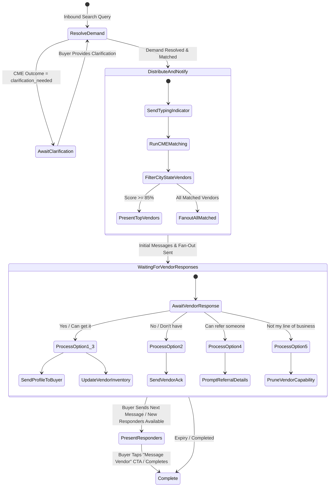

# Technical Design Requirement (TDR): Updated Buyer Search Workflow

**Version:** 1.0  
**Status:** Implementation Ready  
**Target Component:** Conversation OS (MCOS), Capability Matching Engine (CME), Evidence Service, Request Distribution Service  
**Author:** Technical Architecture Team  

---

## 1. Overview & Business Intent

The **Buyer Search Workflow** is the core demand-fulfillment engine of MetaMarket. It converts raw, natural-language buyer queries (products or services) into structured, semantically matched vendor interactions, fans out customer requests to relevant vendors via WhatsApp, handles multi-option vendor responses, presents rich vendor profile cards to buyers, and continuously feeds marketplace interaction data into the Evidence Service to sharpen future search accuracy.

This document formalizes the implementation specifications for the updated Buyer Search Workflow based on the latest business requirements (`Updated-Buyer-Search-Workflow-Requirements.md`). The updated workflow removes legacy operational complexity, enforces zero-friction buyer communication, guarantees low-latency response delivery, and maximizes commercial conversions by ensuring **all matched vendors receive customer requests** while presenting top-tier matched vendors to buyers.

---

## 2. Core Architecture & Component Placement

The workflow operates at the intersection of four core platform systems:

```
                          ┌───────────────────────────┐
                          │   WhatsApp / Channel API  │
                          └─────────────┬─────────────┘
                                        │ (Inbound / Outbound Messages)
                                        ▼
                          ┌───────────────────────────┐
                          │ Conversation OS (MCOS)    │
                          │  - Turn Processor         │
                          │  - BuyerSearch Workflow   │
                          └──────┬─────────────┬──────┘
                                 │             │
        (Demand & Vendor Matching)│             │ (Request Distribution & Fan-Out)
                                 ▼             ▼
  ┌────────────────────────────────┐     ┌────────────────────────────────┐
  │ Capability Matching Engine     │     │ Request Distribution Service   │
  │  - Semantic Expansion          │     │  - Vendor Fan-Out Engine       │
  │  - Location Filter (City/State)│     │  - Vendor Response Intake      │
  │  - Score & Ranking (>=85%)     │     │  - Profile Card Dispatcher     │
  └───────────────┬────────────────┘     └──────────────┬─────────────────┘
                  │                                     │
                  │ (Evidence Lookups)                  │ (Marketplace Events)
                  ▼                                     ▼
  ┌───────────────────────────────────────────────────────────────────────┐
  │                           Evidence Service                            │
  │  - Interaction Learning & Vendor DNA Updates                          │
  │  - Capability Pruning & Referral Network Graphs                       │
  │  - Auto-Inventory Population                                          │
  └───────────────────────────────────────────────────────────────────────┘
```

---

## 3. High-Level Requirements & Technical Specifications

### 3.1 Location Filtering & Geographic Scope
- Vendors matching the buyer's query are filtered by **City OR State** matching the buyer's location.
- Distance and proximity serve as ranking modifiers within the Capability Matching Engine (CME).

### 3.2 Vendor Ranking vs. Display & Messaging Threshold (Crucial Rule)
- **Buyer Display Threshold:** Vendors ranked **highest by the CME (score $\ge$ 85%)** in the buyer's city or state are immediately displayed/shown to the buyer.
- **Vendor Messaging Fan-Out Threshold:** **ALL and EVERY matched vendor MUST receive customer request messages**, regardless of whether their score meets the 85% buyer display threshold. This ensures maximum potential fulfillment without missing sales opportunities while maintaining quality control on initial buyer presentation.

### 3.3 Strict Resolved Product Name Propagation
- The system MUST exclusively use the **Resolved Product Name** extracted during Demand Resolution throughout the entire workflow execution:
  - In outbound vendor notification messages (e.g., *"A customer in Lagos is looking for Billiard Balls"*).
  - In vendor profile cards sent to buyers.
  - In automatic inventory updates when vendors confirm availability.
  - In evidence event payloads written to the Evidence Service.
- Raw, unstructured user input (e.g., *"I want to buy Billiard Balls urgently"*) must never leak into vendor communications, inventory records, or display cards.

### 3.4 Product vs. Service Vendor Equivalence
- Product vendors and Service vendors are handled through the exact same logic, state transitions, messaging formats, inventory/capability updates, and evidence collection flows.

### 3.5 Customer Delays, Typing Indicators & Fallback Messages
- **Typing Indicator Policy:** WhatsApp typing indicators (`typing` state) must be sent ONLY when the system is actively searching, retrieving, and matching vendors via the CME. Typing indicators MUST NOT be used if the system enters error states, retries, or loops. User friendly messages will be sent when there such system issues are encountered.
- **Active Search Messaging:** The system must send a clear acknowledgment informing the buyer that it is actively searching the marketplace for matching vendors.
- **Zero-Vendor Safe Fallback Policy:** The system **MUST NEVER** inform the customer that no vendors were found. If no vendors match or respond initially, the system must issue an encouraging, optimistic rephrase:
  > *"We're on it. We'll notify you as soon as we find the right vendors that can fulfill your request."*

### 3.6 Domain-Aligned Expansion Matching (DAEM) Integration
- **Two-Tier Retrieval Strategy:** When no Tier-1 direct inventory stockists (`capabilityMatch > 0`) are available in the buyer's region, the workflow utilizes Tier-2 **Domain-Aligned Expanded Candidates (`expansionMatch > 0` + Commercial Domain Alignment)**.
- **Cross-Domain Suppression:** Candidates from unrelated commercial domains (e.g., tailors or restaurants matching automotive queries) are strictly suppressed (`score = 0`).
- **Contextual Buyer Presentation:** Domain-aligned expanded vendors are presented with domain-contextualized wording (e.g., *"AutoZone Ventures in Warri specializes in automotive spare parts and accessories"*).
- **Fan-Out & Self-Learning Promotion:** Fanning out lead requests to Tier-2 domain-aligned vendors allows the platform to dynamically discover inventory. When a Tier-2 vendor responds over WhatsApp with Option 1 (*"Yes, I have it"*) or Option 3 (*"I can get it"*), the `EvidenceProcessor` automatically promotes that product capability to a `DIRECT` inventory belief in Vendor DNA for future buyer matches.

---

## 4. End-to-End Workflow State Machine

The workflow is governed by a deterministic finite state machine implemented within `BuyerSearch` workflow (`buyer-search.workflow.ts`).



---

## 5. Vendor Message Format & Multi-Option Response Resolver

### 5.1 Outbound Vendor Notification Template
Every matched vendor receives the following WhatsApp interactive push:

```text
New Customer Request

A customer in {Buyer_City} is looking for {Resolved_Product_Name}

Can you fulfill this request?
1. Yes, I have it
2. No, I don't have it
3. I can get it
4. I can refer someone
5. I don't sell this, not my line of business
```

### 5.2 Vendor Response Resolver Specification
Vendors may respond using:
1. **Numeric Replies:** Reply with numbers corresponding to their choice (e.g., `1`, `3`, `1,4`).
2. **Text Replies:** Exact or fuzzy text matching the option titles (as long as the intent is deducible).
3. **Multi-Option Replies:** Combining multiple numbers or text options separated by commas (`,`), dashes (`-`), spaces, or newlines (e.g., `1, 3`, `1-4`, `3, 4`).
4. **Order Insensitivity:** Selection order does not matter (e.g., `3, 1` is identical to `1, 3`).

#### Parsing & Normalization Logic
The intake handler (`VendorResponseHandler`) maps all inbound vendor inputs to one or more normalized response categories:

| Key | Number | Canonical Category | System Action |
| :--- | :--- | :--- | :--- |
| `YES_HAVE_IT` | `1` | `Yes, I have it` | Dispatch profile card to buyer + Auto-populate inventory + Log positive evidence |
| `NO_DONT_HAVE` | `2` | `No, I don't have it` | Send `"ok, noted"` to vendor + Record temporary stock unavailability evidence |
| `CAN_GET_IT` | `3` | `I can get it` | Dispatch profile card to buyer + Auto-populate inventory + Log procurement capability evidence |
| `CAN_REFER` | `4` | `I can refer someone` | Prompt vendor for referral name/number + Log referral network evidence |
| `NOT_MY_LINE` | `5` | `I don't sell this, not my line of business` | Send acknowledgment + Prune capability scope in CDE/CME |

---

## 6. Detailed Response Handling Flows

### 6.1 Flow A: Positive Fulfillment (Option 1: "Yes, I have it" & Option 3: "I can get it")
1. **Buyer Profile Card Dispatch:** The platform asynchronously formats and sends the vendor's profile card to the buyer's WhatsApp chat.
   
   **Vendor Profile Card Template:**
   ```text
   🌟 *{Business_Name}*
   📍 {City}, {State}
   ⭐ Rating: {Star_Rating} / 5.0
   📝 {Capability_Description}

   💬 Contact: {WhatsApp_Number}
   ```
   **Interactive CTA Button:**
   - **Title:** `"Message Vendor"`
   - **URL/Action:** Direct WhatsApp deep-link (`https://wa.me/{WhatsApp_Number}?text=Hi%20{Business_Name},%20I%20saw%20your%20profile%20on%20MetaMarket%20regarding%20{Resolved_Product_Name}`) linking directly to the seller or seller business page.

2. **Auto-Inventory Population:**
   - The system executes an asynchronous background task adding `{Resolved_Product_Name}` into the vendor's inventory database.
   - Emits event: `vendor.inventory.updated`.

3. **Evidence Service Update:**
   - Emits `request.accepted` event with `resolvedProduct` and `responseTimeMs`.

### 6.2 Flow B: Negative Fulfillment (Option 2: "No, I don't have it now")
1. **Vendor Acknowledgment:** System sends WhatsApp reply to vendor: `"ok, noted with thanks"`.
2. **Buyer Privacy:** Vendor profile card is **NOT** sent to buyer.
3. **Evidence Service Update:** Emits `request.rejected` event to record stock unavailability.

### 6.3 Flow C: Vendor Referral (Option 4: "I can refer someone")
1. **Sub-Flow Activation:** System sends immediate follow-up prompt to vendor over WhatsApp:
   ```text
   Thanks for offering to help! Please reply with the WhatsApp number of the person/business you are referring for {Resolved_Product_Name}.
   ```
2. **Referral Data Intake:** When the vendor replies with contact details, the system logs the referral graph in the Evidence Service.
3. **Evidence Service Update:** Emits `vendor.referral.provided` event.

### 6.4 Flow D: Capability Misalignment (Option 5: "I don't sell this, not my line of business")
1. **Vendor Acknowledgment:** System replies: `"Thank you for letting us know! We've updated our records so you won't receive requests for this item in the future."`
2. **Capability Pruning:**
   - Emits `vendor.capability.pruned` event.
   - CDE & CME immediately reduce or remove the mapping between `{Vendor_ID}` and `{Canonical_Capability_ID}` for `{Resolved_Product_Name}`.

---

## 7. Data Models & API Contracts

### 7.1 Vendor Profile Card Object Model (`src/domain/models/vendor-profile.ts`)

```typescript
export interface VendorProfileCard {
  readonly vendorId: string;
  readonly businessName: string;
  readonly city: string;
  readonly state: string;
  readonly starRating: number;
  readonly whatsappNumber: string;
  readonly capabilityDescription: string;
  readonly ctaUrl: string;
}
```

### 7.2 Vendor Response Action Mapping (`src/domain/workflows/vendor-response.ts`)

```typescript
export type VendorResponseCategory =
  | 'YES_HAVE_IT'
  | 'NO_DONT_HAVE'
  | 'CAN_GET_IT'
  | 'CAN_REFER'
  | 'NOT_MY_LINE';

export interface VendorResponsePayload {
  readonly requestId: string;
  readonly vendorId: string;
  readonly selectedCategories: readonly VendorResponseCategory[];
  readonly rawTextResponse?: string;
}
```

---

## 8. Updates Required to Adjacent Systems

To ensure end-to-end operational alignment, the following updates are defined across adjacent system TDRs:

### 8.1 Capability Matching Engine (`Capability-Matching-Engine.md`)
- **Ranking vs Display Logic (§11, §13):** Update CME retrieval and ranking output contracts to explicitly output two candidate lists:
  1. `buyerDisplayedVendors`: Matched candidates in buyer's city/state with CME Score $\ge 85\%$.
  2. `fannedOutVendors`: ALL matched candidates in buyer's city/state (regardless of score threshold) for WhatsApp request messaging.
- **Resolved Product Propagation (§6):** Enforce canonical `resolvedProduct` string delivery in all CME `DemandObject` outputs.
- **Feedback Loops (§12, §17):** Incorporate Option 4 (referral graph weight) and Option 5 (capability score penalty/pruning) into CME ranking adjustments.

### 8.2 Multi-Channel Conversation OS (`Multi-Channel-Conversation-OS.md`)
- **Typing Indicator Rule (§5.1, §14):** Enforce strict policy limiting typing status triggers strictly to active CME resolution turns. Vendor onboarding workflow should also trigger typing status under an enforce strict policy.
- **Zero-Vendor Message Constraint (§14):** Formalize mandatory fallback copy: *"We're on it. We'll notify you as soon as we find the right vendors that can fulfill your request."*
- **Profile Card Rendering (§13):** Add `Message Vendor` interactive CTA button schema into Canonical Response Model.

### 8.3 Vendor Fan-Out End-to-End TDR (`Vendor-Fanout-EndToEnd-TDR.md`)
- **Interactive Ask Template (§5.1):** Update ask payload structure to support 5 numbered options.
- **Deterministic Multi-Option Resolver (§8.1, §9.2):** Add numeric array and text payload parser to `VendorResponseHandler`.

### 8.4 Evidence Service (`Evidence Service.md`)
- **Event Schemas (§4.2):** Add support for `vendor.referral.provided` and `vendor.capability.pruned` events.
- **Auto-Inventory Sink (§12):** Automatically append resolved products to seller inventory graphs upon receipt of Option 1 or Option 3 acceptances.

---

## 9. Non-Functional Requirements & Performance Tuning

1. **Sub-Second Fan-Out Latency:** Initial vendor notification dispatch and buyer acknowledgment MUST complete in $< 1.5\text{ seconds}$. Vendor card pushes and evidence logging operate asynchronously in background queues.
2. **Idempotent Response Intake:** Repeated taps or duplicate WhatsApp webhook deliveries of vendor response buttons must yield deterministic, idempotent replies without duplicate charges or inventory corruption.
3. **Resilience & State Persistence:** Workflow states and pending request deliveries are persisted in PostgreSQL (`RequestDelivery` table). System crashes or restarts automatically resume waiting searches without losing context.

---

## 10. Acceptance Criteria & Verification Plan

| # | Requirement Scenario | Expected Outcome | Verification |
| :--- | :--- | :--- | :--- |
| **AC-1** | CME matches 10 vendors (2 score $\ge$ 85%, 8 score $<$ 85%) | Buyer receives top 2 vendor cards; ALL 10 vendors receive WhatsApp request push. | Integration Test (`marketplace-loop.test.ts`) |
| **AC-2** | Raw input `"I want billiard balls urgently"` | All messages, vendor cards, and inventory entries strictly use resolved name `"Billiard Balls"`. | Unit Test (`buyer-search.workflow.spec.ts`) |
| **AC-3** | Vendor replies `"1, 3"` or `"1-4"` | System maps input to `YES_HAVE_IT` & `CAN_REFER`, triggers profile send + auto-inventory + referral prompt. | Unit Test (`vendor-response.spec.ts`) |
| **AC-4** | Vendor replies Option 2 (`"No, I don't have it"`) | Vendor receives `"ok, noted"`, profile is NOT sent to buyer, stock unavailability recorded. | Integration Test (`vendor-fanout.test.ts`) |
| **AC-5** | Vendor replies Option 4 (`"I can refer someone"`) | System pings vendor for contact details and updates referral evidence graph. | Integration Test (`vendor-referral.test.ts`) |
| **AC-6** | Vendor replies Option 5 (`"Not my line of business"`) | System acknowledges and prunes capability from CME/CDE for that vendor. | Unit Test (`cde-pruning.spec.ts`) |
| **AC-7** | Search query yields 0 matching vendors | System displays: *"We're on it. We'll notify you as soon as we find the right vendors that can fulfill your request."* | E2E Test (`whatsapp-pipeline.test.ts`) |
