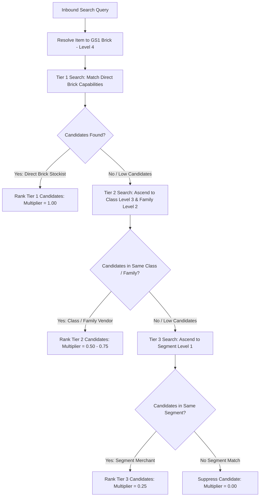
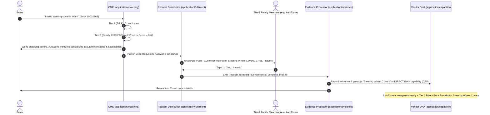

# Capability Matching Engine (CME)
## Technical Design Requirements (TDR) v1.0

---

# 1. Overview

The Capability Matching Engine (CME) is responsible for transforming customer demand into a ranked list of vendors that are most likely to satisfy that demand.

Unlike traditional marketplace search engines that perform keyword or category matching, the CME reasons about the customer's intent, understands business capabilities, accounts for overlapping inventories common in informal markets, and continuously improves through marketplace evidence.

The CME is a retrieval and ranking system. It does **not** generate conversational responses; it provides ranked vendor candidates to downstream systems.

---

# 2. Design Philosophy

The CME is built on five principles.

1. Customers think in needs, not categories.
2. Businesses often carry overlapping inventories.
3. Marketplace evidence is more valuable than assumptions.
4. Multiple independent reasoning signals outperform a single search strategy.
5. The system should become more accurate as marketplace interactions increase.

---

# 3. Responsibilities

The CME is responsible for:

- Understanding customer demand.
- Detecting ambiguity.
- Requesting clarification when necessary.
- Building semantic representations of demand.
- Retrieving candidate vendors.
- Ranking vendors using reasoning and marketplace evidence.
- Returning explainable ranked results.

The CME is **not** responsible for:

- Customer conversations
- Seller onboarding
- Inventory updates
- Payment

---

# 4. Upstream Dependencies

## Conversation OS

Provides:

- Customer message
- Customer context
- Customer location
- Clarification responses
- Conversation state

---

## Capability Discovery System

Provides Vendor DNA.

Vendor DNA contains:

- Primary capabilities
- Secondary capabilities
- Capability confidence
- GPC mappings
- Capability evidence

---

## Evidence Service

Provides marketplace evidence.

Examples:

- Seller confirmations
- Successful matches
- Product relationships
- Marketplace statistics
- Customer feedback

---

# 5. High-Level Architecture

```text
Conversation OS
        │
        ▼
Customer Search
        │
        ▼
Search Mode Classification
        │
        ├───────────────┬───────────────┬───────────────┐
        │               │               │               │
        ▼               ▼               ▼               ▼
 Item Search    Descriptive Search  Business Search  Vibe Search
        │               │               │               │
        └───────────────┴───────┬───────┴───────────────┘
                        ▼
                Demand Understanding
                        │
                        ▼
                 Ambiguity Manager
                        │
                        ├───────────────┐
                        │               │
                  Low Ambiguity   High Ambiguity
                        │               │
                        │        Clarification Request
                        │               │
                        └───────┬───────┘
                                ▼
                   Semantic Expansion
                (Mission + Capability +
                 Inventory Affinity)
                        │
                        ▼
             Canonical Capability Resolution
                        │
                        ▼
                Capability → GPC Mapping
                        │
                        ▼
               Candidate Vendor Retrieval
                        │
                        ▼
                    Evidence Lookup
                        │
                        ▼
                     Ranking Engine
                        │
                        ▼
                     Ranked Vendors
```

---

# 6. Stage 1 — Demand Understanding

## Goal

Transform raw customer input into a structured demand object.

---

## Input

Customer message.

Example:

```text
Hammer
```

---

## Responsibilities

Extract:

- Products
- Services
- Quantities
- Modifiers
- Constraints
- Brands
- Locations
- Delivery preferences

Do **not** infer missing information.

If no modifier exists, leave it empty.

Example:

```yaml
Product:
  Hammer

Modifier:
  None
```

Missing modifiers represent uncertainty, not failure.

---

## Output

Demand Object.

Example:

```yaml
Products:
    Hammer

Services:
    None

Modifiers:
    None

Constraints:
    None

Brand:
    None

Ambiguity:
    Medium
```

---

# 7. Stage 2 — Ambiguity Manager

## Goal

Determine whether clarification is required.

---

## Decision Rule

Clarify only when ambiguity materially changes the vendor set.

---

Example

Low ambiguity

```text
Hammer
```

No clarification.

---

High ambiguity

```text
Printer
```

Possible meanings:

- Home printer
- POS printer
- 3D printer
- Large format printer

Clarification required.

---

Example clarification

```text
Which type of printer are you looking for?

• Home / Office
• POS Receipt
• 3D
• Large Format
```

---

Output

Updated Demand Object.

---

# 8. Stage 3 — Semantic Expansion

The CME generates three independent semantic representations.

These are reasoning layers.

---

## 8.1 Mission Graph

Question:

> What is the customer trying to accomplish?

Example

Input

```text
Hammer
```

Output

```text
Build something

Repair something

Construction

DIY
```

---

## 8.2 Capability Graph

Question

> Which business capabilities normally satisfy this demand?

Example

```text
Hardware

Building Materials

Industrial Tools

Construction Supplies
```

Each capability contains confidence.

Example

```yaml
Hardware:
    0.98

Building Materials:
    0.94
```

---

## 8.3 Inventory Affinity Graph

Question

> Which businesses are likely to stock this item even though it is not their specialty?

Example

```text
General Merchandise

Agricultural Supplies

Electrical Supplies

Supermarket
```

This graph enables discovery of overlapping vendors.

---

# 9. Canonical Capability Resolution

LLM outputs must never directly drive retrieval.

All capabilities resolve to canonical capability IDs.

Example

```text
Hardware

↓

CAP_HARDWARE
```

Canonical IDs are deterministic.

---

# 10. Capability → GPC Mapping

Canonical capabilities map into one or more GPC nodes.

Example

```text
CAP_HARDWARE

↓

Hand Tools

↓

Construction Equipment
```

Multiple GPC nodes may exist.

---

# 11. Candidate Vendor Retrieval

Retrieve vendors matching:

- Canonical Capabilities
- GPC mappings
- Vendor DNA

This stage intentionally retrieves a broad candidate set.

No ranking occurs here.

---

# 12. Evidence Service

The Evidence Service is a separate component.

It continuously learns from marketplace activity.

---

## Responsibilities

Maintain evidence for:

- Vendors
- Products
- Capabilities

---

## Evidence Sources

- Vendor onboarding
- Vendor confirmations(Yes I have it now/No, I don't have it now/Can have it later/I don't sell this)
- Vendor responses
- Post onboarding questions 
- Customer clicks
- Successful transactions
- Customer Purchase confirmation(Yes, I bought from vendor X)
- Customer feedback
- Inventory updates
- Marketplace statistics
- LLM inference (initial bootstrap)

- Request received
- Request accepted(Yes I have it now/I Can get it)
- Request declined(No, I don't have it now/I don't sell this)
- No response
- Response time
- Successful introduction
- Successful transaction (if confirmed)

Marketplace evidence always overrides AI assumptions.

---

## Evidence Record

```yaml
Vendor:
    Vendor A

Subject:
    Hammer

Source:
    Seller Confirmation

Confidence:
    1.0

Timestamp:
    2026-08-05
```

---

## Learning

Every marketplace interaction updates evidence.

Examples

Seller confirms availability.

↓

Increase confidence.

---

Successful sale.

↓

Increase confidence.

---

Seller rejects request.

↓

Decrease confidence.

---

Evidence is:

- Time aware
- Source aware
- Confidence weighted

---

# 13. Ranking Engine

Candidate vendors are ranked using multiple independent signals.

Example

```text
Final Score

=

Capability Match

+

Mission Match

+

Inventory Affinity Match

+

Evidence Score

+

Distance

+

Availability

+

Business Quality
```

Weights are configurable.

Future versions may replace manual weights with Learning-to-Rank models.

---

# 14. Explainability

Every ranked vendor must expose explainable reasoning.

Example

```text
Vendor A

Reason

Strong Hardware capability.

Seller confirmed customer request for Hammer yesterday.

Seller added hammer to inventory

Seller answered scheduled question post onboarding(mention 1 item you sold)

Customer confirmed they bought from seller.

Stocks Nails, Tape Measure and Saw.

Located 1.2 km away.
```

---

# 15. Outputs

```yaml
Vendor:
    Vendor A

Score:
    97

Reasons:
    Hardware Capability
    Seller Confirmation
    Marketplace Evidence
```

---

# 16. Relationships

```text
Conversation OS
        │
        ▼
Capability Matching Engine
        │
        ├──────────────┐
        │              │
Vendor DNA      Evidence Service
        │              │
        └──────┬───────┘
               ▼
          Ranked Vendors
```

---

# 17. Test Cases

---

## Test 1

### Input

```text
Hammer
```

---

Demand Understanding

```yaml
Product:
    Hammer

Modifier:
    None
```

---

Mission

```text
Construction

Repair

DIY
```

---

Capability

```text
Hardware

Building Materials

Construction Supplies
```

---

Inventory Affinity

```text
General Merchandise

Agricultural Supplies

Electrical Supplies
```

---

Expected Vendors

1. Hardware Store
2. Building Materials Shop
3. General Merchant
4. Agricultural Supply Shop
5. Electrical Supply Shop

Desired Outcome

Surface both specialist and overlapping inventory vendors.

---

## Test 2

Input

```text
Printer
```

Expected

Ambiguity detected.

System requests clarification.

No retrieval performed until clarified.

Desired Outcome

Prevent incorrect vendor retrieval.

---

## Test 3

Input

```text
Artist Brush
```

Mission

```text
Painting

Creative Arts
```

Capability

```text
Art Materials

Craft Supplies
```

Inventory Affinity

```text
Bookstores

Educational Stores

Gift Shops
```

Expected Vendors

1. Art Store
2. Craft Store
3. Educational Supply Store
4. Bookstore

Desired Outcome

Surface vendors outside traditional art categories.

---

## Test 4

Input

```text
I want to bake cake
```

Mission

```text
Baking
```

Capability

```text
Baking Ingredients

Kitchen Equipment
```

Inventory Affinity

```text
Supermarkets

Wholesale Food

Kitchenware
```

Expected Vendors

- Baking Supply Shop
- Supermarket
- Kitchenware Store

Desired Outcome

Infer customer mission without explicit products.

---

## Test 5

Marketplace Learning

Day 1

Seller updates inventory or answers scheduled questions (post onboarding question)

```text
Nails

Saw
```

Evidence

Medium.

---

Day 5

Seller confirms customer request for Hammer(Yes, I have it now).

Evidence

High.

---

Day 15

Seller answers scheduled post onboarding question. (I sold hammer)

Evidence

Very High.

---


Day 25

Customer confirmed they bought from seller.

Evidence

Very High.

---

Expected Result

Seller rank increases for future Hammer searches despite not being a dedicated hardware specialist.

Desired Outcome

Marketplace evidence continuously improves retrieval quality.

---

# 18. Future Evolution

Future versions may introduce:

- Learning-to-Rank (LTR) models for automated ranking optimization.
- Dynamic weighting based on marketplace performance.
- Real-time inventory integrations.
- Vendor response-time and fulfillment reliability as ranking signals.
- Seasonal and geographic demand modeling.
- Personalized ranking based on customer preferences and history.

These enhancements should build upon the existing architecture rather than replace it.

---

# 19. Conversation Ownership

## Decision

The Capability Matching Engine (CME) **does not determine whether the current conversation is a customer search.**

This responsibility belongs to the **Conversation OS**.

---

## Conversation OS Responsibilities

Before invoking the CME, the Conversation OS must:

- Determine the conversation intent.
- Route the request to the correct subsystem.

Example conversation types:

- Customer Search
- Vendor Onboarding
- Wallet
- Customer Support
- Inventory Update


Only when the conversation is classified as **Customer Search** should the CME be invoked.

---

# 20. Search Mode Classification

## Goal

After the CME receives a customer search request, it must determine **how the customer is searching**.

Different search modes require different understanding strategies before semantic expansion.

---

## Supported Search Modes

### 20.1 Item Search

Customer already knows the item.

Examples

```text
Hammer

Rice

iPhone Charger

Charcoal Pencil
```

---

### 20.2 Descriptive Search

Customer describes an item but does not know its name.

Examples

```text
The thing used to tighten bolts

That machine used for cutting tiles

The container that keeps food hot
```

The objective is to infer the intended item before continuing with matching.

---

### 20.3 Business Search

Customer is searching directly for a business type rather than a product.

Examples

```text
Hardware Store

Mechanic

Bakery

Tailor
```

In this mode, product inference is unnecessary.

The business capability can be extracted directly.

---

### 20.4 Vibe Search

Customer expresses an outcome, mood, lifestyle, or use case rather than a product.

Examples

```text
I need a classy wedding gift.

Something for my baby's birthday.

I want my sitting room to look modern.

I need something for camping.
```

The objective is to infer the customer's mission and generate candidate products and services before matching.

---

# 21. Search Mode as the Front Stage

Search mode classification is the front stage of the pipeline. The Conversation OS hands off a classified customer search; the CME then determines *how* the customer is searching—Item, Descriptive, Business, or Vibe (see §20)—and all four modes converge into the same understanding → expansion → resolution → retrieval → ranking flow.

This stage is folded into the canonical pipeline in **§5, High-Level Architecture**, rather than forming a separate pipeline. Sections §22–§25 detail how each mode feeds Demand Understanding.

---

# 22. Item Search Flow

## Input

```text
Hammer
```

---

## Responsibilities

- Extract item.
- Detect ambiguity.
- Classify ambiguity.
- Compute ambiguity score.
- Determine whether clarification is required.

---

## Ambiguity Classification

The Ambiguity Manager should classify ambiguity before deciding whether clarification is needed.

Examples include:

### Polysemy

One word with multiple related meanings.

Example

```text
Generator
```

Possible meanings

- Petrol Generator
- Diesel Generator
- Solar Generator
- Inverter Generator

---

### Homonymy

One word representing unrelated meanings.

Example

```text
Bat
```

Possible meanings

- Flying animal
- Baseball bat

---

Additional ambiguity categories may be introduced in future versions.

---

## Ambiguity Score

Each detected ambiguity should receive a confidence score.

Example

```yaml
Item:
    Generator

Ambiguity Type:
    Polysemy

Ambiguity Score:
    0.92
```

---

## Clarification Rule

Clarification is required only when ambiguity is likely to produce significantly different vendor sets.

Example

```text
Which type of generator are you looking for?

• Petrol
• Diesel
• Solar
• Inverter
```

---

# 23. Descriptive Search Flow

## Goal

Convert a customer description into a specific item before retrieval.

---

## Example

Input

```text
The machine used for cutting tiles.
```

---

## Responsibilities

- Understand the description.
- Infer one or more candidate items.
- Assign confidence to each candidate.

Example

```yaml
Candidates:

Tile Cutter:
    0.94

Angle Grinder:
    0.37
```

---

## Confirmation Rule

If confidence is below the automatic acceptance threshold, confirmation is required.

Example

```text
I see you're looking for a Tile Cutter, Is that correct?
```

Customer

```text
Yes
```

Search continues.

---

If customer replies

```text
No
```

Alternative candidates are presented.

---

# 24. Business Search Flow

## Goal

Extract business capability directly.

---

Example

Input

```text
Hardware Store
```

---

Output

```yaml
Capability:

Hardware
```

No product inference is performed.

The search continues directly to Vendor Retrieval.

---

# 25. Vibe Search Flow

## Goal

Infer customer intent from lifestyle, occasion or desired outcome.

---

Example

Input

```text
I need something for camping.
```

---

Responsibilities

Infer:

- Mission
- Candidate products
- Business capabilities

Example

Mission

```text
Camping
```

Generated products

```text
Tent

Sleeping Bag

Torch

Portable Stove

Cooler Box
```

Generated capabilities

```text
Outdoor Equipment

Sporting Goods

General Merchandise
```

Search then continues through the normal CME pipeline.

---

# 26. Relationship With Existing Components

The search modes in §20 do not introduce a separate pipeline. They only determine *how* customer demand enters the canonical pipeline defined in §5: every mode resolves to a demand that then flows through Demand Understanding → Ambiguity Manager → Semantic Expansion (Mission + Capability + Inventory Affinity) → Canonical Capability Resolution → Capability → GPC Mapping → Candidate Retrieval → Evidence Lookup → Ranking Engine.

---

# 27. Design Principles

1. Every customer search must belong to exactly one search mode.
2. Search mode determines the understanding strategy, not the retrieval strategy.
3. Clarification should only occur when it materially improves retrieval quality.
4. Descriptive searches should resolve to a concrete item before semantic expansion.
5. Business searches bypass unnecessary product reasoning.
6. Vibe searches expand customer intent into candidate products and capabilities before retrieval.
7. All search modes converge into the same semantic matching, evidence, and ranking pipeline.

---

---

# 28. Domain-Aligned Expansion Matching (DAEM) via 3-Layer Hybrid Knowledge Graph

## 28.1 Overview & Problem Statement
In informal market ecosystems (e.g., Nigerian open-air commercial hubs in Lagos, Warri, Aba, and Kano), an informal merchant's inventory is a **Venn diagram of overlapping product lines**. A merchant operates across multiple categories based on local demand and commercial focus:
- An **Automotive Spare Parts Merchant** stocks mechanical components (brakes, batteries) as well as fast-moving car accessories (steering wheel covers, wiper blades, floor mats, dash polish).
- A **Pharmacy / Chemist** stocks pharmaceuticals as well as baby wipes, soaps, sanitary pads, and cosmetics.
- A **Provision Store** stocks packaged food as well as AA batteries, lightbulbs, and school notebooks.

Strict primary capability matching (`capabilityMatch > 0` at SKU/Brick level) prevents false-positive matches across unrelated domains (e.g., suppressing a tailoring shop from surfacing for auto repair). However, zero-expansion filtering introduces severe false negatives for **domain-aligned merchants** who naturally carry overlapping inventory within their commercial domain but have not yet declared every single SKU during initial onboarding.

DAEM solves this by superimposing a **3-Layer Hybrid Knowledge Graph** over the platform's PostgreSQL database (`taxonomy_nodes`, `pgvector` HNSW index, and `vendor_capabilities`).

For full technical specifications, see the unified TDR: [`docs/design/Domain-Aligned-Expansion-Matching-TDR.md`](Domain-Aligned-Expansion-Matching-TDR.md).

---

## 28.2 GS1 GPC 4-Level Taxonomy Tree Architecture

The GS1 GPC taxonomy (which is fully loaded in our PostgreSQL database `taxonomy_nodes` table) defines a 4-level hierarchy:

```text
Level 1: Segment (Broad Commercial Domain - e.g., 77000000 "Vehicle")
   │
   └── Level 2: Family (Product Category Group - e.g., 77010000 "Automotive Accessories & Maintenance")
          │
          └── Level 3: Class (Specific Subcategory - e.g., 10002860 "Interior Accessories")
                 │
                 └── Level 4: Brick (Concrete Product Item - e.g., 10002863 "Steering Wheel Covers")
```

During vendor onboarding (`VendorOnboardingWorkflow`), statements (e.g., *"I sell auto spare parts"*) are processed by CDE to assign relevant **GPC Segment(s)**, **Family/Families**, and **Class(es)** to the vendor's capability DNA history.

---

## 28.3 Three-Tier Search & GPC Tree Ascendancy Model

When a customer search query arrives, Demand Resolution resolves the item to its canonical **GS1 Brick (Level 4)**. Candidate matching then ascends the GPC tree across three deterministic tiers:



### Search Tier Specifications

| Search Tier | GPC Tree Level | Match Condition | Relevance Multiplier | Example (Search: *"Steering Cover"*) |
| :--- | :--- | :--- | :--- | :--- |
| **Tier 1 (Direct Brick Match)** | **Level 4 (Brick)** | Vendor has direct capability belief for exact Brick (`10002863`). | **$1.00$** | Vendor who explicitly declared *Steering Wheel Covers*. |
| **Tier 2a (Class Expansion)** | **Level 3 (Class)** | Vendor operates in parent Class (`10002860` - *Interior Accessories*). | **$0.75$** | Car accessories shop stocking interior car accessories. |
| **Tier 2b (Family Expansion)** | **Level 2 (Family)** | Vendor operates in parent Family (`77010000` - *Automotive Accessories & Maintenance*). | **$0.50$** | General auto spare parts dealer. |
| **Tier 3 (Segment Expansion)** | **Level 1 (Segment)** | Vendor operates in parent Segment (`77000000` - *Vehicle*). | **$0.25$** | General vehicle/mechanic business. |
| **Cross-Segment Suppression** | **Different Segment** | Vendor's GPC Segment does not intersect with Product Segment ($\text{Segment}(V) \cap \text{Segment}(D) = \emptyset$). | **$0.00$** | Tailoring shop (Segment `Clothing`) for auto query. |

---

## 28.4 Candidate Scoring & Ranking Function

The candidate scoring function computes vendor rank score based on GPC tree ascendancy:

$$\text{Final Score}(V) = \begin{cases} 
0 & \text{if } \text{Segment}(V) \cap \text{Segment}(D) = \emptyset \quad \text{(Cross-Segment Suppression)} \\
1.00 \cdot W_{\text{cap}} + 0.20 \cdot S_{\text{evid}} + P_{\text{prox}} + A_{\text{avail}} & \text{if } \text{Tier 1: Direct Brick Match (Level 4)} \\
0.75 \cdot W_{\text{cap}} + 0.20 \cdot S_{\text{evid}} + P_{\text{prox}} + A_{\text{avail}} & \text{if } \text{Tier 2a: Class Match (Level 3)} \\
0.50 \cdot W_{\text{cap}} + 0.20 \cdot S_{\text{evid}} + P_{\text{prox}} + A_{\text{avail}} & \text{if } \text{Tier 2b: Family Match (Level 2)} \\
0.25 \cdot W_{\text{cap}} + 0.20 \cdot S_{\text{evid}} + P_{\text{prox}} + A_{\text{avail}} & \text{if } \text{Tier 3: Segment Match (Level 1)}
\end{cases}$$

---

## 28.5 Self-Learning Inventory Promotion Lifecycle

Hierarchical GPC expansion turns every lead fan-out into an autonomous inventory discovery pipeline:



---

## 28.6 Summary of DAEM Guarantees

1. **100% Cross-Segment Protection**: Tailors, restaurants, and unrelated services are mathematically filtered out (`score = 0`) because their GPC Segments (Level 1) do not intersect with the search demand.
2. **Multi-Level Relevance Degradation**: Direct Brick stockists outrank Class subcategory stockists, who outrank Family category dealers, who outrank Segment generalists.
3. **Autonomous Learning**: Every vendor lead acceptance converts inferred Class/Family expansion signals into verified `DIRECT` Brick capability DNA.

---

## 28.7 Failure Scenarios & Architectural Mitigations (`CONTRIBUTING §2.6, §4.1, §4.4, §13`)

1. **Cross-Segment Hybrid Merchants ("The Provision Store / Pharmacy Defect"):**
   - *Failure:* Informal merchants (e.g., Chemists, Provision Stores) sell items across separate GS1 Segments (e.g., Chemist selling Baby Wipes under `Personal Care`). Single-segment traversal suppresses nearby hybrid merchants (`score = 0`).
   - *Mitigation (`CONTRIBUTING §4.1, §4.4`):* CDE's `BusinessUnderstandingService` maps hybrid archetypes (`Pharmacy/Chemist`, `Provision Store`) to multi-segment capability belief vectors during onboarding, attaching co-occurring GS1 Segment nodes to Vendor DNA.

2. **Mission-Based Multi-Category Queries ("The Vibe / Event Search Defect"):**
   - *Failure:* Intent queries (e.g., *"I want to bake a birthday cake"*) require items across multiple GS1 Segments (Flour under `Food`, Pans under `Kitchenware`, Mixers under `Appliances`). Resolving to a single Brick locks search inside one Segment.
   - *Mitigation (`CONTRIBUTING §3.6, §4.1`):* CME Stage 3 (`Semantic Expansion — Mission Graph`) resolves intent queries into an array of distinct canonical Bricks across multiple Segments *before* running candidate retrieval.

3. **Over-Generalization at Tier 3 (Segment Level 1 Noise):**
   - *Failure:* Segment Level 1 (`Vehicle` `77000000`) contains car accessories, trucks, and marine boats. Tier 3 search for car wipers risks surfacing marine boat dealers.
   - *Mitigation (`CONTRIBUTING §4.4`):* Tier 3 multiplier is capped at $0.25$ with geographic proximity decay ($P_{\text{prox}}$) and archetype penalties, ensuring Tier 3 candidates surface only when Tier 1 and Tier 2 are empty.

4. **Local West African Trade Mismatches vs. Formal GS1:**
   - *Failure:* Nigerian market bundling (e.g., "Gas & Stove Shop" stocking Kerosene Stoves, Gas Cylinders, and Matches) spans 3 separate GS1 Segments.
   - *Mitigation (`CONTRIBUTING §4.3, §4.4`):* CME Stage 8.3 (`Inventory Affinity Graph`) maintains localized co-occurrence weights between GS1 Bricks commonly bundled in West African markets.

5. **Vague Initial Vendor Onboarding (Cold-Start Defect):**
   - *Failure:* Vendor onboarded with a 1-word statement (*"I sell goods"*), yielding zero GPC nodes in Vendor DNA.
   - *Mitigation (`CONTRIBUTING §13`):* `VendorOnboardingWorkflow` evaluates statement information density. If $\text{Density} < 0.40$, it initiates an interactive clarification turn.


