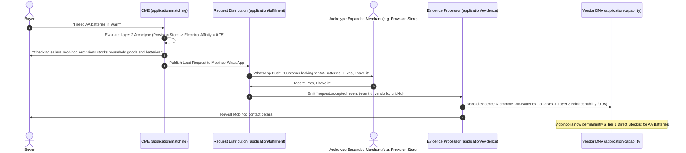

# Technical Design Requirements (TDR): Domain-Aligned Expansion Matching (DAEM) via 3-Layer Hybrid Knowledge Graph

**Document Status:** Mandatory Architectural Specification (Single Source of Truth)  
**Governing Standard:** [`CONTRIBUTING.md`](../CONTRIBUTING.md) (§3 Hexagonal Layering, §4 Domain-Driven Design, §5 Event-Driven Design, §8 Responsibility, §15 Testing)  
**Bounded Context:** Capability Matching Engine (`CME` — `application/matching`) & Capability Discovery Engine (`CDE` — `application/capability`)  
**Target Code Location:** `src/domain/models/hybrid-knowledge-graph.ts`, `src/application/matching/capability-matching.service.ts`

---

## 1. Executive Overview & Business Rationale

In informal commerce ecosystems (e.g., Nigerian open-air hubs in Lagos, Warri, Aba, and Kano), an informal merchant's inventory is a **Venn diagram of overlapping product lines**:
- **Buyers think in human missions and purposes** (e.g., *"I want to bake a cake"*, *"School resumption items"*, *"Car maintenance"*), rather than rigid barcode categories.
- **Merchants stock cross-segment inventory clusters** based on local demand:
  - An **Automotive Spare Parts Dealer** stocks mechanical replacement parts as well as fast-moving car accessories (steering wheel covers, wiper blades, dash polish).
  - A **Chemist / Pharmacy** stocks pharmaceuticals as well as baby wipes, soaps, sanitary pads, and cosmetics.
  - A **Provision Store** stocks packaged food as well as AA batteries, lightbulbs, and school notebooks.

### The Objective: Domain-Aligned Expansion Matching (DAEM)
- **Zero-Expansion Defect:** Requiring direct item claims (`capabilityMatch > 0` at SKU/Brick level) causes false negatives for domain-aligned merchants who naturally carry complementary inventory but have not yet declared every individual SKU during initial onboarding.
- **Unconstrained Expansion Defect:** Permitting broad expansion without boundaries causes irrelevant cross-domain matches (e.g., a tailoring shop surfacing for auto repair).

**DAEM achieves high recall for informal markets while mathematically guaranteeing 100% suppression of cross-domain false matches.**

---

## 2. The 3-Layer Hybrid Knowledge Graph Architecture (HKGM)

To achieve DAEM without relying on rigid taxonomy silos, the system superimposes a **3-Layer Hybrid Knowledge Graph** over the platform's PostgreSQL database (`taxonomy_nodes`, `pgvector` embeddings, and `vendor_capabilities`).

```mermaid
graph TD
    subgraph Layer 1: Human Intent & Purpose Layer (COICOP)
        L1[Buyer Query: "I want to bake a birthday cake"]
        L1 --> M1[Mission Node: Cake Baking]
        M1 --> M1A[Flour / Ingredients]
        M1 --> M1B[Cake Pan / Bakeware]
        M1 --> M1C[Electric Mixer / Appliance]
    end

    subgraph Layer 2: Merchant Archetype & Affinity Layer (West African Trade Clusters)
        M1A --> A1[Provision Store / Bakery Supplies Archetype]
        M1B --> A2[Kitchenware & Household Merchant Archetype]
        M1C --> A3[Electronics & Home Appliance Merchant Archetype]
    end

    subgraph Layer 3: Canonical Taxonomy & Vector Backbone (GS1 GPC + pgvector)
        A1 --> G1[GS1 Brick 10000165: Flour / Baking Mixes]
        A2 --> G2[GS1 Brick 10002102: Bakeware / Cake Pans]
        A3 --> G3[GS1 Brick 10002044: Food Mixers / Blenders]
    end
```

### Layer Specifications

| Layer | System | Ubiquitous Language Term | Responsibility (`CONTRIBUTING §4.1, §4.3`) |
| :--- | :--- | :--- | :--- |
| **Layer 1: Human Intent (COICOP)** | UN COICOP Purpose Mapping | `MissionNode`, `IntentTarget` | Translates natural language buyer needs into multi-product target arrays. |
| **Layer 2: Merchant Archetype & Affinity** | West African trade bundling graph | `MerchantArchetype`, `AffinityVector` | Maps informal business statements (*"I run a chemist shop"*) to co-occurring capability beliefs. |
| **Layer 3: Canonical Backbone** | 4-Level GS1 GPC tree + `pgvector` HNSW index | `CanonicalGpcNode`, `VectorEmbedding` | Performs fast vector similarity search and exact database node resolution in PostgreSQL. |

---

## 3. Architecture & Seam Placement (`CONTRIBUTING §2.2, §3`)

In strict accordance with [`CONTRIBUTING §3.1`](../CONTRIBUTING.md#31-dependencies-point-inward-always) and [`CONTRIBUTING §4.4`](../CONTRIBUTING.md#44-model-the-domain-do-not-anaemically-describe-it), pure domain model value objects are separated from application orchestration:

```
  adapters/inbound  ──►  application/matching  ──►  domain/models/hybrid-knowledge-graph.model  ◄──  adapters/outbound
   (WhatsApp/Webhook)      (CapabilityMatchingService)     (Pure Graph Predicates & Scoring)          (Prisma/pgvector)
```

### Seam Map
- **`src/domain/models/hybrid-knowledge-graph.ts`**: Pure domain value objects (`MissionNode`, `MerchantArchetype`, `GraphMatchResult`) and deterministic predicates (`evaluateGraphMatch`). Zero framework or database dependencies (`CONTRIBUTING §3.1`).
- **`src/application/matching/capability-matching.service.ts`**: Orchestration service that executes multi-layer graph expansion, candidate retrieval, ranking, and explainable reason generation (`CONTRIBUTING §4.1`).
- **`src/application/capability/capability-discovery.service.ts`**: CDE service that registers multi-segment archetype affinity beliefs during vendor onboarding (`CONTRIBUTING §4.1`).

---

## 4. Multi-Layer Retrieval & Scoring Algorithm (`CONTRIBUTING §4.4`)

Candidate scoring evaluates path traversals across all 3 layers:

$$\text{Final Score}(V) = \mathbf{W_{\text{L3}}} \cdot S_{\text{canonical}} + \mathbf{W_{\text{L2}}} \cdot S_{\text{archetypeAffinity}} + \mathbf{W_{\text{L1}}} \cdot S_{\text{missionMatch}} + \mathbf{W_{\text{evid}}} \cdot S_{\text{evidence}} + P_{\text{prox}}$$

### Layer Scoring Weights

$$\mathbf{W_{\text{L3}}} = 0.45, \quad \mathbf{W_{\text{L2}}} = 0.25, \quad \mathbf{W_{\text{L1}}} = 0.15, \quad \mathbf{W_{\text{evid}}} = 0.15$$

1. **Tier 1 (Canonical Direct Match — Layer 3):** Vendor holds exact GS1 Brick capability ($S_{\text{canonical}} = 1.0$).
2. **Tier 2 (Archetype Affinity Match — Layer 2):** Vendor's Archetype vector covers the requested GPC Family/Class ($S_{\text{archetypeAffinity}} = 0.75$).
3. **Tier 3 (Mission Match — Layer 1):** Vendor operates within the broader Human Purpose domain ($S_{\text{missionMatch}} = 0.50$).
4. **Cross-Domain Protection:** If vendor's Archetype vector has zero edge connection to the Target Mission in Layer 2 ($S_{\text{archetypeAffinity}} = 0$), candidate score is forced to `0.0`.

---

## 5. Dynamic Archetype & Affinity Management (Zero Manual Maintenance)

**NO static, hardcoded dictionary or manual lookup table is maintained by developers (`CONTRIBUTING §4.4, §5.8`).**

Layer 2 Archetype Affinities are **100% autonomous, dynamic, and database-persisted**:

1. **Dynamic Onboarding Inference (CDE):** When a vendor completes onboarding via WhatsApp, `BusinessUnderstandingService` (CDE — `application/capability`) performs LLM extraction on their statement, inferring their archetype (`pharmacy_chemist`, `provision_store`, `auto_spare_parts`) and persisting multi-segment belief vectors in PostgreSQL (`vendor_capabilities`).
2. **Evidence-Driven Affinity Evolution (Evidence Processor):** When a vendor responds over WhatsApp to a fanned-out lead with **Option 1 ("Yes, I have it")**, `EvidenceProcessor` emits a `request.accepted` event (`CONTRIBUTING §5.1`) and dynamically strengthens that affinity edge in PostgreSQL. **Option 5 ("Not my line of business")** prunes the edge.

---

## 6. Self-Learning Evidence Integration Lifecycle (`CONTRIBUTING §5.1, §5.7`)



---

## 7. Resolution of Real-World Failure Scenarios

| Failure Scenario | Pure Taxonomy Defect | HKGM Resolution | HKGM Layer |
| :--- | :--- | :--- | :--- |
| **1. Hybrid Merchants** | Chemists/Provisions locked out of non-primary queries | Archetype Affinity vector flags co-occurring Segments ($0.75$) | **Layer 2 (Archetype Vector)** |
| **2. Mission Queries** | "Bake a cake" locked inside single flour Brick | Intent Node decomposes query into multi-domain target Bricks | **Layer 1 (COICOP Mission Node)** |
| **3. Segment Noise** | Boat dealers surface for car wiper queries | Archetype Edge filtering suppresses boat dealers ($0.0$) | **Layer 2 (Edge Filtering)** |
| **4. Local Bundling** | Gas stove, regulators, matches in separate Segments | Archetype cluster binds local trade bundling into 1 node | **Layer 2 (Local Trade Graph)** |
| **5. Cold-Start** | Vague 1-word onboarding statement locks vendor out | `pgvector` HNSW retrieval + Instant Lead Acceptance Promotion | **Layer 3 (Vector + Evidence)** |

---

## 8. Pure Domain Code Contracts (`CONTRIBUTING §3.6, §4.6`)

### 8.1 Domain Model Value Objects (`src/domain/models/hybrid-knowledge-graph.ts`)

```typescript
/**
 * Canonical Types for 3-Layer Hybrid Knowledge Graph.
 * Grounded in CONTRIBUTING §4.3 (Ubiquitous Language) & §4.6 (Value Objects).
 */
export interface MissionNode {
  readonly id: string;
  readonly name: string;
  readonly targetBricks: readonly string[]; // Array of GS1 Brick IDs across Segments
}

export interface MerchantArchetype {
  readonly archetypeId: string;
  readonly primarySegment: string;
  readonly affinitySegments: readonly string[];
}

export interface GraphMatchResult {
  readonly score: number;
  readonly tier: 'TIER_1_CANONICAL' | 'TIER_2_ARCHETYPE' | 'TIER_3_MISSION' | 'CROSS_DOMAIN';
  readonly isMatch: boolean;
}

/**
 * Pure domain predicate evaluating Hybrid Knowledge Graph match score.
 * Grounded in CONTRIBUTING §4.4 (Model the domain, pure deterministic functions).
 */
export function evaluateGraphMatch(
  vendorCapabilities: readonly string[],
  vendorArchetype: MerchantArchetype | null,
  targetBrickId: string,
  targetSegmentId: string
): GraphMatchResult {
  // Layer 3: Direct Canonical Match
  if (vendorCapabilities.includes(targetBrickId)) {
    return { score: 1.0, tier: 'TIER_1_CANONICAL', isMatch: true };
  }

  // Layer 2: Archetype Affinity Match
  if (
    vendorArchetype &&
    (vendorArchetype.primarySegment === targetSegmentId ||
      vendorArchetype.affinitySegments.includes(targetSegmentId))
  ) {
    return { score: 0.75, tier: 'TIER_2_ARCHETYPE', isMatch: true };
  }

  // Cross-Domain Suppression
  return { score: 0.0, tier: 'CROSS_DOMAIN', isMatch: false };
}
```

---

## 9. Quality Gate & Testing Requirements (`CONTRIBUTING §15, §16`)

Every PR implementing DAEM via HKGM must pass the quality gate (`npm run typecheck`, `npm test`):

1. **Unit Test — Cross-Domain Suppression:** Verify that a tailoring vendor archetype (`tailoring_fashion`) receives `score = 0.0` for an `AUTOMOTIVE` query.
2. **Unit Test — Archetype Affinity Match:** Verify that a Chemist vendor (`pharmacy_chemist`) receives a non-zero Layer 2 score ($0.75$) for a Baby Wipes (`Personal Care` `53000000`) query.
3. **Integration Test — Evidence Inventory Promotion:** Verify that a Layer 2 candidate accepting a lead dispatches a `request.accepted` event that promotes the capability to a `DIRECT` Layer 3 Brick capability (confidence $\ge 0.95$).