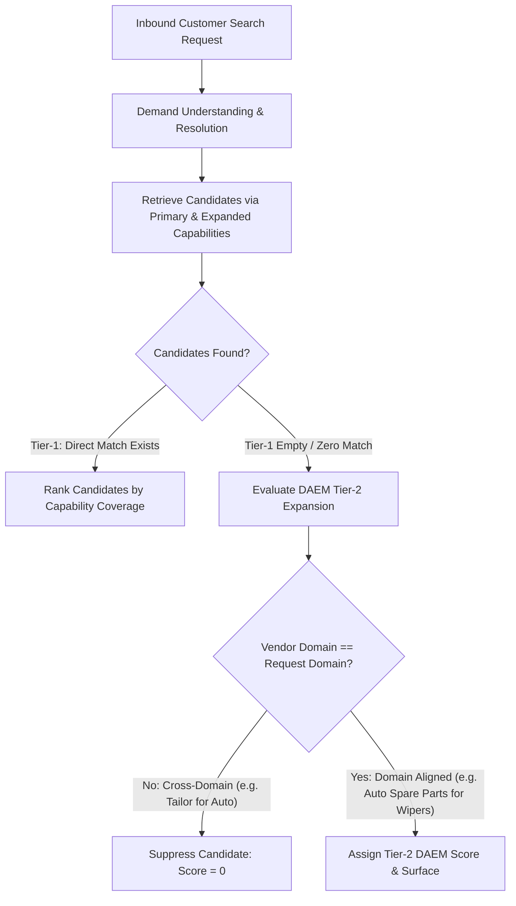
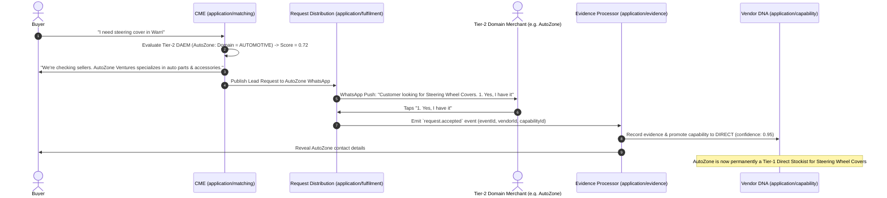

# Technical Design Requirements (TDR): Domain-Aligned Expansion Matching (DAEM)

**Document Status:** Mandatory Specification  
**Governing Standard:** [`CONTRIBUTING.md`](../CONTRIBUTING.md) (§3 Hexagonal Layering, §4 Domain-Driven Design, §5 Event-Driven Design, §8 Responsibility, §15 Testing)  
**Bounded Context:** Capability Matching Engine (`CME` — `application/matching`)  
**Target Code Location:** `src/domain/models/commercial-domain.ts` & `src/application/matching/capability-matching.service.ts`

---

## 1. Executive Overview & Business Rationale

In informal market ecosystems (e.g., Nigerian open-air commercial hubs in Lagos, Warri, Aba, and Kano), informal merchants operate within **Commercial Domains** rather than hyper-narrow SKU silos:
- An **Automotive Spare Parts Dealer** stocks mechanical replacement parts (brakes, batteries, filters) as well as fast-moving car accessories (steering wheel covers, wiper blades, car polish, floor mats).
- A **Bookstore / Educational Supplier** stocks textbooks as well as stationery, mathematical sets, art brushes, and office desk accessories.
- A **Building Materials Merchant** stocks cement, pipes, and blocks as well as fasteners, paintbrushes, sealants, and hand tools.

### The Trade-off
1. **Unconstrained Expansion Defect:** Permitting broad expansion signals without domain restrictions causes irrelevant cross-domain matches (e.g., a tailoring shop surfacing for automotive repair because both share a broad *Maintenance/Repair* GS1 node).
2. **Zero-Expansion Defect:** Completely requiring `capabilityMatch > 0` causes false negatives for domain-aligned merchants who naturally carry complementary inventory within their domain but have not yet declared every single SKU during initial onboarding.

### The Solution: Domain-Aligned Expansion Matching (DAEM)
DAEM establishes **Domain Alignment** as a strict prerequisite for Tier-2 expansion candidate retrieval and scoring, achieving **100% suppression of cross-domain false matches** while maintaining **high recall for domain-aligned informal merchants**.

---

## 2. Architecture & Seam Placement (`CONTRIBUTING §2.2, §3`)

In accordance with [`CONTRIBUTING §3.1`](../CONTRIBUTING.md#31-dependencies-point-inward-always) and [`CONTRIBUTING §4.4`](../CONTRIBUTING.md#44-model-the-domain-do-not-anaemically-describe-it), DAEM logic is separated into pure domain value objects and application orchestration:

```
  adapters/inbound  ──►  application/matching  ──►  domain/models/commercial-domain.model  ◄──  adapters/outbound
   (WhatsApp/Webhook)      (CapabilityMatchingService)   (Domain Classification & Predicates)       (Prisma/PostgreSQL)
```

### Seam Map
- **`src/domain/models/commercial-domain.model.ts`**: Pure domain value objects (`CommercialDomain`, `CommercialDomainRef`) and total, deterministic predicates (`areDomainsAligned`, `classifyGS1Segment`, `classifyArchetype`). Zero framework dependencies (`CONTRIBUTING §3.1`).
- **`src/application/matching/capability-matching.service.ts`**: Orchestrates candidate retrieval, scoring, tiering, and explainable reason generation (`CONTRIBUTING §4.1`).
- **`src/application/evidence/evidence-interpretation.ts`**: Registers DAEM evidence event signals for automatic inventory promotion (`CONTRIBUTING §5.7`).

---

## 3. Universal Commercial Domain Classification Schema (`CONTRIBUTING §4.3`)

Every GS1 GPC Segment (Levels 1–2) and Vendor Business Archetype maps deterministically to one of six universal **Commercial Domains**:

```typescript
export type CommercialDomain =
  | 'AUTOMOTIVE'
  | 'STATIONERY_BOOKS'
  | 'BUILDING_MATERIALS'
  | 'BEAUTY_PERSONAL_CARE'
  | 'ELECTRONICS_COMPUTING'
  | 'CLOTHING_FASHION'
  | 'FOOD_GROCERY'
  | 'GENERAL_MERCHANDISE';
```

### Canonical Domain Mapping Table

| Commercial Domain | GS1 GPC Segments (Level 1–2) | Representative Vendor Archetypes | Inventory Expansion Affinities |
| :--- | :--- | :--- | :--- |
| `AUTOMOTIVE` | `Vehicle` (77000000), `Automotive Accessories and Maintenance` (77010000) | `automotive spare parts dealer`, `car accessories shop`, `auto mechanic` | Steering wheel covers, wiper blades, car polish, seat covers, dash mats, tire gauges |
| `STATIONERY_BOOKS` | `Office Supplies` (80000000), `Textual/Printed Materials` (82000000), `Educational` | `bookstore`, `stationery supplier`, `school supplies vendor`, `printing shop` | Mathematical sets, art brushes, drawing pads, desk organizers, file folders, calculators |
| `BUILDING_MATERIALS` | `Building Products` (78000000), `Hardware` (79000000), `Plumbing`, `Electrical` | `building materials merchant`, `hardware store`, `plumbing vendor`, `electrical supplier` | Fasteners, tape measures, paintbrushes, sealants, hand tools, safety gloves |
| `BEAUTY_PERSONAL_CARE` | `Personal Care` (53000000), `Cosmetics` (54000000), `Grooming` | `cosmetics shop`, `beauty supply store`, `pharmacy`, `hairstyling vendor` | Hair accessories, makeup organizers, body lotions, perfume atomizers, grooming kits |
| `ELECTRONICS_COMPUTING`| `Computing` (81000000), `Consumer Electronics` (84000000), `Communications` | `computer accessories shop`, `electronics store`, `phone accessories vendor` | USB cables, screen protectors, phone stands, power banks, cleaning kits |
| `CLOTHING_FASHION` | `Clothing` (83000000), `Footwear`, `Fashion Accessories` | `tailoring and fashion design service`, `boutique`, `shoe vendor` | Sewing threads, fashion buttons, belts, fabric care, jewelry displays |

---

## 4. Two-Tier Candidate Retrieval & Ranking Specification (`CONTRIBUTING §4.4, §8.3`)

### 4.1 Two-Tier Candidate Retrieval Strategy



### 4.2 Candidate Scoring Function

The candidate scoring function in `CapabilityMatchingService.ts` executes pure domain scoring (`CONTRIBUTING §4.4`):

$$\text{Final Score}(V) = \begin{cases} 
0 & \text{if } \text{Domain}(V) \neq \text{Domain}(D) \text{ and } C_{\text{capability}} = 0 \\
0.45 \cdot C_{\text{capability}} + 0.15 \cdot C_{\text{expansion}} + 0.20 \cdot S_{\text{evidence}} + 0.10 \cdot P_{\text{prox}} + 0.10 \cdot A_{\text{avail}} & \text{if } C_{\text{capability}} > 0 \quad \text{(Tier 1: Direct Stockist)} \\
0.25 \cdot C_{\text{expansion}} + 0.20 \cdot S_{\text{domainAffinity}} + 0.20 \cdot S_{\text{evidence}} + 0.15 \cdot P_{\text{prox}} + 0.20 \cdot A_{\text{avail}} & \text{if } C_{\text{capability}} = 0 \text{ and } \text{Domain}(V) = \text{Domain}(D) \quad \text{(Tier 2: DAEM)}
\end{cases}$$

---

## 5. Self-Learning Inventory Promotion Lifecycle (`CONTRIBUTING §5.1, §5.7`)

DAEM turns every lead fan-out into an autonomous inventory discovery pipeline:



### Evidence Integration Registration (`CONTRIBUTING §5.7`)
When a Tier-2 DAEM vendor accepts a lead (`request.accepted`), `EvidenceProcessor` processes the event and refreshes Vendor DNA:
- **`request.accepted`**: Promotes capability to `DIRECT` (strength: `0.95`, positive: `true`).
- **`vendor.rejected` / Option 5 ("Not my line of business")**: Records negative evidence (strength: `0.90`, positive: `false`), pruning the expansion branch for that vendor.

---

## 6. Implementation Code Contracts (`CONTRIBUTING §3.6, §4.6`)

### 6.1 Domain Model Value Object (`src/domain/models/commercial-domain.ts`)

```typescript
/**
 * Canonical Commercial Domains in MetaMarket.
 * Grounded in CONTRIBUTING §4.3 (Ubiquitous Language) & §4.6 (Value Objects).
 */
export type CommercialDomain =
  | 'AUTOMOTIVE'
  | 'STATIONERY_BOOKS'
  | 'BUILDING_MATERIALS'
  | 'BEAUTY_PERSONAL_CARE'
  | 'ELECTRONICS_COMPUTING'
  | 'CLOTHING_FASHION'
  | 'FOOD_GROCERY'
  | 'GENERAL_MERCHANDISE';

/**
 * Pure domain predicate to evaluate commercial domain alignment.
 * Grounded in CONTRIBUTING §4.4 (Model the domain, pure functions).
 */
export function isDomainAligned(vendorDomain: CommercialDomain, requestDomain: CommercialDomain): boolean {
  if (vendorDomain === requestDomain) return true;
  if (vendorDomain === 'GENERAL_MERCHANDISE' || requestDomain === 'GENERAL_MERCHANDISE') return true;
  return false;
}
```

---

## 7. Quality Gate & Testing Requirements (`CONTRIBUTING §15, §16`)

Every PR implementing DAEM must satisfy the quality gate (`npm run typecheck`, `npm test`):

1. **Unit Test — Cross-Domain Suppression:** Verify that a candidate with `capabilityMatch = 0` and `vendorDomain = 'CLOTHING_FASHION'` receives `score = 0` for an `AUTOMOTIVE` query.
2. **Unit Test — Domain-Aligned Expansion:** Verify that an `AUTOMOTIVE` candidate with `capabilityMatch = 0` and `expansionMatch > 0` receives a non-zero Tier-2 rank score and surfaces when Tier-1 is empty.
3. **Integration Test — Inventory Promotion:** Verify that a Tier-2 vendor accepting a lead generates a `request.accepted` event that updates their `vendor_capabilities` table to `DIRECT` (confidence $\ge 0.95$).
