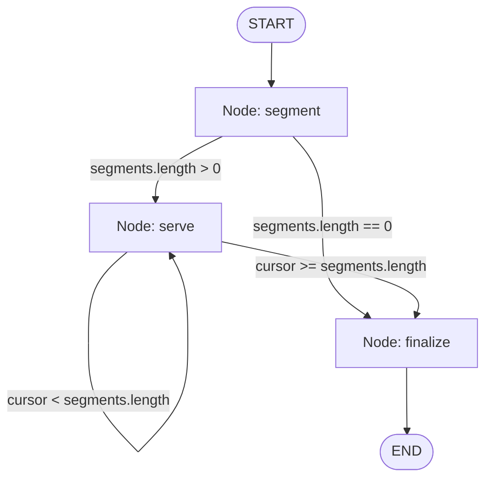
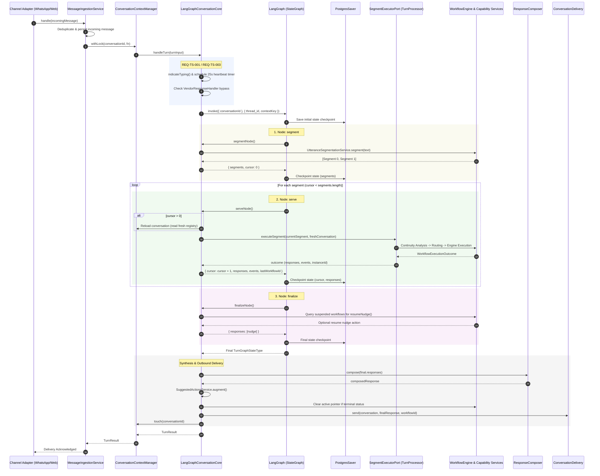

# MCOS & LangGraph Architecture and Integration Design

**Document Status:** Approved & Implemented  
**Target Branch:** `mcos-langgraph`  
**Audience:** Platform Architects, AI/Backend Engineers, Distributed Systems Engineers  
**Related Documents:**
- [Multi-Channel Conversation OS (MCOS) TDR v3.0](file:///home/algorithmz/MetaMarket/docs/design/Multi-Channel-Conversation-OS.md)
- [Conversation Core Comparison TDR](file:///home/algorithmz/MetaMarket/docs/design/Conversation-Core-Comparison-TDR.md)

---

## 1. Executive Summary

In MetaMarket's conversational commerce platform, conversations are chaotic, long-running, multi-turn, and often multi-intent. Users communicate via WhatsApp, the web, SMS, or USSD to perform commercial actions—such as registering as vendors, searching for automotive parts, funding wallets, or asking platform questions—often digressing or bundling multiple disparate requests into a single message (e.g., *"Yes, KYB. Also who sells engine oil near Alaba?"*).

To manage this operational and conversational complexity, the codebase divides responsibilities across two distinct architectural layers:

1. **MCOS (Multi-Channel Conversation Operating System)**: The enterprise conversation platform, domain state owner, and execution substrate. MCOS owns channel adaptation, canonical messaging, message deduplication, media processing pipelines, distributed conversation locking, persistent database state (`workflow_instances`, `conversations`, `messages`), domain capabilities (matching, vendor distribution, wallet/credits, evidence), enterprise LLM failover with circuit breakers, and guaranteed outbound delivery.
2. **LangGraph (`@langchain/langgraph`)**: The turn plan orchestrator. Operating strictly behind the inbound `ConversationCorePort`, LangGraph models the discrete turn execution lifecycle as a checkpointed, stateful directed graph (`StateGraph`). It sequences utterance segmentation, iterative segment execution against MCOS's workflow engine, and post-turn completion/nudge synthesis.

This document details the architectural responsibilities of MCOS and LangGraph, their integration seam, state ownership boundaries, and runtime execution flow on the `mcos-langgraph` branch.

---

## 2. The Role of MCOS (Multi-Channel Conversation OS)

MCOS is the foundational conversational operating system for the entire application. It decouples business logic from external channel idiosyncrasies and guarantees deterministic workflow progression.

### 2.1 Core Architectural Tenets

```
                   External Channels
        (WhatsApp Cloud API, Web SSE / POST, SMS, USSD)
                              │
                              ▼
                       Channel Adapters
                              │
                    Canonical Ingestion
              (Deduplication, Lock, Media Queue)
                              │
                              ▼
                     Conversation Core Seam
                    (ConversationCorePort)
                              │
                              ▼
                   MCOS Workflow Subsystem
       (Continuity, 6-Layer Discovery, Workflow Engine)
                              │
                              ▼
                     Capability Services
          (Matching, Distribution, Wallet, Evidence)
                              │
                              ▼
                   Outbound Delivery Engine
        (ChannelNotifierRegistry, DurableChannelNotifier)
```

1. **Channel Agnosticism**: Business logic and workflows never inspect channel headers or payload variations. Channel Adapters translate provider-specific formats into the canonical `IncomingMessage` aggregate.
2. **Conversation as Root Aggregate**: The `Conversation` entity ([`ConversationContextManager`](file:///home/algorithmz/MetaMarket/src/application/conversation/conversation-context.manager.ts)) owns user identity mapping, history, memory, the workflow registry, and the active workflow pointer.
3. **Deterministic State Machine Execution**: Business processes execute via deterministic state machines ([`WorkflowEngine`](file:///home/algorithmz/MetaMarket/src/domain/workflows/workflow-engine.ts)). AI assists with extraction, semantic classification, and summarization, but never directly decides state transitions.
4. **Single Source of Business Record**: Workflow state, entity bindings, and conversational contexts are persisted in PostgreSQL via Prisma (`workflow_instances`, `conversations`, `messages`).
5. **Multi-Provider LLM Resilience**: All LLM calls (segmentation, intent resolution, entity extraction, continuity analysis) route through [`LlmProviderService`](file:///home/algorithmz/MetaMarket/src/infrastructure/llm/llm-provider.service.ts), which manages an automatic 3-provider failover chain (e.g., DeepSeek → Anthropic Claude → OpenAI) backed by circuit breakers. LangChain's native chat model classes are explicitly prohibited from invoking LLMs directly, ensuring circuit breaker protections are preserved.

### 2.2 Key Subsystems in MCOS

- **Ingestion & Distributed Concurrency** ([`MessageIngestionService`](file:///home/algorithmz/MetaMarket/src/application/pipeline/message-ingestion.service.ts)):
  - Resolves conversation identity from user channel addresses.
  - Enforces idempotent message deduplication (`saveIncoming`).
  - Dispatches media attachments (audio voice notes, images) to an asynchronous worker queue ([`MediaProcessingQueuePort`](file:///home/algorithmz/MetaMarket/src/domain/ports/outbound/media-processing-queue.port.ts)) while extracting inline text artifacts without blocking webhook delivery.
  - Obtains a distributed mutex ([`ConversationContextManager.withLock`](file:///home/algorithmz/MetaMarket/src/application/conversation/conversation-context.manager.ts#L202-L209)) per conversation ID to guarantee serial turn execution across horizontal replicas.
- **Understanding & Continuity Pipeline**:
  - [`UtteranceSegmentationService`](file:///home/algorithmz/MetaMarket/src/application/understanding/segmentation.service.ts): Decomposes compound multi-intent sentences into discrete ordered request segments.
  - [`ConversationContinuityAnalyzer`](file:///home/algorithmz/MetaMarket/src/application/understanding/continuity-analyzer.service.ts): Evaluates whether an utterance segment continues an active workflow, resumes a suspended workflow, starts a new workflow, digresses, or switches context.
  - [`IntentResolutionService`](file:///home/algorithmz/MetaMarket/src/application/understanding/intent-resolution.service.ts) & [`SemanticResolutionService`](file:///home/algorithmz/MetaMarket/src/application/understanding/semantic-resolution.service.ts): Disambiguate intents and normalize entity parameters.
- **Workflow Registry & 6-Layer Discovery Engine** ([`WorkflowManager`](file:///home/algorithmz/MetaMarket/src/domain/workflows/workflow-manager.ts)):
  Resolves ambiguous user requests to specific workflow instances using six hierarchical layers:
  1. *Explicit Workflow ID*: Tapped button/action payloads (`encodeActionPayload`).
  2. *Deterministic Identifier*: Request numbers, reference codes, tracking tags.
  3. *Entity Match*: Direct matching on `importantEntities` (e.g., matching a part query to an active search).
  4. *Semantic Fingerprint*: Lexical overlap scoring with `MIN_FINGERPRINT_SCORE = 0.5`.
  5. *Embedding Similarity*: Vector cosine similarity via [`EmbeddingProviderPort`](file:///home/algorithmz/MetaMarket/src/domain/ports/outbound/embedding-provider.port.ts) with `MIN_EMBEDDING_SIMILARITY = 0.82`.
  6. *Active Workflow*: Fallback to the active focused workflow pointer if not in conflict.
- **Domain Workflows**:
  - `VendorOnboarding`: Multi-step KYC, catalog collection, location capture, catalog indexing.
  - `BuyerSearch`: Request extraction, taxonomy matching, vendor candidate matching, request distribution.
  - `CreditRecharge`: Konnet/Korapay payment link generation, balance management.
  - `PlatformInfo`: FAQ, platform pricing, and informational responses.
  - `Triage`: Graceful fallback and human escalation for unroutable requests.
- **Outbound Delivery Subsystem**:
  - [`ResponseComposer`](file:///home/algorithmz/MetaMarket/src/application/response/response-composer.service.ts): Merges responses from multiple segments into one unified conversational reply.
  - [`SuggestedActionsService`](file:///home/algorithmz/MetaMarket/src/application/response/suggested-actions.service.ts): Generates contextual quick-reply chips and interactive buttons.
  - [`DurableChannelNotifier`](file:///home/algorithmz/MetaMarket/src/infrastructure/notifications/durable-channel-notifier.service.ts): Provides write-ahead outbox queuing for WhatsApp and Web Server-Sent Events (SSE), ensuring delivery survive transient connection drops.

---

## 3. The Role of LangGraph in the Codebase

LangGraph (`@langchain/langgraph` v1.4.14 with `@langchain/langgraph-checkpoint-postgres` v1.0.5) serves as the **Turn Plan Supervisor**. It models the execution flow of an individual conversational turn as a declarative, checkpointed state machine graph.

### 3.1 Architectural Scope and Placement

LangGraph does not manage conversation persistence, historical chat recall, or business state. Instead, its role is confined to **orchestrating a single turn end-to-end**:



- **Inbound Seam**: Implements [`ConversationCorePort`](file:///home/algorithmz/MetaMarket/src/domain/ports/inbound/conversation-core.port.ts) via [`LangGraphConversationCore`](file:///home/algorithmz/MetaMarket/src/application/langgraph/langgraph-conversation-core.ts).
- **Turn-Level State Graph**: Defined via `buildTurnGraph()` with three nodes: `segment`, `serve`, and `finalize`.
- **Checkpointing**: Persists in-flight graph execution state per turn into PostgreSQL via [`TurnCheckpointer`](file:///home/algorithmz/MetaMarket/src/application/langgraph/turn-checkpointer.provider.ts) (`PostgresSaver`).

### 3.2 State Modeling: `TurnGraphState`

The state passed through the graph is defined in [`turn-graph.state.ts`](file:///home/algorithmz/MetaMarket/src/application/langgraph/turn-graph.state.ts):

```typescript
export const TurnGraphState = Annotation.Root({
  conversationId: Annotation<string>,

  /** The message split into the requests it carries. Written once by the segment node. */
  segments: Annotation<readonly GraphSegment[]>({
    reducer: (_existing, update) => update,
    default: () => [],
  }),

  /** Index cursor of the segment currently being served. */
  cursor: Annotation<number>({
    reducer: (_existing, update) => update,
    default: () => 0,
  }),

  /** Accumulated responses across segments, in presentation order. */
  responses: Annotation<readonly Response[]>({
    reducer: (existing, update) => [...existing, ...update],
    default: () => [],
  }),

  /** Domain events emitted across executed segments. */
  events: Annotation<readonly DomainEvent[]>({
    reducer: (existing, update) => [...existing, ...update],
    default: () => [],
  }),

  /** The workflow instance ID that owned the most recently served segment. */
  lastWorkflowId: Annotation<string | null>({
    reducer: (existing, update) => update ?? existing,
    default: () => null,
  }),

  /** Failure flag indicating if any segment encountered an unrecoverable workflow error. */
  failed: Annotation<boolean>({
    reducer: (existing, update) => existing || update,
    default: () => false,
  }),

  /** Reason why a segment could not be routed, if applicable. */
  unroutable: Annotation<string | null>({
    reducer: (existing, update) => update ?? existing,
    default: () => null,
  }),
});
```

### 3.3 Checkpointing and Non-Serializable State Decoupling

PostgreSQL checkpoints require pure, serializable JSON data. Live database connections, entity classes, runtime date instances, and inbound webhook buffers cannot be passed to LangGraph's checkpoint saver.

LangGraph integrates with MCOS through an in-memory execution bridge:
1. **Thread Scope**: Checkpoints are keyed by turn, not conversation:
   ```typescript
   thread_id: `${conversation.id}:${message.id}`
   ```
   *Rationale*: Thread state must not bleed across turns. A conversation-scoped thread would resume the previous turn's cursor, segments, and responses into a new incoming message. Long-term conversation continuity belongs to MCOS's database tables.
2. **Turn Context Decoupling**: Non-serializable state (`IncomingMessage`, loaded `Conversation`, `ClockPort`, `Artifact[]`) is stored in an in-memory map keyed by `contextKey = randomUUID()`.
3. The graph config passes `configurable: { [TURN_CONTEXT_KEY]: contextKey }`.
4. Nodes resolve their operational context synchronously via `this.turnContext(config)`. The context entry is deleted in a `finally` block when graph execution finishes.

---

## 4. How MCOS and LangGraph Are Currently Integrated

The integration between MCOS and LangGraph follows Hexagonal (Ports & Adapters) principles. The boundary is sharp, with explicit inbound and outbound ports.

### 4.1 The Integration Seam (Ports & Dependency Injection)

```
┌────────────────────────────────────────────────────────────────────────┐
│                        MCOS Inbound Pipeline                           │
│  [WhatsApp / Web Controller] ──> [MessageIngestionService.runTurn()]   │
└───────────────────────────────────┬────────────────────────────────────┘
                                    │ Calls via CONVERSATION_CORE
                                    ▼
┌────────────────────────────────────────────────────────────────────────┐
│               ConversationCorePort (Inbound Port)                      │
│               [LangGraphConversationCore.handleTurn()]                 │
└───────────────┬────────────────────────────────────────┬───────────────┘
                │ Invokes Compiled StateGraph            │
                ▼                                        ▼
    ┌──────────────────────┐                 ┌──────────────────────┐
    │  LangGraph Engine    │                 │ TurnCheckpointer     │
    │  [StateGraph Engine] │ <─────────────> │ [PostgresSaver / DB] │
    └───────────┬──────────┘                 └──────────────────────┘
                │
                │ Each loop iteration executes segment via SEGMENT_EXECUTOR
                ▼
┌────────────────────────────────────────────────────────────────────────┐
│               SegmentExecutorPort (Outbound Port)                      │
│               [TurnProcessor.executeSegment()]                         │
└───────────────┬────────────────────────────────────────────────────────┘
                │
                ▼
┌────────────────────────────────────────────────────────────────────────┐
│                      MCOS Workflow Subsystem                           │
│   ContinuityAnalyzer ──> WorkflowManager ──> WorkflowEngine (State FSM)│
│   ──> Capability Services (Matching, Distribution, Wallet, Evidence)   │
└───────────────────────────────────┬────────────────────────────────────┘
                                    │ Returns SegmentExecutionResult
                                    ▼
┌────────────────────────────────────────────────────────────────────────┐
│                 LangGraph Node Aggregation & Finalize                  │
│       [finalizeNode: resumeNudge] ──> [ResponseComposer.compose]       │
└───────────────────────────────────┬────────────────────────────────────┘
                                    │ Delivers response
                                    ▼
┌────────────────────────────────────────────────────────────────────────┐
│                        MCOS Outbound Pipeline                          │
│     [ConversationDelivery] ──> [DurableChannelNotifier] ──> Client     │
└────────────────────────────────────────────────────────────────────────┘
```

#### Inbound Port: `ConversationCorePort`
Defined in [`src/domain/ports/inbound/conversation-core.port.ts`](file:///home/algorithmz/MetaMarket/src/domain/ports/inbound/conversation-core.port.ts):
```typescript
export const CONVERSATION_CORE = Symbol('ConversationCore');

export interface ConversationCorePort {
  handleTurn(input: ConversationTurnInput): Promise<ConversationTurnResult>;
  deliver(message: IncomingMessage, response: Response, workflowId: string | null): Promise<void>;
}
```

In [`ConversationModule`](file:///home/algorithmz/MetaMarket/src/config/conversation.module.ts#L208-L215), the core is bound to LangGraph:
```typescript
// The conversation core under test: LangGraph supervisor graph
{ provide: CONVERSATION_CORE, useExisting: LangGraphConversationCore },

// The per-segment pipeline, shared by both cores
{ provide: SEGMENT_EXECUTOR, useExisting: TurnProcessor },
```

#### Outbound Port from LangGraph: `SegmentExecutorPort`
Defined in [`src/domain/ports/inbound/segment-executor.port.ts`](file:///home/algorithmz/MetaMarket/src/domain/ports/inbound/segment-executor.port.ts):
```typescript
export const SEGMENT_EXECUTOR = Symbol('SegmentExecutor');

export interface SegmentExecutorPort {
  executeSegment(input: SegmentExecutionInput): Promise<SegmentExecutionResult>;
}
```
[`TurnProcessor`](file:///home/algorithmz/MetaMarket/src/application/pipeline/turn-processor.service.ts) implements `executeSegment`, running MCOS's continuity analyzer, intent resolver, semantic resolver, workflow manager routing, and workflow engine execution for that segment.

---

### 4.2 End-to-End Turn Execution Sequence



---

### 4.3 Detailed Graph Node Operations

#### 1. `segmentNode`
- **Input**: Raw text and interactive payloads from the turn context.
- **Action**: Invokes MCOS's [`UtteranceSegmentationService.segment()`](file:///home/algorithmz/MetaMarket/src/application/understanding/segmentation.service.ts). If an interactive button was pressed (`interactivePayload !== null`), segmentation immediately returns a single segment to prevent misattributing button payloads to compound sentences.
- **Output**: Writes `segments: GraphSegment[]` and sets `cursor: 0`.
- **Conditional Routing**:
  - If `segments.length > 0` → routes to `serveNode`.
  - If `segments.length === 0` → routes directly to `finalizeNode` (handles empty/unreadable messages).

#### 2. `serveNode`
- **Input**: Current `cursor` position and `segments` array from state.
- **Critical Isolation Logic**:
  ```typescript
  if (segment.index > 0) {
    const reloaded = await this.context.load({
      userId: turn.message.userId,
      channel: turn.message.channel,
    });
    turn.conversation = reloaded.conversation;
  }
  ```
  Every segment after the first **reloads the conversation aggregate from PostgreSQL**. This guarantees that the routing and continuity checks for segment `N+1` observe the exact workflow registry mutations, state updates, or suspensions committed by segment `N`.
- **Delegation**: Calls `SegmentExecutorPort.executeSegment()`.
- **Error Containment**: If a segment resolves to `unroutable`, the error is recorded in state (`unroutable: result.unroutable`), the cursor increments, and processing continues. One unroutable clause does not crash the remaining valid clauses.
- **Output**: Appends segment responses and events to state, updates `lastWorkflowId`, and increments `cursor`.
- **Conditional Routing**:
  - If `cursor < segments.length` → loops back to `serveNode`.
  - If `cursor >= segments.length` → transitions to `finalizeNode`.

#### 3. `finalizeNode`
- **Input**: Completed turn state.
- **Action**: Evaluates if the turn left the conversation with **no active workflow** while **suspended workflows exist**.
- **Resume Nudge**:
  If a user digressed to ask a billing question during vendor onboarding, onboarding was suspended. When the billing question completes, `resumeNudge()` constructs an invitation:
  ```
  "Before that — shall we carry on with what we started?
   _Vendor Onboarding: KYB Brake Pads_"
  [Button: "Yes, continue"] -> payload: { workflowId, action: 'resume' }
  ```
- **Output**: Appends the resume nudge button to the responses array.

---

## 5. Critical Architecture Decisions & Invariants

### 5.1 The Single State Owner Principle (No Split-Brain State)

A primary risk in integrating a graph framework with an existing conversational engine is **dual state ownership**—where both LangGraph and MCOS attempt to track active workflow pointers, user memory, and execution history.

| State Dimension | Owner | Persistence Storage | Rationale |
| :--- | :--- | :--- | :--- |
| **In-flight Turn Graph Position** | **LangGraph** | Postgres Checkpointer (`PostgresSaver`) | Owns the execution cursor (`cursor`), segments list, and turn-local partial responses. Discarded when the turn finishes. |
| **Workflow Registry & Active Pointer** | **MCOS** | Prisma PostgreSQL (`workflow_instances`) | Source of truth for discovery, active workflow pointer, entity maps (`importantEntities`), and lifecycle status (`active`, `suspended`, `completed`). |
| **Conversation Aggregate & History** | **MCOS** | Prisma PostgreSQL (`conversations`, `messages`) | Long-term user identity, conversation metadata, deduplication records, and message threads. |
| **Non-Serializable Turn Context** | **Bridge Map** | In-memory `Map<string, TurnContext>` | Prevents non-serializable objects (DB connections, dates) from failing PostgreSQL checkpointer serialization. |

> [!IMPORTANT]
> LangGraph's checkpointer owns **only in-flight graph position within a single turn**. It never stores business data, active workflow pointers, or long-term conversation history.

### 5.2 Why Sequential Looping Beats LangGraph `Send` Fan-Out

LangGraph provides a `Send()` API to conditionally fan out parallel subgraphs. In early design reviews, fanning out multiple objectives to parallel subgraphs was considered. However, this was deliberately rejected in favor of a sequential cursor loop:

- **The Problem**: Natural language requests bundled in a single turn are rarely orthogonal. For example:
  *"Yes, KYB. Also who sells engine oil near Alaba?"*
  - Clause 1 completes a step in `VendorOnboarding`.
  - Clause 2 opens a new `BuyerSearch` workflow.
- **The Failure Mode of Fan-Out**:
  If executed concurrently via `Send`:
  1. Clause 2 runs before Clause 1 commits its updates.
  2. Clause 2 reads a stale workflow registry.
  3. Clause 2 may attempt to bind "engine oil" to the onboarding workflow instead of creating a search workflow, or cause concurrent write conflicts on `workflow_instances`.
- **The Solution**: The sequential cursor loop in `LangGraphConversationCore`, combined with a database reload between segments (`segment.index > 0`), guarantees that Segment 2 routes against the world as Segment 1 left it.

### 5.3 Fast-Path Bypass for Vendor Responses

Before compiling or invoking the graph, `LangGraphConversationCore.handleTurn` executes a fast-path check:
```typescript
const vendorReply = await this.vendorResponses.tryHandle({
  conversation,
  interactivePayload: input.interactivePayload,
  text,
});
if (vendorReply !== null) {
  await this.delivery.send(conversation, vendorReply, null);
  return { response: vendorReply, workflowId: null };
}
```
When a vendor responds to an outbound RFQ (Request For Quotation) broadcast with a price quote or tap action, the response is deterministic and self-contained. Bypassing LLM segmentation, continuity analysis, and graph invocation reduces response latency from ~3500ms to <150ms while avoiding unnecessary token costs.

### 5.4 Best-Effort Signaling & Empathy Fallbacks

Real-world commercial messaging (particularly on WhatsApp) demands proactive signaling during slow multi-step turns:
1. **Typing Indicators (`REQ-TS-001`)**: `indicateTyping()` is signaled via `ChannelNotifierRegistryPort` at the start of turn processing and refreshed after long-running operations.
2. **25-Second Heartbeat (`REQ-TS-003`)**: A background timer triggers at 25 seconds if the turn has not finished, sending an interim reassuring message (*"I'm still working on your request! Thank you for your patience..."*) and refreshing the typing state.
3. **Graceful Fallbacks (`REQ-TS-002`)**: If an unhandled exception occurs anywhere inside the graph, MCOS traps it in `handleInternalError`, logs the failure with `StageLoggerPort`, and delivers an honest, empathetic response to the user instead of dropping the message silently.

---

## 6. Verification and Integration Metrics

The integration is verified by the automated test suite in [`test/integration/chaotic-conversation.test.ts`](file:///home/algorithmz/MetaMarket/test/integration/chaotic-conversation.test.ts), which replays the canonical chaos transcript through both the WhatsApp and Web channels:

1. **Turn 1 (Initiate)**: *"I sell Toyota brake pads and shock absorbers"* → Successfully initiates `VendorOnboarding`.
2. **Turn 2 (Digression)**: *"Wait, how much do you charge per month to list items here?"* → Suspends onboarding, routes to `PlatformInfo`, answers billing terms, and appends a `resumeNudge` action.
3. **Turn 3 (Multi-Intent Compound)**: *"Yes, KYB. Also who sells engine oil near Alaba?"* →
   - Segment 0 routes to suspended `VendorOnboarding`, supplies the brand ("KYB"), and progresses the onboarding state.
   - Segment 1 reloads the registry, identifies an unhandled requirement, routes to `BuyerSearch`, and initiates vendor matching.
   - `ResponseComposer` merges both responses into a unified reply.

### Automated Test Assertions
```typescript
// Channel parity: identical business objective execution across WhatsApp and Web
expect(web.turns.map(t => t.objectivesServed))
  .toEqual(whatsapp.turns.map(t => t.objectivesServed));

// Both objectives served in Turn 3
expect(multiIntent.objectivesServed)
  .toEqual(['VendorOnboarding', 'BuyerSearch']);

// Exact pipeline mechanism verified
expect(multiIntent.llmOperations).toContain('utterance_segmentation');
expect(multiIntent.llmOperations.filter(op => op === 'continuity_analysis'))
  .toHaveLength(2);

// Token cost bounded (<= 20 LLM calls across chaos transcript)
expect(scorecard.llmCallCount).toBeLessThanOrEqual(20);
```

---

## 7. Summary of Integration Responsibilities

| Subsystem / Feature | MCOS Ownership | LangGraph Ownership |
| :--- | :---: | :---: |
| **Inbound Webhook & Channel Adapters** | **Yes** | No |
| **Conversation Mutex Locking (`withLock`)** | **Yes** | No |
| **Message Deduplication & Media Pipeline** | **Yes** | No |
| **Turn Plan Graph Topology & Conditional Edges** | No | **Yes** |
| **Turn Checkpointing (`PostgresSaver`)** | No | **Yes** |
| **Utterance Segmentation Service** | **Yes** | Called as Node |
| **Segment Iteration & Execution Cursor** | No | **Yes** |
| **Continuity Analysis & 6-Layer Discovery** | **Yes** | Delegated via Port |
| **Workflow State Machine Execution** | **Yes** | Delegated via Port |
| **Capability Services (Matching, Wallet, Fanout)** | **Yes** | No |
| **Multi-Provider LLM Failover & Circuit Breakers**| **Yes** | No |
| **Response Composition & Action Suggestions** | **Yes** | Invoked post-graph |
| **Durable Outbound Channel Delivery** | **Yes** | No |
